## Amit Arora, [`aa1603@georgetown.edu`](mailto:aa1603@georgetown.edu) {.smaller .title-12}

:::: {.columns} 
::: {.column width="75%"}

* Principal Solutions Architect - AI/ML at AWS
* Adjunct Professor at Georgetown University
* Multiple patents in telecommunications and applications of ML in telecommunications

Fun Facts

:::

::: {.column width="25%"}

:::
::::

* I am a self-published author https://blueberriesinmysalad.com/
* My book "Blueberries in my salad: my forever journey towards fitness & strength" is written as code in R and Markdown
* I love to read books about health and human performance, productivity, philosophy and <i>Mathematics for ML</i>. My reading list is [online](https://aarora79.github.io/my-reading-list/)!

---

## Try playing a Linux game!

[Bash crawl](https://gitlab.com/slackermedia/bashcrawl) is a game to help you practice your navigation and file access skills. Click on the **binder** link in this repo to launch a jupyter lab session and explore!

---

# Modern Data Architecture

## Architecture

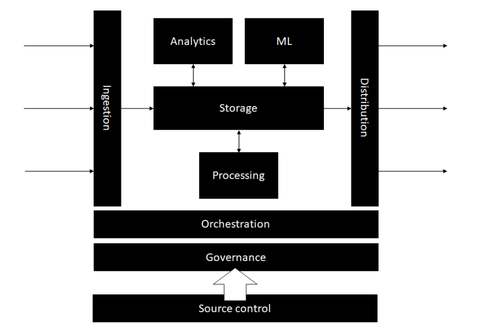{fig-align="center"}

## Storage

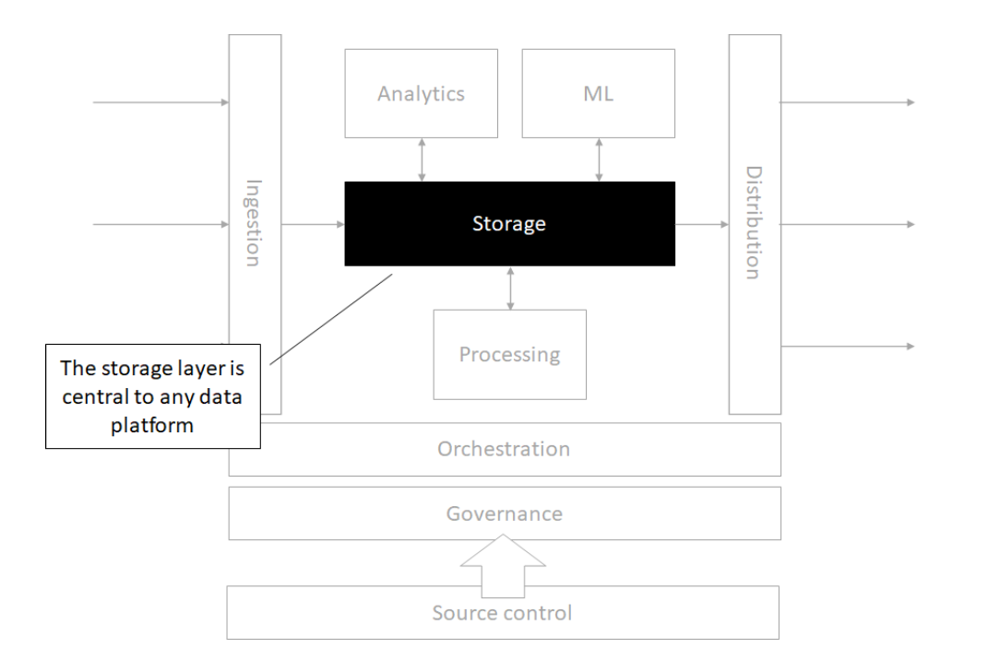{fig-align="center"}

## Source control

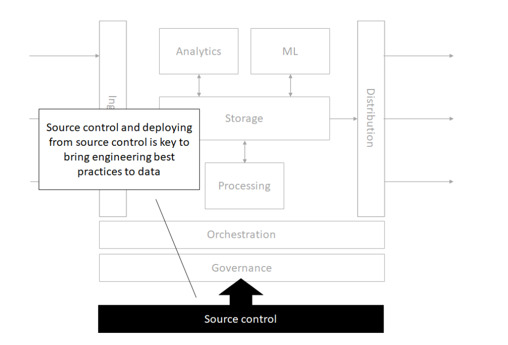{fig-align="center"}

## Orchestration

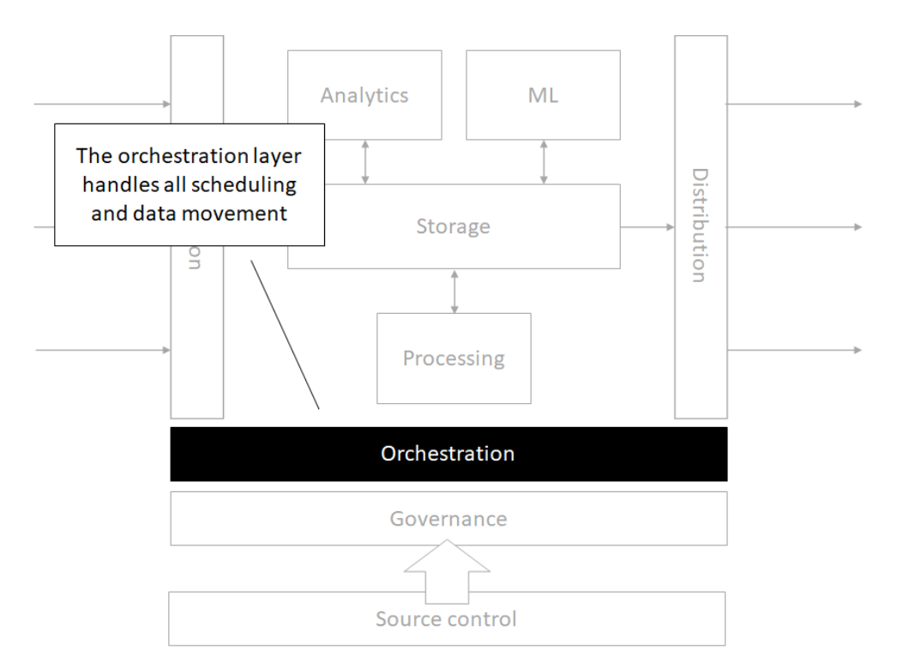{fig-align="center"}

## Processing

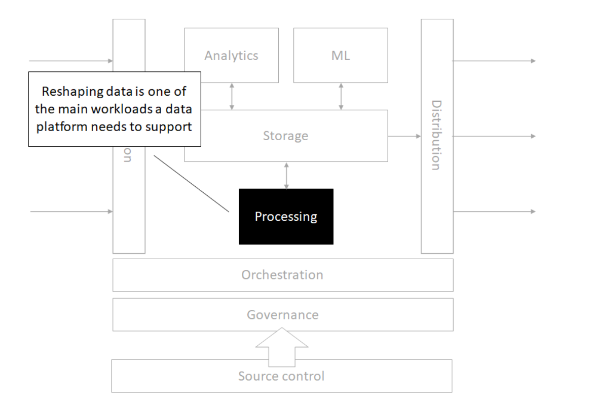{fig-align="center"}

## Analytics

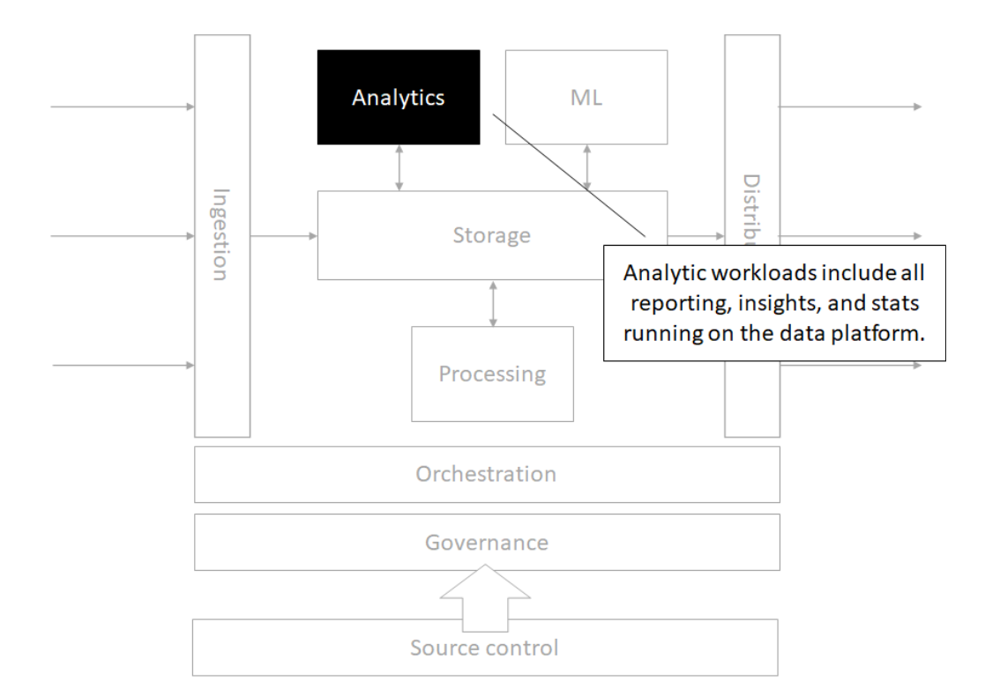{fig-align="center"}

## Machine Learning

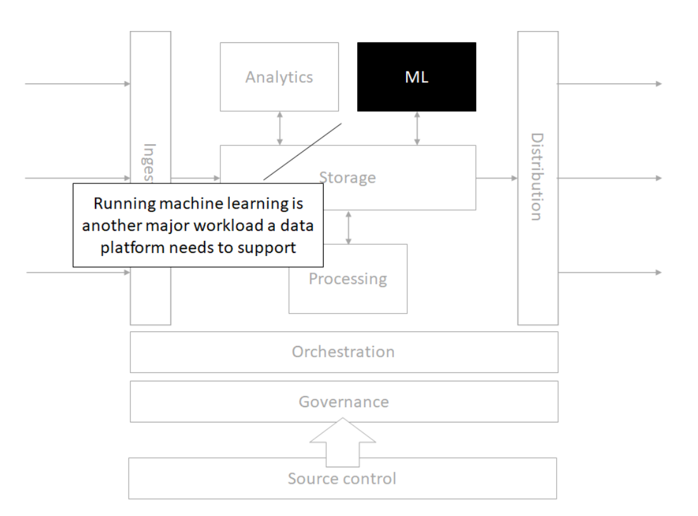{fig-align="center"}

## Governance

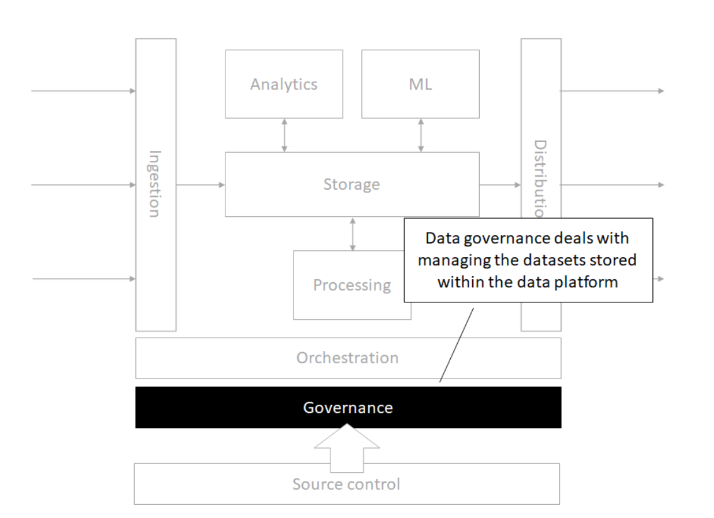{fig-align="center"}

---

## In one minute of time (2018)

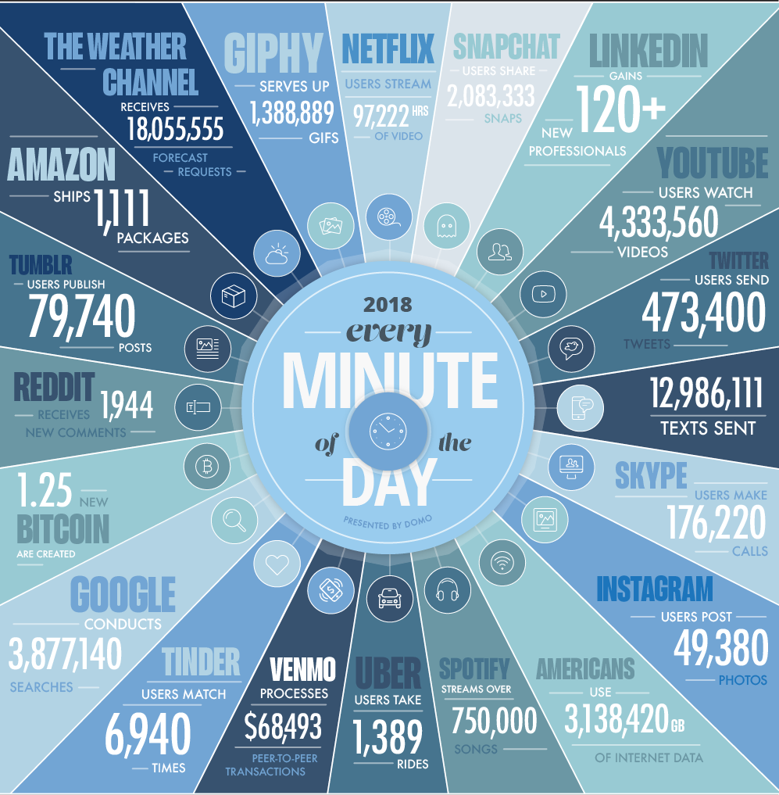

## In one minute of time (2019)

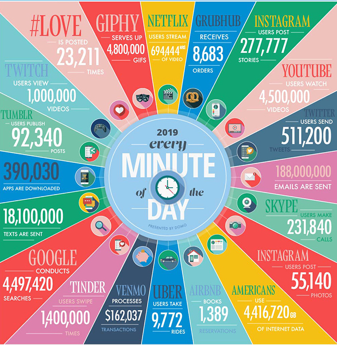

## In one minute of time (2020)

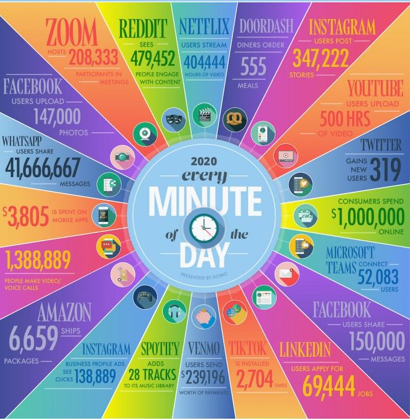

## In one minute of time (2021)

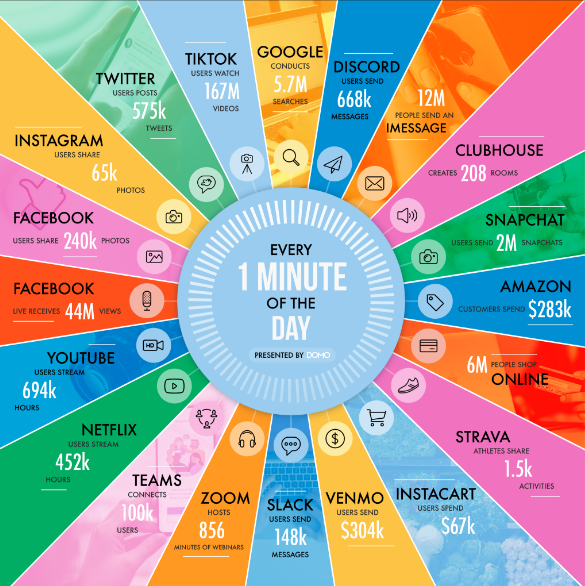

---

## It can also be user-generated content: {.crunch-title .crunch-ul .text-90}

:::: {layout="[1,1]" layout-valign="center"}
::: {#user-generated-text}

* Instagram posts & Reels
* X (Twitter) posts & Threads
* TikTok videos
* YouTube Shorts
* Reddit discussions
* Discord conversations
* AI-generated content (text, images, code)
* ...

:::
::: {#user-generated-img}

:::
::::

---

## Where else?

* The Internet
* Transactions
* Databases
* Excel
* PDF Files
* Anything digital (music, movies, apps)
* Some old floppy disk lying around the house

---

## Frameworks for Thinking About Big Data {.crunch-title .title-08}

**IBM (The 3 V's)**

* **Volume** (Gigabytes &rarr; Exabytes &rarr; Zettabytes)
* **Velocity** (Batch &rarr; Streaming &rarr; Real-time AI inference)
* **Variety** (Structured, Unstructured, Embeddings)

**Additional V's for 2025**

:::: {.columns}
::: {.column width="35%"}

* Variability
* Veracity
* Visualization

:::
::: {.column width="65%"}

* Value
* **Vectors** (embeddings for AI/ML)
* **Versatility** (multi-modal data)

:::
::::

---

## Let's discuss!

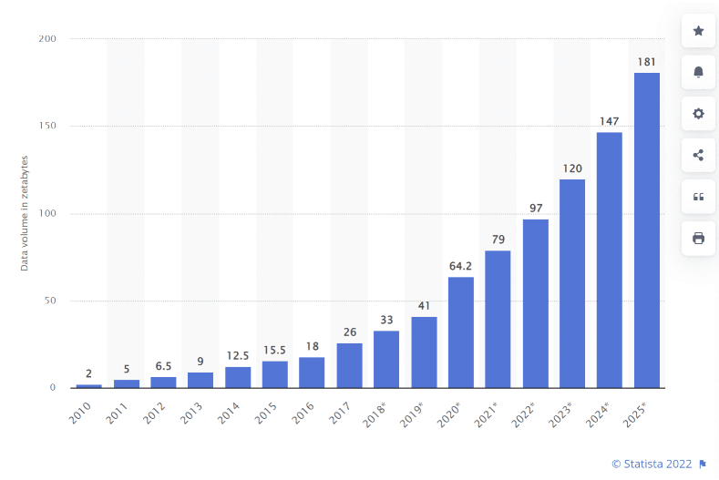

---

## Data "Size"

$$
\text{``Size''} = f(\text{Processing Ability}, \text{Storage Space})
$$

* Can you analyze/process your data on a single machine?
* Can you store (or is it stored) on a single machine?
* Can you serve it fast enough for real-time AI applications?

If any of of the answers is _**no**_ then you have a big-ish data problem!

---

## Challenges of Working with Large Datasets {.text-85 .title-09}

| The V | The Challenge |
|---|---|
| **Volume** | data scale |
| **Value** | data usefulness in decision making |
| **Velocity** | data processing: batch or stream |
| **Viscosity** | data complexity |
| **Variability** | data flow inconsistency |
| **Volatility** | data durability |
| **Viability** | data activeness |
| **Validity** | data properly understandable |
| **Variety** | data heterogeneity |

---

## Learning Objectives {.smaller}

-   Setup, operate and manage big data tools and cloud infrastructure, including Spark, DuckDB, Polars, Athena, Snowflake, and orchestration tools like Airflow on Amazon Web Services
-   Use ancillary tools that support big data processing, including git and the Linux command line
-   Execute a big data analytics exercise from start to finish: ingest, wrangle, clean, analyze, store, and present
-   Develop strategies to break down large problems and datasets into manageable pieces
-   Identify broad spectrum resources and documentation to remain current with big data tools and developments
-   Communicate and interpret the big data analytics results through written and verbal methods

---

## Every 60 Seconds (2026) {.crunch-title .text-80 .crunch-p .crunch-ul}

* AI things serve **millions** of requests (exact numbers proprietary)
* **500 hours** of video uploaded to YouTube
* **1.04 million** Slack messages sent
* **362,000 hours** watched on Netflix
* **5.9-11.4 million** Google searches
* **$443,000** spent on Amazon
* **347,200** posts on X (formerly Twitter)
* **231-250 million** emails sent

---

## There's lots of **graph** data too {.crunch-title .text-90}

:::: {layout="[1,1]" layout-valign="center"}
::: {#graph-text}

Many interesting datasets have a graph structure:

* Social networks
* Google's knowledge graph
* Telecom networks
* Computer networks
* Road networks
* Collaboration/relationships

Some of these are **HUGE**

:::
::: {#graph-img}

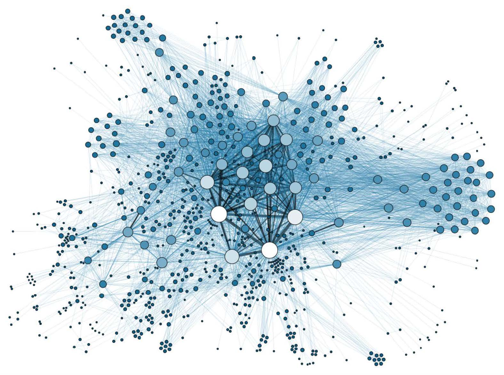

:::
::::

---

## Thinking About Big Data Workflows {.smaller .crunch-title .title-12}

[William Cohen](http://www.cs.cmu.edu/~wcohen/) (Director, Research Engineering, Google):

* Working with big data is _not_ about...
  * Code optimization
  * Learning the details of today's hardware/software (they are evolving...)
* Working with big data _is_ about **understanding**:
  * The cost of what you want to do
  * What the tools that are available offer
  * How much can be accomplished with linear or nearly-linear operations 
  * How to organize your computations so that they effectively use whatever’s fast
  * How to test/debug/verify with large data
* Recall that traditional tools like `R` and `Python` are **single threaded** (by default)

---

## Additional Links of Interest

* Matt Turck's Machine Learning, Artificial Intelligence & Data Landscape (MAD)
  * [Article](https://mattturck.com/mad2023/)
  * [Interactive Landscape](https://mad.firstmarkcap.com/)