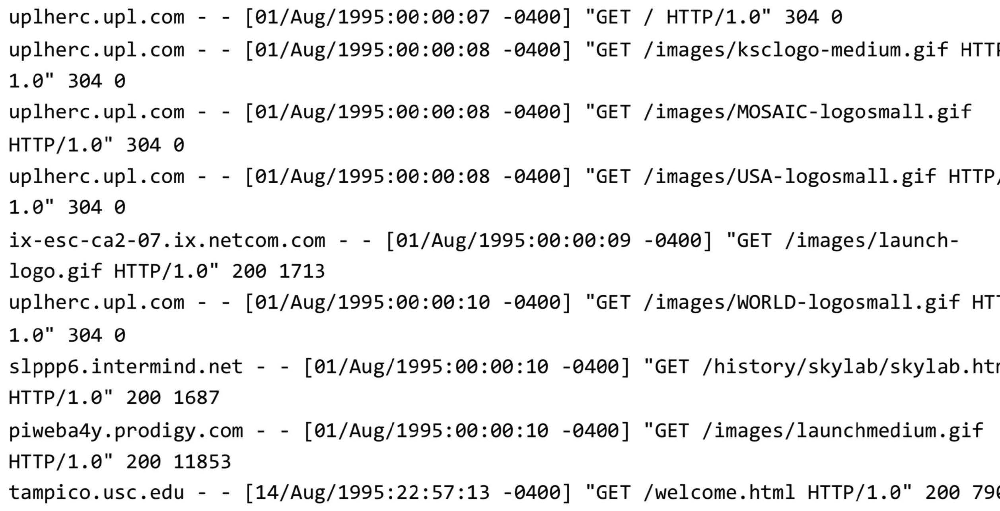
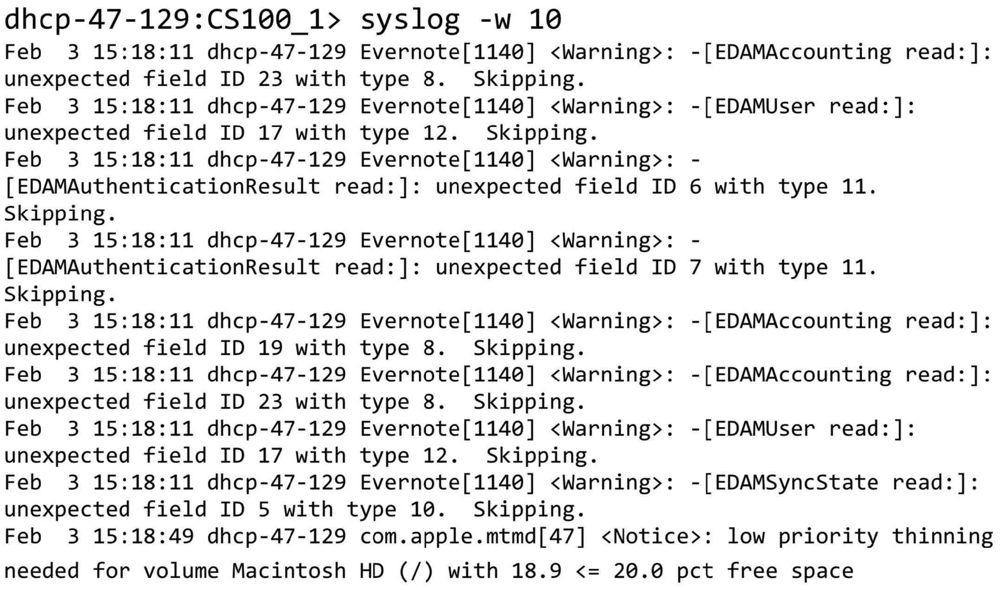
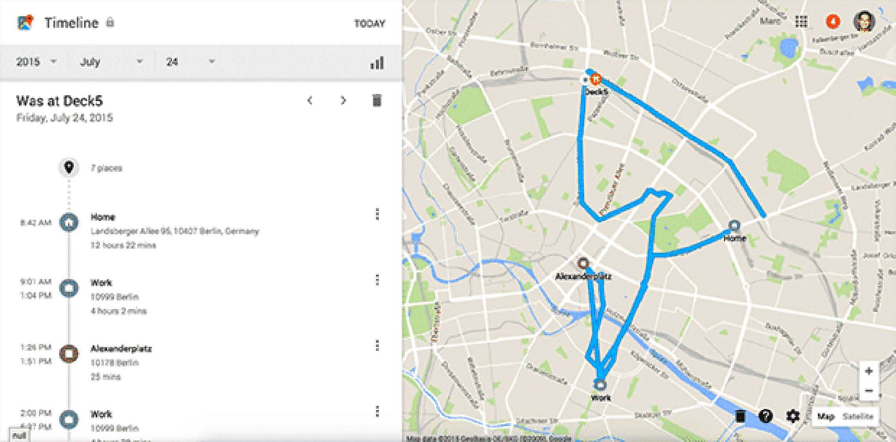
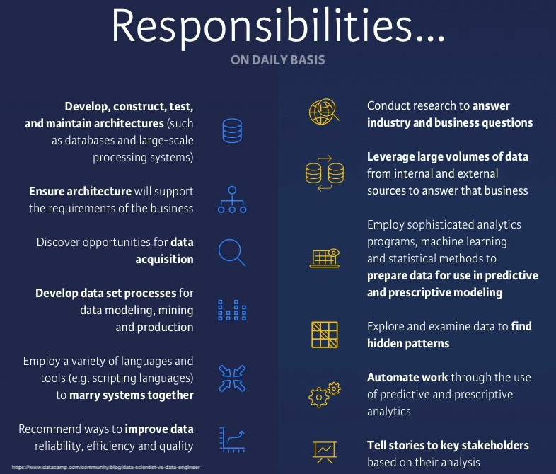
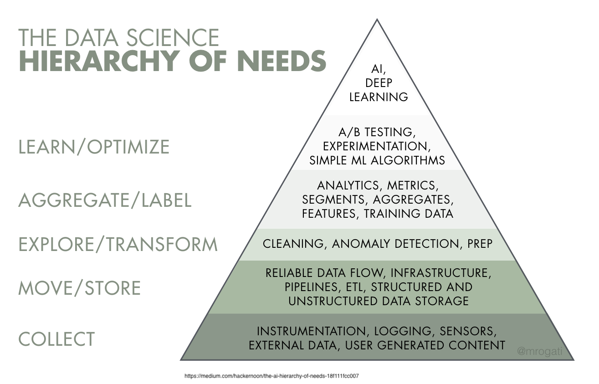
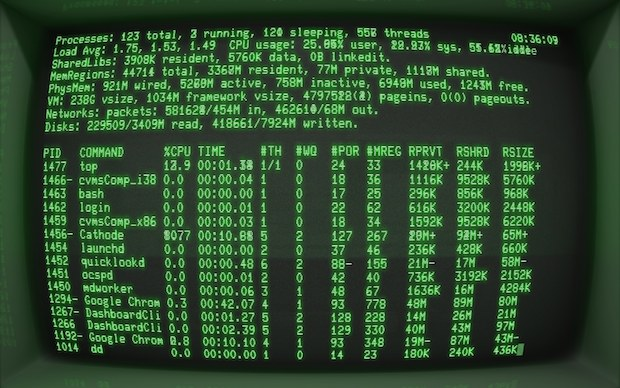
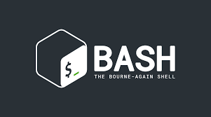

::: {.content-visible unless-format="revealjs"}

<center class='mb-3'>
<a class="h2" href="./slides.html" target="_blank">Open slides in new tab &rarr;</a>
</center>

:::

# Schedule {.smaller .crunch-title .crunch-callout .code-90}

Today's Planned Schedule:

| | Start | End | Topic |
|:- |:- |:- |:- |
| **Lecture** | <span class='sec-start'>3:30pm</span> | 4:00pm | [HW1 Questions and Concerns &rarr;](#hw1-questions-andor-concerns)
| | 7:00pm | 7:30pm | [Motivating Examples: Causal Inference &rarr;](#motivation-ii-causal-inference) |
| | 7:30pm | 7:45pm | [Your First Probabilistic Graphical Model! &rarr;](#your-first-probabilistic-graphical-model)
| **Break!** | 7:45pm | 8:00pm | |
| | 8:00pm | 9:00pm | [PGM "Lab" &rarr;](#hidden-markov-models-(hmms-are-our-ur-pgms))

: {tbl-colwidths="[12,12,12,64]"}

# Course Overview {data-stack-name="Course Overview"}

## Course Webpage {.smaller .crunch-p}

<center style='margin-bottom: 20px;'>

[**`https://jjacobs.me/dsan6000`**](https://jjacobs.me/dsan6000){.boxed-cb target='_blank'}

</center>

Links to these additional resources are in the sidebar:

* [Canvas page](https://georgetown.instructure.com/courses/234516){target='_blank'}
* [Google Space](https://chat.google.com/room/AAQAfu8NheM?cls=1)
* Instructors email: [`dsan6000@georgetown.edu`](mailto:dsan6000@georgetown.edu)

## Jeff Jacobs, [`jj1088@georgetown.edu`](mailto:jj1088@georgetown.edu) {.smaller .title-12 .crunch-ul .crunch-img .crunch-title .ul-block}

::: {style="float: right; padding: 8px;"}

{width="300"}

:::

* Background in Computational Social Science (Comp Sci MS &rarr; Political Economy PhD &rarr; Labor Econ Postdoc)

**Fun (Relevant) Facts**

* Used Prefect (ETL Framework) daily for PhD projects! [(Example)](https://ieeexplore.ieee.org/document/9346539)
* Server admin for lab server &rarr; lab AWS account at Columbia (2015-2023) &rarr; new DSAN server (!) (2025-)
* Passion project 1: [Code for Palestine (2015-2022)](https://www.codedotx.org/code-for-palestine) &rarr; [YouthCode-Gaza (2023)](https://www.codedotx.org/youthcode-gaza) &rarr; [Ukraine Ministry of Digital Transformation (2024)](https://jjacobs.me/data-ethics-cdto/#/title-slide)
* Passion projects 2+3 [🤓]: [web app frameworks](https://dbtskills.io/)
* Sleep disorder means lots of [reading](https://notes.jjacobs.me) -- mainly history! -- at night
* Also teaching *PPOL6805 / DSAN 6750: GIS for Spatial Data Science* this semester

## Instructional Team: Teaching Assistants {.title-08}

:::: {layout="[1,1,1]"}

](images/samyu.jpg){align="center"}

](images/fangzhou.jpg){align="center"}

](images/siru.jpg){align="center"}

::::

## Evaluation

- Group project : 40%
- Assignments : 30%
- Lab completions : 20%
- Quizzes : 10%

## Communication

* The [Google Space](){target='_blank'} is the primary form of communication for **general questions**
* You can email the instructional team with private questions (e.g., about your AWS allocation) at [`dsan6000@georgetown.edu`](mailto:dsan6000@georgetown.edu){target='_blank'}
* (But, consider using the Google Space first: most questions last year were issues faced by multiple students!)

## In-Class Midterm {.crunch-title .crunch-ul}

* The gist: You will be given **specifications** for an app/pipeline/infrastructure (hypothetical, but based on real-world!): goals, budgets, etc.
* Your job will be to use what you've learned in weeks 1-6 to **write out the implementation details** of how you would meet these specifications
* Will make more sense by end of lecture today with **X.com** example

# What Makes Data "Big"? Why Do We Need "The Cloud"? {data-stack-name="Big Data"}

## $\text{Revenue} = f(\text{Tracking}, \text{Analytics})$ {.title-11 .smaller}

*(See [TheMarkup.org's Blacklight Tool](https://themarkup.org/blacklight/2020/09/22/how-we-built-a-real-time-privacy-inspector#survey) or [OpenTelemetry](https://opentelemetry.io/docs/what-is-opentelemetry/) for more examples)*

```{=html}
<table>
<colgroup>
<col style='width: 16%;'>
<col style='width: 24%;'>
<col style='width: 8%;'>
<col style='width: 28%;'>
<col style='width: 8%;'>
<col style='width: 24%;'>
</colgroup>
<thead>
<tr>
  <th class='tdvc'>Tracking Level</th>
  <th class='tdvc'>Example Transaction</th>
  <th class='text-80 tdc tdvc'>&rarr;<br><i>(instant)</i></th>
  <th class='tdvc'>OLTP (Transaction DB)</th>
  <th class='text-80 tdc tdvc'><span data-qmd="$\leadsto$<br>*(nightly)*"></span></th>
  <th>OLAP (Analytics)</th>
</tr>
</thead>
<tbody>
<tr>
  <td class='tdvc'><span data-qmd="***HTTP Requests***"></span></td>
  <td class='tdvc'><span data-qmd="User $i$ visited page $y$ at time $t$"></span></td>
  <td class='tdvc tdc'>&rarr;</td>
  <td class='text-65 tdvc'><div data-qmd="`{'user_id': 123,`<br>`'page': '/login',`<br>`'ts': '20260831_153000'}`"></div></td>
  <td class='tdvc tdc'><span data-qmd="$\leadsto$"></span></td>
  <td class='tdvc text-90'><span data-qmd='*"50% more users on weekends"*'></span></td>
</tr>
<tr>
  <td class='tdvc'><span data-qmd="***Key Logging***"></span></td>
  <td class='tdvc'><span data-qmd="User $i$ typed letter $\ell$ into textbox $y$ at time $t$"></span></td>
  <td class='tdc tdvc'>&rarr;</td>
  <td class='text-65 tdvc'><div data-qmd="`{'user_id': 123,`<br>`'page': '/new-message',`<br>`'focus': 'email-subject',`<br>`'key': '<backspace>',`<br>`'ts': '20260831_153000'}`"></div></td>
  <td class='tdc tdvc'><span data-qmd="$\leadsto$"></span></td>
  <td class='tdvc text-90'><span data-qmd='*"On average, users rewrite 20% of email before send"*'></span></td>
</tr>
<tr>
  <td class='tdvc'><span data-qmd="***Session Recording***"></span></td>
  <td class='tdvc'><span data-qmd="User $i$'s mouse was at $(x,y)$ at time $t$"></span></td>
  <td class='tdc tdvc'>&rarr;</td>
  <td class='text-65 tdvc'><div data-qmd="`{'user_id': 123,`<br>`'page': '/view-post/10',`<br>`'cursor': [100, 350],`<br>`'scroll_pos': '5%'`<br>`'ts': '20260831_153000'}`"></div></td>
  <td class='tdc tdvc'><span data-qmd="$\leadsto$"></span></td>
  <td class='text-90'><span data-qmd='*"Only 30% of users scroll to ad below fold"*'></span></td>
</tr>
</tbody>
</table>
```

## OLTP Demo {.smaller .crunch-title .title-11 .crunch-code-filename}

```{=html}
<style>
.browser {
  color: #e7e9ec;
  margin: 10px;
  border: 2px solid darkgray;
  border-radius: 6px;
  overflow: hidden;
  flex: 1;
  display: flex;
  flex-direction: column;
}
.browser-head {
  background: #1c222b;
  padding: 8px 10px;
  display: flex;
  align-items: center;
  gap: 8px;
}
.browser-head .dots{
  display: flex;
  gap: 5px;
}
.browser-head .dots span{
  width: 8px;
  height: 8px;
  border-radius: 50%;
  background: #3a4150;
}
.browser-head .urlbar{
  flex: 1;
  background: #12161c;
  border-radius: 4px;
  padding: 5px 10px;
  font-size: 11px;
}
.browser-body{
  padding: 16px;
  flex: 1;
  display: flex;
  flex-direction: column;
  gap: 14px;
}
.site-mock{
  background: #1a1f27;
  border: 1px solid #2a313c;
  border-radius: 6px;
  padding: 14px;
}
.site-mock h4{
  margin: 0 0 6px;
  font-size: 16pt;
  color: #f2f3f4;
}
.site-actions{
  display: flex;
  flex-wrap: wrap;
  gap: 10px;
}
.site-actions button{
  padding: 7px 12px;
  border-radius: 4px;
  border: 1px solid #3a4150;
  background: #232a34;
  color: #e7e9ec;
  cursor: pointer;
}
.site-actions button:hover{
  background: #2c3441;
}
.site-actions button:active{
  transform:scale(0.97);
}
.tracker-log{
  flex: 1;
  overflow-y: auto;
  display: flex;
  flex-direction: column;
  gap: 6px;
  padding-right: 5px;
}
.tracker-log .empty {
  color: #5c636e;
  padding-top:6px;
}
.tracker-item {
  font-size: 11px;
  background: #1a1f27;
  border: 1px solid #2a313c;
  border-left: 3px solid #e69f00;
  border-radius:3px;
  padding:7px 9px;
  animation:slideIn .25s ease;
}
.tracker-item .t1 {
  color: #e69f00;
  font-weight: 600;
}
.tracker-item .t2 {
  margin-left: 5px;
}
@keyframes slideIn{
  from{
    opacity: 0; transform: translateY(-4px);
  }
  to{
    opacity: 1; transform: translateY(0);
  }
}
.request-card{
  background: #eef2fe;
  border: 2px solid darkgray;
  border-radius: 6px;
  overflow: hidden;
  opacity: 0;
  transform: translateY(6px);
  animation: none;
}
.request-card.show{
  animation:cardIn .3s ease forwards;
}
@keyframes cardIn{
  to{
    opacity:1;transform:translateY(0);
  }
}
.request-card .req-head{
  background: #1a1f27;
  color:#fff;
  font-size:11px;
  padding:6px 10px;
  display:flex;
  justify-content: space-between;
}
.request-card pre{
  margin: 0;
  padding: 10px;
  font-size: 11px;
  color: #1b2559;
  white-space: pre-wrap;
  word-break: break-word;
}
.payload-list{
  flex: 1;
  /* overflow-y: auto; */
  display: flex;
  flex-direction: column;
  gap: 10px;
  padding-right: 5px;
}
.payload-list .empty{
  color: #4b5158;
  font-size: 12px;
}
.table-wrap{
  flex: 1;
  overflow: auto;
  border: 1px solid darkgray;
  border-radius: 4px;
  margin-left: 0px !important;
}
table.events{
  width: 100%;
  border-collapse: collapse;
  font-size: 12px;
}
table.events thead th{
  position: sticky;
  top: 0;
  background: #f0efe9;
  text-align: left;
  padding: 6px 8px;
  border-bottom: 1px solid lightgray;
  color: #4b5158;
  font-weight:600;
}
table.events tbody td{
  padding: 6px 6px;
  border-bottom: 1px solid #ecece6;
  white-space: nowrap;
  color: #14171a;
  font-size: 11pt;
}
table.events tbody tr.new{
  animation: rowIn .5s ease;
}
@keyframes rowIn{
  from{
    background: #d3f0da;
  }
  to{
    background: transparent;
  }
}
</style>
```

:::: {.columns}
::: {.column width="35%"}

<div style="display: flex; align-items: center; justify-content: center; margin: auto; gap: 10px;"><i class='bi bi-1-circle' style='line-height: 1;'></i> Your Browser <button id="resetDemo">Reset</button></div>

```{=html}
<div class="browser">
  <div class="browser-head">
    <div class="dots"><span></span><span></span><span></span></div>
    <div class="urlbar">shopdemo.example/product/213</div>
  </div>
  <div class="browser-body">
    <div class="site-mock">
      <h4>Rick Owens Teaspoon, $99</h4>
      <div class="site-actions">
        <button data-ev="pageview">Load page</button>
        <button data-ev="scroll">Scroll product photos</button>
        <button data-ev="cookie">Accept cookies</button>
        <button data-ev="addcart">Add to cart</button>
      </div>
    </div>
    <div class="tracker-log" id="trackerLog">
      <div class="empty"></div>
    </div>
  </div>
</div>
```

:::
::: {.column width="30%"}

<div style="display: flex; align-items: center; justify-content: center; margin: auto; gap: 10px;"><i class='bi bi-2-circle' style='line-height: 1;'></i> Network Requests</div>

<div class="payload-list" id="payloadLog">
  <div class="empty"></div>
</div>

:::
::: {.column width="35%"}

<div style="display: flex; align-items: center; justify-content: center; margin: auto; gap: 10px;"><i class='bi bi-3-circle' style='line-height: 1;'></i> OLTP Database</div>

``` {.sql .code-overflow-wrap #transactionLog code-line-numbers="false" filename="Last SQL Command:"}
CREATE TABLE events (
  event_id int PRIMARY KEY,
  event_type varchar(255),
  uid int,
  ts timestamp
);
```

```{=html}
<div class="table-wrap">
  <table class="events">
  <thead>
    <tr>
      <th class='tt'>event_id</th>
      <th class='tt'>event_type</th>
      <th class='tt'>uid</th>
      <th class='tt'>ts</th>
    </tr>
    </thead>
    <tbody id="eventsBody"></tbody>
  </table>
</div>
```

:::
::::

```{=html}
<script>
(function() {
  console.log('oltp demo js')
  const trackerLog = document.getElementById('trackerLog');
  const payloadLog = document.getElementById('payloadLog');
  const eventsBody = document.getElementById('eventsBody');
  const transactionLog = document.getElementById('transactionLog');
  let eventCount = 0;
  let userId = '123'
  const trackerDefs = {
    pageview: { source:'analytics.js', detail:'captures pageview' },
    scroll: { source:'analytics.js', detail:'captures scroll depth' },
    cookie: { source:'consent-manager.js', detail:'writes cookie + syncs ad ID' },
    addcart: { source:'ad-pixel.js', detail:'Sends product id + price to ad network' },
  };
  function clearEmpty(container){
    const empty = container.querySelector('.empty');
    if(empty) empty.remove();
  }
  function fireEvent(evType){
    const def = trackerDefs[evType]
    clearEmpty(trackerLog)
    clearEmpty(payloadLog)
    // 1. Tracker log
    const item = document.createElement('div')
    item.className = 'tracker-item'
    item.innerHTML = `<div class="t1">${def.source}</div><div class="t2">${def.detail}</div>`;
    trackerLog.appendChild(item);
    trackerLog.scrollTop = trackerLog.scrollHeight;
    // 2. Network request
    setTimeout(() => {
      eventCount++;
      const ts = new Date().toISOString().replace('T',' ').slice(0,19).replaceAll('-','');
      const payload = {
        event_type: evType,
        user_id: userId,
        url: "/product/213",
        ts: ts,
        ip: "100.101.102.103",
      };
      const card = document.createElement('div');
      card.className = 'request-card';
      card.innerHTML = `<div class="req-head"><span class='tt'>POST /collect</span><span>${def.source}</span></div><pre>${JSON.stringify(payload, null, 2)}</pre>`;
      payloadLog.appendChild(card);
      requestAnimationFrame(() => card.classList.add('show'));
      payloadLog.scrollTop = payloadLog.scrollHeight;

      // 3. DB insert
      setTimeout(() => {
        const row = document.createElement('tr');
        row.className = 'new';
        const shortId = String(eventCount).padStart(4,'0');
        row.innerHTML = `<td class='tt'>${shortId}</td><td class='tt'>${evType}</td><td class='tt'>${userId}</td><td class='tt'>${ts}</td>`;
        eventsBody.append(row);
        transactionLog.firstChild.firstChild.innerHTML = `<span id="transactionLog-1"<a href="#transactionLog-1" aria-hidden="true" tabindex="-1"></a><span class='kw'>INSERT</span> <span class='kw'>INTO</span> events <span class='kw'>VALUES</span> (\n  ${shortId}, ${evType}, ...\n); <span class='kw'>COMMIT</span>;</span>`;
      }, 180);
    }, 200);
  } // end fireEvent

  // console.log(document.querySelectorAll('.site-actions button'))
  document.querySelectorAll('.site-actions button')
    .forEach((btn) => {
      btn.addEventListener('click', () => {
        fireEvent(btn.dataset.ev);
        console.log('fired: ' + btn.dataset.ev)
      })
    })
  document.getElementById('resetDemo').addEventListener('click', ()=>{
    trackerLog.innerHTML = '<div class="empty"></div>';
    payloadLog.innerHTML = '<div class="empty"></div>';
    eventsBody.innerHTML = '';
    transactionLog.firstChild.firstChild.innerHTML = 'CREATE TABLE events (\n  event_id int PRIMARY KEY,\n  event_type varchar(255),\n  user_id int,\n  ts timestamp\n);';
    eventCount = 0;
    userId = 'u123'
  });
})();
</script>
```

## Apache (web server) log files



## System log files



## Internet of Things (IoT) {.crunch-title .crunch-p .crunch-ul .crunch-img}

**75 billion connected devices generating data:**

:::: {layout="[50,50]" layout-valign="top"}
::: {#iot-text}

* Smart home devices (Alexa, Google Home, Apple HomePod)
* Wearables (Apple Watch, Fitbit, Oura rings)
* Connected vehicles & self-driving cars
* Industrial IoT sensors

:::
::: {#iot-img}

* Smart city infrastructure
* Medical devices & remote patient monitoring


:::
::::

## Smartphone Location Data



## Typical Real-World Scenarios in 2025 {.text-90}

**Scenario 1: Traditional Big Data**

You have a laptop with 16GB of RAM and a 256GB SSD. You are given a 1TB dataset in text files. **What do you do?**

**Scenario 2: AI/ML Pipeline**

Your company wants to build a RAG system using 10TB of internal documents. You need sub-second query response times. **How do you architect this?**

**Scenario 3: Real-Time Analytics**

You need to process 1 million events/second from IoT devices and provide real-time dashboards with <1s latency. **What's your stack?**

## Big Data Definition For This Class(!) {.smaller .title-12}

<div style="border: 1px solid black; padding-left: 12px; padding-right: 12px; padding-top: 6px; margin-bottom: 10px; border-radius: 20px;">

<center class='text-90'>

**Big Data: "When the *size* of the data itself becomes part of the engineering problem"**

</center>

```{=html}
<table>
<thead>
</thead>
<tbody>
<tr>
  <td align="center" rowspan="2" width="15%" style="vertical-align: middle; border-bottom: 0px; border-top: 0px;">Can be <b>processed</b> on single machine?</td>
  <td align="center" width="5%" style="vertical-align: middle; border-right: 2px solid #909090; border-bottom: 0px solid #909090;"><i>No</i></td>
  <td align="center" width="40%" style="vertical-align: middle; border-right: 2px solid #909090; border-top: 2px solid #909090; background-color: #FF991C90;"><span data-qmd="**Medium**<br>(*Parallel Processing*)"></span></td>
  <td align="center" width="40%" style="background-color: #FF991C90; vertical-align: middle; border-top: 2px solid #909090; border-right: 2px solid #909090;"><span data-qmd="[Big!]{.honk-honk}<br>Parallel + Distributed Processing"></span></td>
</tr>
<tr>
  <td align="center" style="vertical-align: middle; border-right: 2px solid #909090; border-bottom: 0px solid #909090;"><i>Yes</i></td>
  <td align="center" style="vertical-align: middle; border-right: 2px solid #909090;"><span data-qmd="Small<br>(*Your Laptop*)"></span></td>
  <td align="center" style="vertical-align: middle; border-right: 2px solid #909090; background-color: #FF991C90;"><span data-qmd="**Medium**<br>(*Data Streaming*)"></span></td>
</tr>
<tr>
  <td style="border-bottom: 0px;"></td>
  <td style="border-bottom: 0px solid #909090;"></td>
  <td align="center" style="vertical-align: middle; border-bottom: 0px solid #909090; padding-bottom: 0px;"><i>Yes</i></td>
  <td align="center" style="vertical-align: middle; border-bottom: 0px solid #909090; padding-bottom: 0px;"><i>No</i></td>
</tr>
<tr>
  <td style="border-bottom: 0px;"></td>
  <td style="border-bottom: 0px;"></td>
  <td align="center" colspan="2" style="border-bottom: 0px; padding-bottom: 0px;">Can be <b>stored</b> on single machine?</td>
</tr>
</tbody>
</table>
```

</div>

# Big Data in the Age of Generative AI

## The New Data Landscape (2025) {.crunch-ul}

**Training Foundation Models**

* GPT-4: Trained on about 13 trillion tokens
* Llama 3: 15 trillion tokens 
* Google Gemini: Multi-modal training (text, images, video)
* Each iteration requires **petabytes** of curated data

**Data Requirements Have Exploded**

* 2020: BERT trained on 3.3 billion words
* 2023: GPT-4 trained on ~13 trillion tokens
* 2024: Llama 3 trained on 15+ trillion tokens

## Big Data Infrastructure: Data Lakes, Warehouses {.title-09 .text-80}

**Traditional Use Cases:**

* Business intelligence
* Analytics & reporting
* Historical data storage

**Modern AI Use Cases:**

* Training data repositories
* Vector embeddings storage
* RAG (Retrieval-Augmented Generation) context
* Fine-tuning datasets
* Evaluation & benchmark data

## RAG and Context Engineering: The New Data Pipeline {.text-80 .crunch-title .crunch-p}

```{dot}
//| fig-height: 1
digraph G {
  rankdir="LR";
  raw[label="Raw Data"];
  lake[label="Data Lake"];
  proc[label="Processing"];
  vec[label="Vector DB"];
  context[label="LLM Context"];
  raw -> lake -> proc -> vec -> context;
}
```

**Key Components:**

* **Data Lakes** (S3, Azure Data Lake): Store massive unstructured data
* **Data Warehouses** (Snowflake, BigQuery): Structured data for context
* **Vector Databases** (Pinecone, Weaviate, Qdrant): Semantic search
* **Embedding Models**: Convert data to vectors
* **Orchestration** (Airflow, Prefect): Manage the pipeline


## MCP Servers & Agentic AI {.smaller .crunch-title .crunch-ul .crunch-p}

**Model Context Protocol (MCP)**

* Open protocol for connecting AI assistants to data sources
* Standardized way to expose tools and data to LLMs
* Enables "agentic" behavior - AI that can act autonomously

**MCP in Production**

```{dot}
//| fig-height: 1
digraph G {
  rankdir="LR";
  ware[label="Data Warehouse"];
  mcp[label="MCP Server"];
  agent[label="AI Agent"];
  action[label="Action"];
  ware -> mcp -> agent -> action;
}
```

**Examples:**

* AI agents querying Snowflake for real-time analytics
* Autonomous systems updating data lakes based on predictions
* Multi-agent systems coordinating through shared data contexts


## Data Quality for AI {.text-85 .crunch-p .crunch-ul}

*(Why Data Quality Matters More Than Ever)*

**Garbage In, Garbage Out - Amplified:**

* Bad training data → Biased models
* Incorrect RAG data → Hallucinations
* Poor data governance → Compliance issues

**Data Quality Challenges in 2025**

* **Scale**: Validating trillions of tokens
* **Diversity**: Multi-modal, multi-lingual data
* **Velocity**: Real-time data for online learning
* **Veracity**: Detecting AI-generated synthetic data

## Real-World Big Data / AI Examples {.crunch-title .smaller .title-11 .crunch-ul .crunch-p}

**Netflix**

* **Data Scale**: 260+ million subscribers generating 100+ billion events/day
* **AI Use**: Personalization, content recommendations, thumbnail generation
* **Stack**: S3 → Spark → Iceberg → ML models → Real-time serving

**Uber**

* **Data Scale**: 35+ million trips per day, petabytes of location data
* **AI Use**: ETA prediction, surge pricing, driver-rider matching
* **Stack**: Kafka → Spark Streaming → Feature Store → ML Platform

**OpenAI**

* **Data Scale**: Trillions of tokens for training, millions of queries/day
* **AI Use**: GPT models, DALL-E, embeddings
* **Stack**: Distributed training &rarr; Vector DBs &rarr; Inference clusters


## Emerging Trends (2025-2027) {.smaller .crunch-ul .crunch-p}

**Unified Platforms:**

* Data lakes becoming "AI lakes"
* Integrated vector + relational databases
* One-stop shops for data + AI (Databricks, Snowflake Cortex)

**Edge Computing + AI:**

* Processing at the data source
* Federated learning across devices
* 5G enabling real-time edge AI

**Synthetic Data:**

* AI generating training data for AI
* Privacy-preserving synthetic datasets

## What You'll Learn in This Course {.crunch-title .smaller}

*Modern Big Data Stack (2025)*

:::: {layout="[1,1]"}
::: {#bd-stack-left}

**Query Engines:**

* DuckDB - In-process analytical database
* Polars - Lightning-fast DataFrame library  
* Spark - Distributed processing at scale

**Data Warehouses & Lakes:**

* Snowflake - Cloud-native data warehouse
* Athena - Serverless SQL on S3
* Iceberg - Open table format

:::
::: {#bd-stack-right}

**AI/ML Integration:**

* Vector databases for embeddings
* RAG implementation patterns
* Streaming with Spark Structured Streaming

**Orchestration:**

* Airflow for pipeline management
* Serverless with AWS Lambda

:::
::::

## Data Types

* Structured
* Unstructured
* Natural language
* Machine-generated
* Graph-based
* Audio, video, and images
* Streaming


## Big Data vs. Small Data I {.smaller .crunch-title .text-60}

|  | Small Data is usually... | On the other hand, Big Data... |
|---|---|---|
| **Goals** | gathered for a specific goal | may have a goal in mind when it's first started, but things can evolve or take unexpected directions |
| **Location** | in one place, and often in a single computer file | can be in multiple files in multiple servers on computers in different geographic locations |
| **Structure/Contents** | highly structured like an Excel spreadsheet, and it's got rows and columns of data | can be unstructured, it can have many formats in files involved across disciplines, and may link to other resources |
| **Preparation** | prepared by the end user for their own purposes | is often prepared by one group of people, analyzed by a second group of people, and then used by a third group of people, and they may have different purposes, and they may have different disciplines |

: {tbl-colwidths="[20, 40, 40]"}

## Big Data vs. Small Data II {.smaller .crunch-title .text-60}

|  | Small Data is usually... | On the other hand, Big Data... |
|---|---|---|
| **Longevity** | kept for a specific amount of time after the project is over because there's a clear ending point. In the academic world it's maybe five or seven years and then you can throw it away | contains data that must be stored in perpetuity. Many big data projects extend into the past and future |
| **Measurements** | measured with a single protocol using set units and it's usually done at the same time | is collected and measured using many sources, protocols, units, etc |
| **Reproducibility** | be reproduced in their entirety if something goes wrong in the process | replication is seldom feasible |
| **Stakes** | if things go wrong the costs are limited, it's not an enormous problem | can have high costs of failure in terms of money, time and labor |
| **Access** | identified by a location specified in a row/column | unless it is exceptionally well designed, the organization can be inscrutable |
| **Analysis** | analyzed together, all at once | is ordinarily analyzed in incremental steps |

: {tbl-colwidths="[20, 40, 40]"}


## Tools at-a-glance

:::: {.columns}
::: {.column width="50%" .r-fit-text}
### Languages, libraries, and projects
- [Python](https://www.python.org/)
    - [`pandas`](https://pandas.pydata.org/)
    - [`polars`](https://www.pola.rs/)
    - [`PySpark`](https://spark.apache.org/docs/latest/api/python/index.html)
    - [`duckdb`](https://duckdb.org/docs/api/python/overview.html)
    - [`dask`](https://www.dask.org/)
    - [`ray`](https://www.ray.io/)
- [Apache Arrow](https://arrow.apache.org/)
- [Apache Spark](https://spark.apache.org/)
- [SQL](https://en.wikipedia.org/wiki/SQL) 
- [Apache Hadoop](https://hadoop.apache.org/) (briefly)

:::

::: {.column width="50%" .r-fit-text}

### Cloud Services 

- Amazon Web Services (AWS)
  - [AWS Sagemaker](https://aws.amazon.com/pm/sagemaker/)
  - [Amazon S3](https://aws.amazon.com/s3/)
- Azure
  - [Azure Blob](https://azure.microsoft.com/en-us/products/storage/blobs/)
  - [Azure Machine Learning](https://azure.microsoft.com/en-us/products/machine-learning/)

Other:

- [AWS Elastic MapReduce (EMR)](https://aws.amazon.com/emr/)
  
:::
:::: 

# Data Engineering {data-stack-name="Data Engineering"}

## Data Scientist vs. Data Engineer {.smaller}

In this course, you'll **augment** your data scientist skills with data engineering skills!

<center>

{width="60%"}

</center>

## Data Engineer Responsibilities

<center>



</center>


## Data Engineering: Levels 2 and 3

<center>



</center>

# Time for Lab! Linux Command Line {data-stack-name="Linux Lab"}

## The Terminal {.crunch-title .text-90}

:::: {layout="[1,1]" layout-valign="center"}
::: {#terminal-text}

- Terminal access was **THE ONLY** way to do programming
- No GUIs! No Spyder, Jupyter, RStudio, etc.
- Coding is still more powerful than graphical interfaces for complex jobs
- Coding makes work repeatable

:::
::: {#terminal-img}



:::
::::

## BASH {.crunch-title}

:::: {layout="[60,40]" layout-valign="center"}
::: {#bash-text}

* Created in 1989 by Brian Fox: "**B**ourne-**A**gain **Sh**ell"
* Brian Fox also built the first online interactive banking software
* BASH is a command processor
* Connection between you and the machine language and hardware

:::
::: {#bash-img}



:::
::::

## The Prompt

``` {.bash code-line-numbers="false"}
username@hostname:current_directory $
```

What do we learn from the prompt?

- Who you are - **`username`**
- The machine where your code is running - **`hostname`**
- The directory where your code is running - **`current_directory`**
- The shell type - **`$`** - this symbol means BA$H

## Syntax {.smaller .crunch-title .crunch-p .crunch-li-7}

``` {.bash code-line-numbers="false"}
COMMAND -F --FLAG
```

* `COMMAND` is the program, everything after that = arguments
* `F` is a single letter flag, `FLAG` is a single word or words connected by dashes. A space breaks things into a new argument.
* Sometimes argument has single letter and long form versions (e.g. `F` and `FLAG`)

```{.bash code-line-numbers="false"}
COMMAND -F --FILE file1
```

* Here we pass a text argument `"file1"` as the **value** for the `FILE` flag
* **`-h`** flag is usually to get help. You can also run the **`man`** command and pass the name of the program as the argument to get the help page.

Let's try basic commands:

- **`date`** to get the current date
- **`whoami`** to get your user name
- **`echo "Hello World"`** to print to the console

## Examining Files {.crunch-title .text-85 .crunch-ul .crunch-li-8}

* Find out your **P**resent **W**orking **D**irectory **`pwd`**
* Examine the contents of files and folders using **`ls`**
* Make new files from scratch using **`touch`**
* **Glob**: "Mini-language" for selecting files with wildcards
  - **`\*`** for wild card any number of characters
  - **`\?`** for wild card for a single character
  - **`[]`** for one of many character options
  - **`!`** for exclusion
  - **`[:alpha:]`**, **`[:alnum:]`**, **`[:digit:]`**, **`[:lower:]`**, **`[:upper:]`**

[Reference material: Shell Lesson 1,2,4,5](https://linuxjourney.com/lesson/the-shell)

## Navigating Directories {.crunch-title .text-80 .crunch-ul .crunch-p .crunch-li-8}

* Knowing **where your terminal is executing code** ensures you are working with the right inputs/outputs.
* Use `pwd` to determine the Present Working Directory.
* Change to a folder called "git-repo" with `cd git-repo`.
- **`.`** refers to the current directory, such as **`./git-repo`**
- **`..`** can be used to move up one level (**`cd ..`**), and can be combined to move up multiple levels (**`cd ../../my_folder`**)
- **`/`** is the **root** of the filesystem: contains core folders (system, users)
- **`~`** is the **home directory**. Move to folders referenced relative to this path by including it at the start of your path, for example **`~/projects`**.
* To **visualize the structure** of your working directory, use **`tree`**

[Reference link](https://www.freecodecamp.org/news/linux-command-line-bash-tutorial/)

## Interacting with Files {.crunch-title .crunch-ul .text-85 .crunch-p .crunch-li-8}

Now that we know how to navigate through **directories**, we need commands for interacting with **files**...

- **`mv`** to move files from one location to another
  * Can use glob here - `?`, `*`, `[]`, ...
- **`cp`** to copy files instead of moving
  + Can use glob here - `?`, `*`, `[]`, ...
- **`mkdir`** to make a directory
- **`rm`** to remove files
- **`rmdir`** to remove directories
- **`rm -rf`** to blast everything! WARNING!!! DO NOT USE UNLESS YOU KNOW WHAT YOU ARE DOING

## Using BASH for Data Exploration {.crunch-title .crunch-ul .text-90 .crunch-li-8}

- **`head FILENAME`** / **`tail FILENAME`** - glimpsing the first / last few rows of data
- **`more FILENAME`** / **`less FILENAME`** - viewing the data with basic up / (up & down) controls
- **`cat FILENAME`** - print entire file contents into terminal
- **`vim FILENAME`** - open (or edit!) the file in vim editor
- **`grep FILENAME`** - search for lines within a file that match a regex expression
- **`wc FILENAME`** - count the number of lines (**`-l`** flag) or number of words (**`-w`** flag)

[Reference material: Text Lesson 8,9,15,16](https://linuxjourney.com/lesson/stdout-standard-out-redirect)

## Pipes and Arrows

* **`|`** sends the stdout to another command (is the most powerful symbol in BASH!)
* **`>`**  sends stdout to a file and overwrites anything that was there before
* **`>>`** appends the stdout to the end of a file (or starts a new file from scratch if one does not exist yet)
* **`<`** sends stdin into the command on the left

[Reference material: Text Lesson 1,2,3,4,5](https://linuxjourney.com/lesson/stdout-standard-out-redirect)

## Alias and User Files {.crunch-title .text-85}

* `/.bashrc` is where your shell settings are located
* How many processes? **`whoami | xargs ps -u | wc -l`**
* Hard to remember full command! Let's make an **alias**
* General syntax:

  ``` {.bash code-line-numbers="false"}
  alias alias_name="command_to_run"
  ```

* For our case:

  ``` {.bash code-line-numbers="false"}
  alias nproc="whoami | xargs ps -u | wc -l"
  ```

* Now we need to put this alias into the .bashrc

  ``` {.bash code-line-numbers="false"}
  alias nproc="whoami | xargs ps -u | wc -l" >> ~/.bashrc
  ```

* Your commands get saved in **`~/.bash_history`**

## Process Management {.crunch-title .text-90 .crunch-ul .crunch-p .crunch-li-8}

* Use **`ps`** to see your running processes
* Use **`top`** or even better **`htop`** to see all running processes
* Install **htop** via **`sudo yum install htop -y`**
* To kill a broken process: first find the **process ID (PID)**
* Then use **`kill [PID NUM]`** to "ask" the process to terminate. If things get really bad: **`kill -9 [PID NUM]`**
* To kill a command in the terminal window it is running in, try using **Ctrl + C** or **Ctrl + /**
* Run **`cat`** on its own to let it stay open. Now open a new terminal to examine the processes and find the cat process.

[Reference material: Text Lesson 1,2,3,7,9,10](https://linuxjourney.com/lesson/monitor-processes-ps-command)

