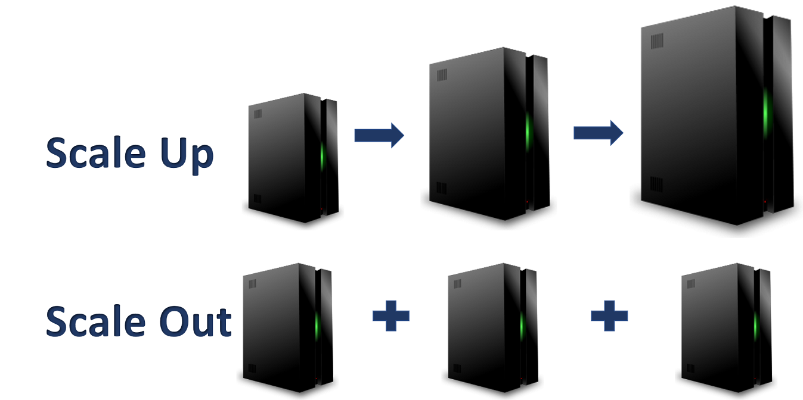

## Benefits

:::: {layout="[1,1]" layout-valign="center"}
::: {#benefits-text}

* Provides access to low-cost computing
* Costs are decreasing every year
* Elastic
* PaaS works!
* Many other benefits...

:::
::: {#benefits-img}

{fig-align="center"}

:::
::::

---

# Further Reading (Rabbitholes!) {data-stack-name="Further Reading"}

## Further Reading: SaaS and Cloud Computing {.smaller .title-11}

**SaaS and Cloud Computing Statistics:**

- [1. Zylo: 111 Unmissable SaaS Statistics for 2025](https://zylo.com/blog/saas-statistics/)
- [2. Spendesk: 60+ eye-opening SaaS statistics (2025)](https://www.spendesk.com/blog/saas-statistics/)
- [3. Substly: The 28 most important SaaS statistics in 2023](https://www.substly.com/en/blog/the-28-most-important-saas-statistics-in-2023)
- [4. Harpa AI: SaaS Industry Key Statistics 2023](https://harpa.ai/blog/saas-industry-key-statistics-2023)
- [5. Content Beta: 110+ SaaS Statistics and Trends](https://www.contentbeta.com/blog/saas-video-statistics/)
- [6. Statista: Average number of SaaS apps used in the U.S. 2024](https://www.statista.com/statistics/1233538/average-number-saas-apps-yearly/)
- [7. Meetanshi: SaaS Statistics for 2025: Market Size, Growth, Trends & More](https://meetanshi.com/blog/saas-statistics/)

## Data Storage and AI Infrastructure {.smaller .title-11}

* **2025 global data volume (181 zettabytes)**
  * [rivery.io](https://rivery.io/blog/big-data-statistics-how-much-data-is-there-in-the-world/)
  * [ExplodingTopics.com](https://explodingtopics.com/blog/data-generated-per-day)
  * [PIT.edu](https://www.pit.edu/news/data-analytics-statistics-and-trends-for-2025/)
  * [Forbes](https://www.forbes.com/councils/forbestechcouncil/2024/03/04/from-5mb-hard-drives-to-180-zettabytes-the-data-migration-challenge/)
* [CommonCrawl and ImageNet dataset sizes](https://www.ibm.com/think/topics/ai-data-center)
* AI inference latency and storage tech:
  * [IBM](https://www.ibm.com/think/topics/ai-data-center)
  * [RCR Wireless](https://www.rcrwireless.com/20250407/fundamentals/ai-optimized-data-center)

## Storage Economics and Technology {.smaller}

* **Storage cost declines**
  * [HumanProgress.org](https://humanprogress.org/trends/vastly-cheaper-computation/)
  * [Our World In Data](https://ourworldindata.org/data-insights/the-price-of-computer-storage-has-fallen-exponentially-since-the-1950s)
* [Ongoing significance of transfer (egress) costs](https://lightedge.com/the-data-explosion-and-hidden-data-storage-costs-in-the-cloud-could-object-storage-be-the-answer/)
* [Edge computing trends](https://mondo.com/insights/evolution-data-storage-tapes-cloud-computing/)

## GPU Infrastructure and AI Training Costs {.smaller .title-11}

* GPT-4 GPU count and training duration
  * [Genspark.ai](https://www.genspark.ai/spark/how-many-gpus-are-needed-to-train-gpt4-o/56c3b449-f206-495f-bc9b-d06812bf4a33)
  * [klu.ai](https://klu.ai/blog/gpt-4-llm)
  * [acorn.io](https://www.acorn.io/resources/learning-center/openai/)
* [Meta's NVIDIA H100 GPUs](https://www.reddit.com/r/singularity/comments/1bi8rme/jensen_huang_just_gave_us_some_numbers_for_the/)
* AI training cost estimates
  * [Genspark.ai](https://www.genspark.ai/spark/how-many-gpus-are-needed-to-train-gpt4-o/56c3b449-f206-495f-bc9b-d06812bf4a33)
  * [acorn.io](https://www.acorn.io/resources/learning-center/openai/)

---

## What Does the Cloud Look Like? Microsoft Azure Data Center {.smaller .title-08}

<center>



</center>

---

## Loudon County, VA: "CLoudon"

* 70% of the world's internet traffic passes through Loudon
* [How data centers power VA's Loudon County](https://gcn.com/articles/2018/10/12/loudoun-county-data-centers.aspx)
* [The heart of "The Cloud" is in Virginia](https://www.cbsnews.com/news/cloud-computing-loudoun-county-virginia/)
* [CBS Sunday Morning Visits the Home of the Internet in Loudoun County](https://biz.loudoun.gov/2017/10/30/cbs-sunday-morning-visits-loudoun/)

---

## Platform as a Service (PaaS) {.smaller}

### What is PaaS?

* **Complete development and deployment environment** in the cloud
* Provider manages: Infrastructure, operating systems, runtime environments
* You manage: Applications and data

**Examples and Use Cases**

* **AWS Elastic Beanstalk**, Google App Engine, Microsoft Azure App Service
* **Perfect for:** Web applications, API development, microservices
* **Benefits:** Faster development, automatic scaling, integrated DevOps

``` {.bash code-line-numbers="false"}
# Deploy your app with minimal configuration
git push heroku main  # App automatically deployed and scaled
```

## Software as a Service (SaaS) {.smaller}

* **Complete applications** delivered over the internet
* Provider manages: Everything (infrastructure, platform, software)
* You manage: Your data and user access

**Examples and Use Cases**

* **Gmail**, Salesforce, Microsoft 365, Slack, Zoom
* **Perfect for:** Business applications, collaboration tools, CRM
* **Benefits:** No installation, automatic updates, accessible anywhere

**The SaaS Revolution**

* 80% of companies use SaaS applications
* $195 billion market size (2023)

## Cloud Infrastructure and the AI Revolution {.smaller}

* **Massive Computational Requirements**
  * Training large language models requires thousands of GPUs
  * Cloud provides elastic access to specialized hardware
  
* **Data Storage and Processing**
  * AI models need petabytes of training data
  * Cloud offers unlimited, globally distributed storage

* **Cost Efficiency**
  * Pay-per-use model for expensive AI hardware
  * No upfront investment in GPU clusters

---

## Distributed Computing and Large Clusters {.smaller .title-11 .crunch-ul}

**Modern AI Requires Massive Clusters**

* **Model parallelism**: Split models across multiple GPUs
* **Data parallelism**: Process different data batches simultaneously  
* **Pipeline parallelism**: Different layers on different GPUs

**Technologies Enabling Scale**

* **Kubernetes**: Container orchestration for microservices
* **Apache Spark**: Distributed data processing framework
* **Ray**: Distributed AI/ML framework for Python

``` {.python}
# Distributed training with Ray
import ray
from ray import tune
# Scale across 1000+ machines automatically
tune.run(train_model, resources_per_trial={"gpu": 8})
```

---

## Data Storage Evolution {.smaller .crunch-title .crunch-p .text-65}

**The Data Tsunami**

* **2025 projection**: 181 zettabytes of data globally
* **AI training datasets**: CommonCrawl (800TB), ImageNet (150GB)
* **Real-time requirements**: 1-10ms latency for inference (some cases sub-millisecond)

**Storage Technologies**

* **Object Storage**: Amazon S3, Google Cloud Storage (petabyte scale)
* **High-performance**: NVMe SSDs, persistent memory
* **Distributed filesystems**: HDFS, GlusterFS, Ceph

**The Economics of Data**

* **Storage costs**: Dropped 99.9% since 1980
* **Transfer costs**: Still significant for large datasets
* **Edge computing**: Bringing compute closer to data sources

---

## Evolution of the Cloud {.smaller}

| Yesterday | Today | Tomorrow |
|---|---|---|
| Limited number of tools and vendors | Many tools and vendors to work with | Integrated tools and vendors |
| One platform - few devices | Multiple platforms - many devices | Connected platforms and devices |
| Data is scarce but manageable | Overabundance of data | Data is used for important business decisions |
| IT has major influence and control | IT has limited influence and control | IT is strategic to the business |
| People only work when they are at work | People work wherever they want | People have access to what they need wherever they are |

---

## GPU Infrastructure: The AI Powerhouse {.smaller .title-11}

**From Gaming to AI**

* **Originally**: Graphics processing for video games
* **Now**: Parallel processing powerhouse for AI/ML workloads
* **Architecture**: Thousands of cores vs. CPUs 8-64 cores

**Cloud GPU Offerings**

```bash
# AWS GPU instances for different AI workloads
p4d.24xlarge   # 8x NVIDIA A100 (40GB) - $32/hour
p3.16xlarge    # 8x NVIDIA V100 (16GB) - $24/hour
g4dn.xlarge    # 1x NVIDIA T4 (16GB)   - $0.50/hour
```

**The Scale Challenge**

* **GPT-4 training**: Estimated 25,000 A100 GPUs for 6 months
* **Meta's AI infrastructure**: 350,000+ NVIDIA H100 chips
* **Cost**: Single AI training run can cost $100M+

