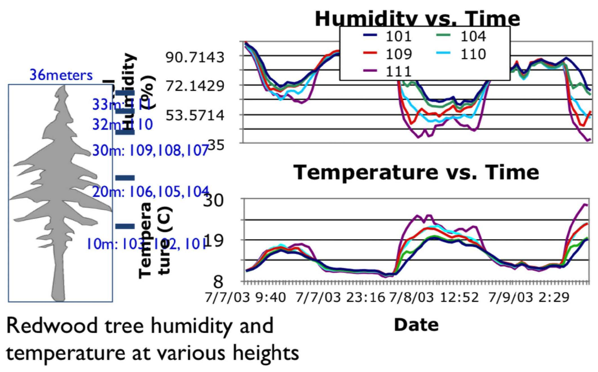
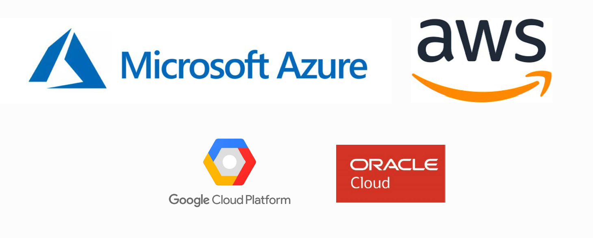
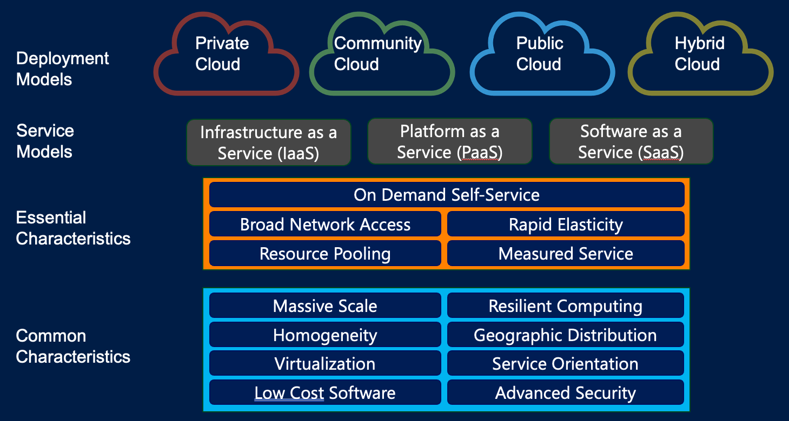
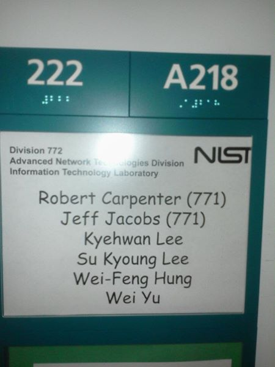
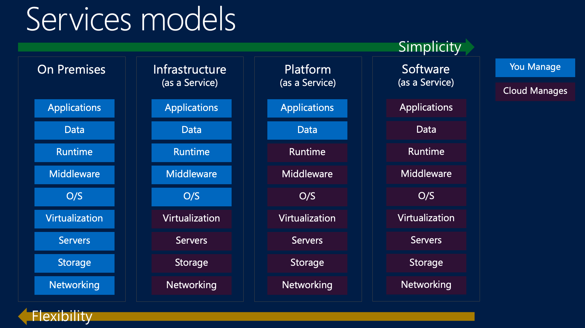
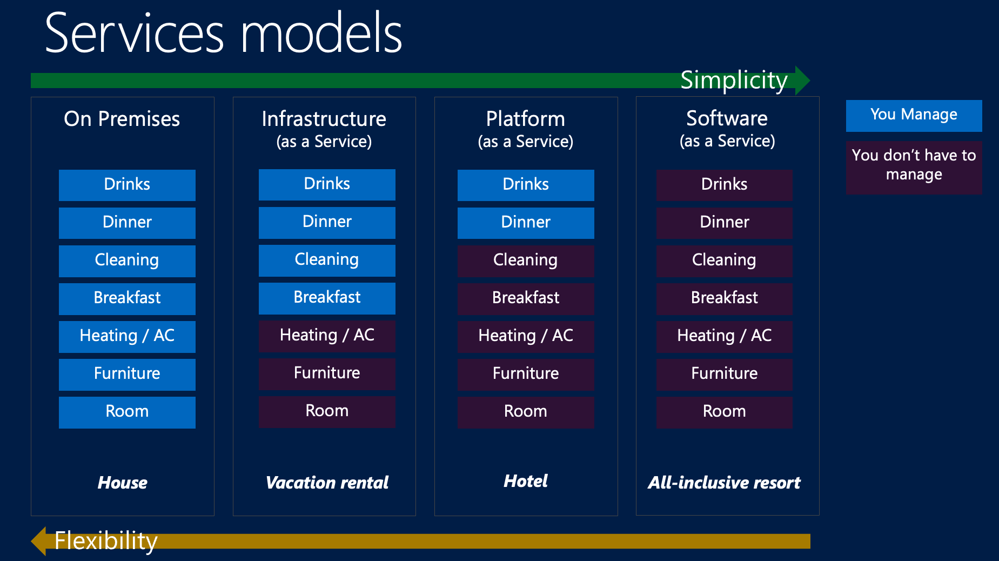

::: {.content-visible unless-format="revealjs"}

<center class='mb-3'>
<a class="h2" href="./slides.html" target="_blank">Open slides in new tab &rarr;</a>
</center>

:::

# What Makes Data "Big"? Why Do We Need A "Cloud"? {data-stack-name="Why Big Data?"}

## Internet of Things (IoT) {.crunch-title .crunch-p .crunch-ul .crunch-img}

*Nearly 100 billion devices generating data:*

:::: {layout="[50,50]" layout-valign="top"}
::: {#iot-text}

* Smart home devices (Alexa, Google Home, Apple HomePod)
* Wearables (Apple Watch, Fitbit, Oura rings)
* Vehicles (not just self-driving cars!)
* Industrial sensors

:::
::: {#iot-img}

* Smart city infrastructure
* Medical devices, remote patient monitoring

{width="800"}

:::
::::

::: {.aside}

Slide Author: Amit Arora!

:::

## Smartphone Location Data {.crunch-title}

<center>

{width="600"}

</center>

::: {.aside}

Slide Author: Amit Arora!

:::

## Real-World Examples {.crunch-title .smaller .title-11 .crunch-ul .crunch-p}

**Netflix**

* *Scale*: 260+ million subscribers generating 100+ billion events/day
* *AI Use*: Personalization, content recommendations, thumbnail generation
* *Stack*: S3 → Spark → Iceberg → ML models → Real-time serving

**Uber**

* *Scale*: 35+ million trips per day, petabytes of location data
* *AI Use*: ETA prediction, surge pricing, driver-rider matching
* *Stack*: Kafka → Spark Streaming → Feature Store → ML Platform

**OpenAI**

* *Scale*: Trillions of tokens for training, millions of queries/day
* *AI Use*: GPT models, DALL-E, embeddings
* *Stack*: Distributed training &rarr; Vector DBs &rarr; Inference clusters

::: {.aside}

Slide Author: Amit Arora!

:::

## Data Architecture / Infrastructure Demo {.smaller .title-08}

<center>
***How would you make X, the Former Bird App, scale to a billion users!?!***
</center>

{align="center"}

<center>

[[**"Back of the envelope" calculation demo**](https://observablehq.com/@jpowerj/scaling-bird-app)]{.boxed-cb}

</center>

# "The Cloud" = Renting Computers from a Big Company {data-stack-name="The Cloud: AWS"}

*(...That's it, that's the whole definition)*

## Our Toolbox From Now Until December 😎 {.smaller .crunch-title .title-11}

:::: {.columns}
::: {.column width="50%"}

<div style='border: 2px solid black; padding-left: 10px; padding-right: 10px; padding-bottom: 8px; padding-top: 6px; border-radius: 20px;'>

<center><div>**Big Data Handling**</div></center>
<center><div style='font-size: 70%;'>*You **could** technically run all these on your laptop!*</div></center>
<center><div style='font-size: 70%;'>*...But in this class they'll run **on remote EC2***</div></center>

<hr />

- [Python](https://www.python.org/)
    - [`pandas`](https://pandas.pydata.org/)
    - [`duckdb`](https://duckdb.org/docs/api/python/overview.html)
    - [`polars`](https://www.pola.rs/)
    - [`pyspark`](https://spark.apache.org/docs/latest/api/python/index.html)
    * [`prefect`](https://www.prefect.io/)
- [Apache Arrow](https://arrow.apache.org/)
- [Apache Hadoop](https://hadoop.apache.org/) $\leadsto$ [Apache Spark](https://spark.apache.org/)

</div>

:::

::: {.column width="50%"}

<div style='border: 2px solid black; padding-left: 10px; padding-right: 10px; padding-top: 6px; margin-bottom: 8px; border-radius: 20px;'>

<center><div>**Cloud Services**</div></center>
<center><div style='font-size: 70%;'>*These run on [some Amazon server](https://docs.aws.amazon.com/global-infrastructure/latest/regions/aws-availability-zones.html#zones-north-america) near<br>[Dulles Airport](https://www.datacentermap.com/c/amazon-aws/datacenters/) or [Frederick, MD](https://www.wmar2news.com/news/local-news/frederickcounty/maryland-approves-amazons-air-quality-permit-to-build-frederick-data-center)*</div></center>

<hr />

- Virtual Machines: [EC2](https://aws.amazon.com/ec2/)
- Object Storage: [S3](https://aws.amazon.com/s3/)
- Elastic Map-Reduce: [EMR](https://aws.amazon.com/emr/)

</div>

<div style='border: 2px solid black; padding-left: 10px; padding-right: 10px; padding-top: 6px; border-radius: 20px;'>

<center><div>**IDEs**</div></center>
<center><div style='font-size: 70%;'>*These **should** be run on your laptop*</div></center>
<center><div style='font-size: 70%;'>*...But just to **connect to EC2** (edit/run remote files)!*</div></center>

<hr />

* [VSCode](https://code.visualstudio.com/)
* [Positron](https://positron.posit.co/)

</div>
  
:::
::::

# So You've Hit A Data-Related Wall... What Now? {data-stack-name="[Thing]-as-a-Service" .smaller .title-12}

<div style="border: 1px solid black; padding-left: 12px; padding-right: 12px; padding-top: 6px; margin-bottom: 10px; border-radius: 20px;">

<center class='text-90'>

**Big Data: "When the *size* of the data itself becomes part of the engineering problem"**

</center>

```{=html}
<table>
<thead>
</thead>
<tbody>
<tr>
  <td align="center" rowspan="2" width="15%" style="vertical-align: middle; border-bottom: 0px; border-top: 0px;">Can be <b>processed</b> on single machine?</td>
  <td align="center" width="5%" style="vertical-align: middle; border-right: 2px solid #909090; border-bottom: 0px solid #909090;"><i>No</i></td>
  <td align="center" width="40%" style="vertical-align: middle; border-right: 2px solid #909090; border-top: 2px solid #909090; background-color: #FF991C90;"><span data-qmd="**Medium**<br>(*Parallel Processing*)"></span></td>
  <td align="center" width="40%" style="background-color: #FF991C90; vertical-align: middle; border-top: 2px solid #909090; border-right: 2px solid #909090;"><span data-qmd="[Big!]{.honk-honk}<br>Parallel + Distributed Processing"></span></td>
</tr>
<tr>
  <td align="center" style="vertical-align: middle; border-right: 2px solid #909090; border-bottom: 0px solid #909090;"><i>Yes</i></td>
  <td align="center" style="vertical-align: middle; border-right: 2px solid #909090;"><span data-qmd="Small<br>(*Your Laptop*)"></span></td>
  <td align="center" style="vertical-align: middle; border-right: 2px solid #909090; background-color: #FF991C90;"><span data-qmd="**Medium**<br>(*Data Streaming*)"></span></td>
</tr>
<tr>
  <td style="border-bottom: 0px;"></td>
  <td style="border-bottom: 0px solid #909090;"></td>
  <td align="center" style="vertical-align: middle; border-bottom: 0px solid #909090; padding-bottom: 0px;"><i>Yes</i></td>
  <td align="center" style="vertical-align: middle; border-bottom: 0px solid #909090; padding-bottom: 0px;"><i>No</i></td>
</tr>
<tr>
  <td style="border-bottom: 0px;"></td>
  <td style="border-bottom: 0px;"></td>
  <td align="center" colspan="2" style="border-bottom: 0px; padding-bottom: 0px;">Can be <b>stored</b> on single machine?</td>
</tr>
</tbody>
</table>
```

</div>

## Jeff's Favorite "Big Data" Definition {.title-09}

&nbsp;<br>

> *Big data is when **the size of the data itself** becomes **part of the problem*** [@loukides_what_2010]

* In other words: Your problem becomes a "big data problem" when you **hit one or both of the walls!**

## You vs. Your Opps {.smaller}

<center>



</center>

## So You Find Yourself Smashed Against A Wall... {.smaller .title-10 .crunch-title}

*(Some of yall would fold in this scenario)*

{fig-align="center"}

## The "Pre-Cloud" Approach: Make The One Computer Faster and Faster {.smaller .title-10}

<center>



</center>

## It Worked For... Many Decades!

{fig-align="center"}

## Is Moore's Law Dead? {.crunch-title .crunch-p}

*...Kind of?*

* Focus nowadays: **specialized hardware / compute architectures** hyper-optimized for **particular tasks**
  * [If you took DSAN 5500] Think of **BLAS**
* Graphic Processing Units (GPUs)
* Google's **Tensor Processing Units (TPUs)**

## Even Upgrading Our Hardware Didn't Help 😭 *Now* What Do We Do? {.title-08 .crunch-title .crunch-p-top .text-90}

*...We* [distribute!]{.honk-honk .text-150} (**Horizontal** Scaling)

```{=html}
<table>
<colgroup>
<col style="width: 18%;">
<col style="width: 38%;">
<col style="width: 44%;">
</colgroup>
<thead>
<tr>
  <th></th>
  <th class='tdc'><div data-qmd="Vertical Scaling<br><i class='bi bi-pc-display-horizontal text-60'></i> &rarr; <i class='bi bi-pc-display-horizontal'></i>"></div></th>
  <th class='tdc'><div data-qmd="Horizontal Scaling<br><div style='display: flex; flex-direction: row; justify-content: center; line-height: 1; gap: 10px;'><i class='bi bi-pc-display-horizontal' style='line-height: 1 !important;'></i> &rarr; </img></div>"></div></th>
</tr>
</thead>
<tbody>
<tr>
  <td><span data-qmd="**Processing Power**"></span></td>
  <td>Fancier CPU (faster/more cores)</td>
  <td><span data-qmd="More computers $\implies$ More CPUs"></span></td>
</tr>
<tr>
  <td><span data-qmd="**Memory**"></span></td>
  <td>Install more RAM</td>
  <td><span data-qmd="More computers $\implies$ More RAM"></span></td>
</tr>
<tr>
  <td><span data-qmd="**Storage**"></span></td>
  <td>Bigger hard drive</td>
  <td><span data-qmd="More computers $\implies$ More hard drive space"></span></td>
</tr>
</tbody>
</table>
```

## My Favorite Example Ever {.smaller}

* Spongebob is cooking Krabby Patties too slowly to satisfy ravenous customers...
* Should he **upgrade his one spatula?** How bout just **many simple spatulas at once!**

<center>



</center>

## How Do We Achieve This? ...That's Exactly What *The Cloud* is For! {.smaller .title-12}

{fig-align="center"}

## "The Cloud": NIST Definition {.crunch-title .smaller .title-12 .crunch-quarto-layout-panel .crunch-img .crunch-p}

:::: {layout="[96,4]"}
::: {#nist-img}

{fig-align="center"}

:::
::: {#nist-card}

{width="30"} {width="30"}

:::
::::

## Simplicity vs. Flexibility {.smaller .crunch-title}

{fig-align="center"}

## Hotel Analogy {.smaller .crunch-title}

{fig-align="center"}

## Infrastructure as a Service (IaaS) {.smaller}

* **Virtualized computing resources** delivered over the internet
* Provider manages: Physical hardware, virtualization, networking, storage
* You manage: Operating systems, applications, runtime, data, middleware

**Examples and Use Cases**

* **Amazon EC2**, Microsoft Azure VMs, Google Compute Engine
* **Perfect for:** Development environments, web hosting, backup & recovery
* **Benefits:** Rapid scaling, pay-as-you-go, global availability

``` {.bash code-line-numbers="false"}
# Launch a virtual machine in seconds
aws ec2 run-instances --image-id ami-12345 --instance-type t3.large
```

::: {.aside}

Slide credit: Amit Arora

:::

## Software as a Service (SaaS) {.smaller}

* **Complete applications** delivered over the internet
* Provider manages: Everything (infrastructure, platform, software)
* You manage: Your data and user access

**Examples and Use Cases**

* **Gmail**, Salesforce, Microsoft 365, Zoom
* **Perfect for:** Business applications, collaboration tools, CRM
* **Benefits:** No installation, automatic updates, accessible anywhere
* 80% of companies use SaaS applications

::: {.aside}

Slide credit: Amit Arora

:::

# HW2: EC2 🤝 S3 {data-stack-name="AWS Lab"}

[Click to Start HW2!](https://gu-dsan.github.io/6000-fall-2025/labs/02-labs.html)

## References

::: {#refs}
:::