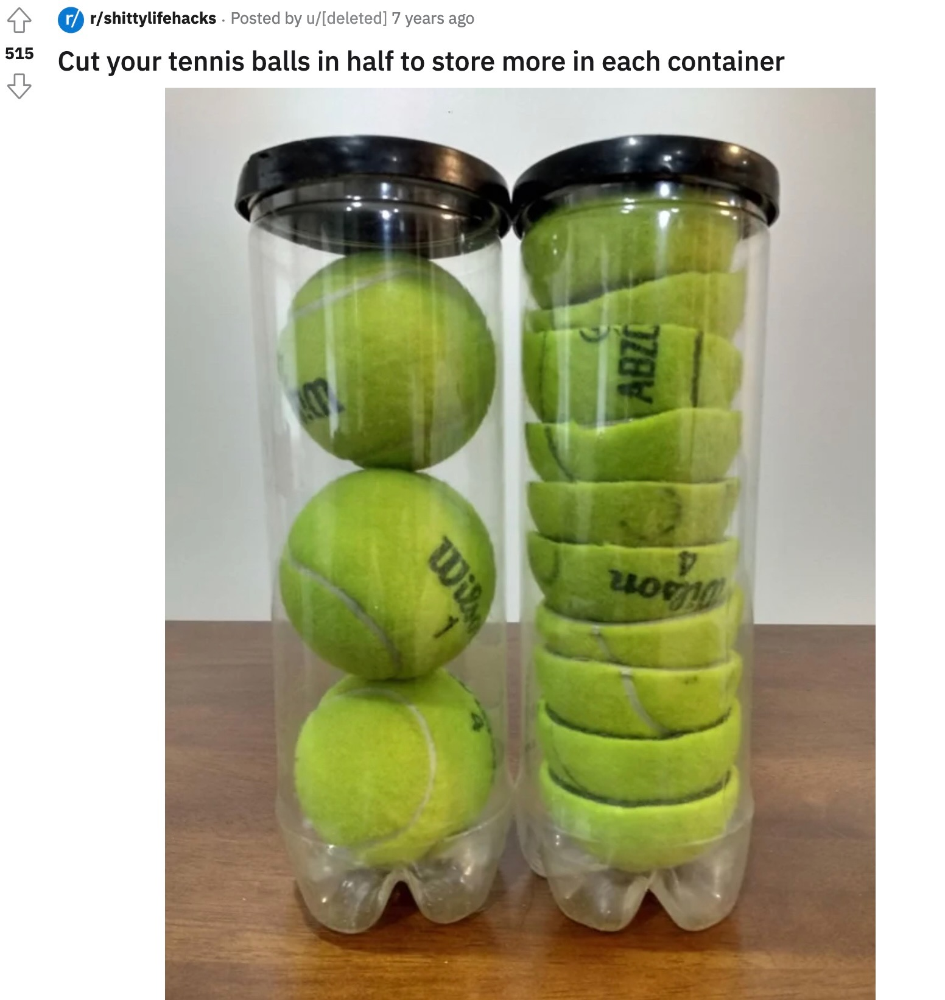
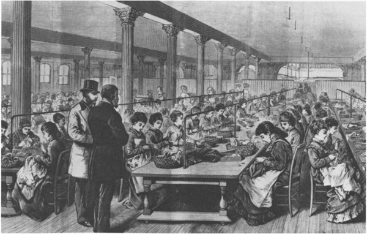
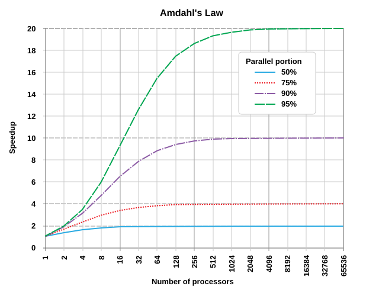

::: {.content-visible unless-format="revealjs"}

<center class='mb-3'>
<a class="h2" href="./slides.html" target="_blank">Open slides in new tab &rarr;</a>
</center>

:::

# Parallelization in General {.smaller .title-13 data-stack-name="Parallel Overview"}

:::: {#fig-kentaro}



DJ Kentaro = The Scheduler, Spinning records = Processes
::::

## Quick Survey Question, for Intuition-Building

* Is the human sensorimotor system capable of **"true" multitasking**?
* As in, doing two things at the **exact same time?**
* *(...Or, do we instead have to **rapidly switch back and forth** between tasks?)*

## The Answer {.smaller .crunch-title .crunch-ul}

* The human brain is [mostly] **not** capable of true multitasking (*[rare exceptions](https://medicine.georgetown.edu/news-releases/georgetown-researchers-show-how-brain-rewires-itself-to-enable-true-multitasking/)*)
* In CS terms, true multitasking is called **multiprocessing** (more on this later)
* We **are** capable, however, of *other* modes of **concurrency**:

```{=html}
<table>
<colgroup>
<col style="width: 25%;">
<col style="width: 35%;">
<col style="width: 40%;">
</colgroup>
<thead>
<tr>
  <th></th>
  <th>Multithreading</th>
  <th>Asynchronous Execution</th>
</tr>
</thead>
<tbody>
<tr>
  <td><span data-qmd='**Unconsciously**<br>(you do it already, "naturally")'></span></td>
  <td><span data-qmd="Focus on **one** speaker within a loud room, many other sounds entering your ears"></span></td>
  <td><span data-qmd="Put food in oven, set alarm, go do something else, take out of oven once alarm goes off"></span></td>
</tr>
<tr>
  <td><span data-qmd="**Consciously**<br>(you can do it with effort/practice)"></span></td>
  <td><span data-qmd='Pat head (up and down) and rub stomach (circular motion) "simultaneously"'></span></td>
  <td class='tdvc'>Throw a ball in the air, clap 3 times, catch ball</td>
</tr>
<tr>
  <td><span data-qmd="**From Observer's Perspective?**"></span></td>
  <td class='tdvc'><span data-qmd='*Looks like* multiprocessing'></span></td>
  <td class='tdvc'>Doesn't look like multiprocessing</td>
</tr>
</tbody>
</table>
```

## Helpful *Specifically* for Programming {.title-09 .crunch-title .crunch-ul}

* Course notes from MIT's [class on parallel computing](https://book.sciml.ai/) phrases it like: if implemented thoughtfully, concurrency is a **power multiplier** for your code (do 10 things in 1 second instead of 10 seconds)

{fig-align="center"}

## Helpful *In General* as a Way of Thinking! {.crunch-title .crunch-ul .title-08}

* Say you get hired as a Project Manager...
* Part of your job will fundamentally involve **pipelines!**
  * Need to know when Task $B$ does/does not require Task $A$ as a prerequisite
  * Need to know whether Task $A$ and Task $B$ can **share one resource** or **need their own individual resources**
  * Once Task $A$ and $B$ both complete, how do we **merge** their results together?

## Avoiding the Rabbithole {.fix-ol}

Parallel computing is a **rabbithole**, but one you can safely avoid via simple heuristics ("rules of thumb"):

1. Check for optimizations to serial code first (vectorization, memoization),
2. Check for **embarrassingly parallel** code blocks
3. Use **map-reduce** approach for more complicated cases
4. Still hitting a wall? Try **horizontal scaling**

...Horizontally-scaled map-reduce, you say? Why, that's **exactly what Hadoop / Spark do for us!**

## "Embarrassingly Parallel" Pipelines {.smaller .crunch-title .crunch-ul .crunch-callout-half .fix-video}

::: {.callout-tip title="Embarrassingly Parallel"}

A problem is *embarrassingly parallel* when it can be divided into $N$ subtasks without any **temporal dependence** or **need for communication** between the tasks

:::

:::: {.columns}
::: {.column width="55%"}

<center>



</center>

:::
::: {.column width="45%"}

<span class='info-badge'>**Temporal Dependence:**</span>

Does spongebob have to **wait for one krabby patty to finish cooking** before **starting to cook a second one?**

<span class='info-badge'>**Between-Process Communication:**</span>

Does the cooking of one patty **require some piece of another partially-cooked patty**?

:::
::::

## Naïvely "Chopping" Non-Embarrassingly-Parallel Problems {.smaller .title-08 .crunch-title .crunch-title .crunch-callout .crunch-p .crunch-ul}

:::: {.columns}
::: {.column width="55%"}

* Not all data-processing pipelines are embarrassingly-parallel!
* May still be hope via **map-reduce** approach
* We'll use the following terminology:

::: {.callout-tip title="Non-Embarrassingly-Parallel Problems"}

If a data-processing problem is *not* embarrassingly-parallel, then the **tasks** that need to be performed may be:

* **Loosely-coupled**: Can be **mapped** to embarrassingly-parallel pieces, solved separately by non-communicating processors, then **merged**
* **Tightly-coupled**: Can be **mapped** to sub-tasks, solved separately by *communicating* processors, then **merged**
* **Non-parallelizable**: ["$\text{P}$-complete" problems](https://en.wikipedia.org/wiki/P-complete#P-complete_problems) **proven** to have no efficient parallelization unless $\text{P} = \text{NP}$

:::

:::
::: {.column width="45%"}

{fig-align="center"}

:::
::::

## Buzzkill: Complications to Come 😰 {.smaller .crunch-title .crunch-ul .title-09 .crunch-li-8 .fix-ol}

If it's such a magical powerup, why not **parallelize *everything?*** A: **Overhead costs** 😞

```{=html}
<table>
<colgroup>
<col style="width: 43%;">
<col style="width: 19%;">
<col style="width: 19%;">
<col style="width: 19%;">
</colgroup>
<thead>
<tr>
  <th></th>
  <th class='tdc'>Embarrassingly Parallel</th>
  <th class='tdc'>Loosely Coupled</th>
  <th class='tdc'>Tightly Coupled</th>
</tr>
</thead>
<tbody>
<tr>
  <td><span data-qmd="<i class='bi bi-1-circle'></i> **Sending** tasks to workers"></span></td>
  <td class='tdc tdvc'>⏱️</td>
  <td class='tdc tdvc'>⏱️</td>
  <td class='tdc tdvc'>⏱️</td>
</tr>
<tr>
  <td><span data-qmd="<i class='bi bi-2-circle'></i> Facilitating **communication** between workers"></span></td>
  <td class='tdc tdvc'></td>
  <td class='tdc tdvc'></td>
  <td class='tdc tdvc'>⏱️</td>
</tr>
<tr>
  <td><span data-qmd="<i class='bi bi-3-circle'></i> **Collecting** results from workers"></span></td>
  <td class='tdc tdvc'></td>
  <td class='tdc tdvc'>⏱️</td>
  <td class='tdc tdvc'>⏱️</td>
</tr>
<tr>
  <td><span data-qmd="<i class='bi bi-4-circle'></i> **Merging** collected results"></span></td>
  <td class='tdc tdvc'></td>
  <td class='tdc tdvc'>⏱️</td>
  <td class='tdc tdvc'>⏱️</td>
</tr>
</tbody>
</table>
```

* Map-reduce (underlying Hadoop / Spark) focuses on **loosely-coupled** problems (may be *overkill* for embarrassingly-parallel: can just use `multiprocessing` or `joblib`)
* Earlier famous parallelization library was created for **tightly-coupled** problems: [**Message Passing Interface**](https://en.wikipedia.org/wiki/Message_Passing_Interface){target='_blank'} (C, C++, and Fortran)

## In Action {.crunch-title .crunch-details .title-09 .crunch-p .crunch-img .crunch-quarto-figure}

[{fig-align="center" style="line-height: 0;"}](https://colab.research.google.com/drive/1DydNTIMPCnu0MCday-x7cRr7EXCirQGU?usp=drive_link){.noicon target='_blank'}

```{python}
#| echo: true
#| code-fold: false
#| cache: true
import time
from sympy.ntheory import factorint
from joblib import Parallel, delayed
parallel_runner = Parallel(n_jobs=4)
start, end = 500, 650
def find_prime_factors(num):
  time.sleep(.01)
  return factorint(num, multiple=True)
disp_time = lambda start, end: print('{:.4f} s'.format(end - start))
```

::: {.columns}
::: {.column width="50%"}

```{python}
#| echo: true
#| code-fold: false
#| cache: true
serial_start = time.time()
result = [
  (i,find_prime_factors(i))
  for i in range(start, end+1)
]
serial_end = time.time()
disp_time(serial_start, serial_end)
```

:::
::: {.column width="50%"}

```{python}
#| echo: true
#| code-fold: false
#| cache: true
par_start = time.time()
result = parallel_runner(
  delayed(find_prime_factors)(i)
  for i in range(start, end+1)
)
par_end = time.time()
disp_time(par_start, par_end)
```

:::
:::

## What Is `joblib` Doing Here? {.crunch-title .crunch-img}

:::: {.columns}
::: {.column width="30%"}

```{=html}
<table>
<thead>
<tr>
  <th></th>
  <th>Input</th>
</tr>
</thead>
<tbody>
<tr>
  <td class='tdr'>1</td>
  <td><span data-qmd="`500`"></span></td>
</tr>
<tr>
  <td class='tdr'>2</td>
  <td><span data-qmd="`501`"></span></td>
</tr>
<tr>
  <td class='tdr'>3</td>
  <td><span data-qmd="`502`"></span></td>
</tr>
<tr>
  <td class='tdr'>4</td>
  <td><span data-qmd="`503`"></span></td>
</tr>
<tr>
  <td class='tdr'>5</td>
  <td><span data-qmd="`504`"></span></td>
</tr>
<tr>
  <td class='tdc' colspan="2"><span data-qmd="$\vdots$"></span></td>
</tr>
<tr>
  <td class='tdr'>151</td>
  <td><span data-qmd="`650`"></span></td>
</tr>
</tbody>
</table>
```

:::
::: {.column width="40%"}

<center style="font-size: 80%;">

`joblib` / Hadoop / Spark

{fig-align="center"}

<div style="display: inline-block; width: 100%; height: 40px; background: #000000; clip-path: polygon(0 50%, 10% 0, 10% 40%, 90% 40%, 90% 0, 100% 50%, 90% 100%, 90% 60%, 10% 60%, 10% 100%);"></div>

</center>

:::
::: {.column width="30%"}


```{=html}
<table>
<thead>
<tr>
  <th class='tdc'>Worker</th>
  <th></th>
</tr>
</thead>
<tbody>
<tr>
  <td class='tdc'></img></td>
  <td class='tdc tdvc'>1</td>
</tr>
<tr>
  <td class='tdc'></img></td>
  <td class='tdc tdvc'>2</td>
</tr>
<tr>
  <td class='tdc'></img></td>
  <td class='tdc tdvc'>3</td>
</tr>
<tr>
  <td class='tdc tdvc'></img></td>
  <td class='tdc tdvc'>4</td>
</tr>
</tbody>
</table>
```

:::
::::

## Amdahl's Law {.crunch-title}

How do we know whether or not the overhead is **"worth it"?**

{fig-align="center"}

# Beyond Embarrassingly-Parallel Problems... {.smaller .title-12 data-stack-name="Beyond Embarrassingly Parallel"}

* Why **"map"**-reduce? What does it mean to **map** non-embarrassingly-parallel tasks to embarrassingly-parallel ones?

## What Happens When *Not* Embarrassingly Parallel? {.smaller .crunch-title .crunch-math .crunch-ul .title-09}

* Think of the difference between **linear** and **quadratic equations** in algebra:
* $3x - 1 = 0$ is "embarrassingly" solvable, on its own: you can solve it directly, by adding 3 to both sides $\implies x = \frac{1}{3}$. Same for $2x + 3 = 0 \implies x = -\frac{3}{2}$
* Now consider $6x^2 + 7x - 3 = 0$: Harder to solve "directly", so your instinct might be to turn to the laborious **quadratic equation**:

$$
\begin{align*}
x = \frac{-b \pm \sqrt{b^2 - 4ac}}{2a} = \frac{-7 \pm \sqrt{49 - 4(6)(-3)}}{2(6)} = \frac{-7 \pm 11}{12} = \left\{\frac{1}{3},-\frac{3}{2}\right\}
\end{align*}
$$

* And yet, $6x^2 + 7x - 3 = (3x - 1)(2x + 3)$, meaning that we could have **split** the problem into two "embarrassingly" solvable pieces, then **multiplied** to get result!

## The Analogy to Map-Reduce {.crunch-title .title-09 .text-90}

| | |
|:- |:-:|
| $\leadsto$ If code is **not** embarrassingly parallel (instinctually requiring laborious serial execution), | $\underbrace{6x^2 + 7x - 3 = 0}_{\text{Solve using Quadratic Eqn}}$ |
| But can be **split** into... | $(3x - 1)(2x + 3) = 0$ |
| Embarrassingly parallel **pieces** which **combine** to same result, | $\underbrace{3x - 1 = 0}_{\text{Solve directly}}, \underbrace{2x + 3 = 0}_{\text{Solve directly}}$ |
| We can use **map-reduce** to achieve ultra speedup (running "pieces" on **GPU!**) | $\underbrace{(3x-1)(2x+3) = 0}_{\text{Solutions satisfy this product}}$ |

: {tbl-colwidths="[75,25]"}

## For a Problem You've Seen Before! {.smaller .crunch-title .crunch-details}

* Problem from DSAN 5000/5100: Computing SSR (**Sum of Squared Residuals**)
* $y = (1,3,2), \widehat{y} = (2, 5, 0) \implies \text{SSR} = (1-2)^2 + (3-5)^2 + (2-0)^2 = 9$
* Computing pieces separately:

  ``` {.python code-line-numbers="false"}
  map(do_something_with_piece, list_of_pieces)
  ```

  ```{python}
  #| echo: true
  #| code-fold: false
  my_map = map(lambda input: input**2, [(1-2), (3-5), (2-0)])
  map_result = list(my_map)
  map_result
  ```

* Combining solved pieces

  ``` {.python code-line-numbers="false"}
  reduce(how_to_combine_pair_of_pieces, pieces_to_combine)
  ```

  ```{python}
  #| echo: true
  #| code-fold: false
  from functools import reduce
  my_reduce = reduce(lambda piece1, piece2: piece1 + piece2, map_result)
  my_reduce
  ```

# Quick Aside: Functional Programming (FP)

## Functions vs. Functionals {.crunch-title .crunch-ul .crunch-details .title-09 .crunch-li-8 .text-90}

You may have noticed: `map()` and `reduce()` are "meta-functions": functions that **take other functions as inputs**

::: {.columns}
::: {.column width="50%"}

```{python}
#| echo: true
#| code-fold: false
def add_5(num):
  return num + 5
add_5(10)
```

:::
::: {.column width="50%"}

```{python}
#| echo: true
#| code-fold: false
def apply_twice(fn, arg):
  return fn(fn(arg))
apply_twice(add_5, 10)
```

:::
:::

In Python, functions **can be used as** vars (Hence `lambda`{.python}):

```{python}
#| echo: true
#| code-fold: false
add_5 = lambda num: num + 5
apply_twice(add_5, 10)
```

This relates to a whole paradigm, "functional programming": mostly outside scope of course, but lots of important+useful takeaways/rules-of-thumb!

## Train Your Brain for Functional Approach $\implies$ Master Debugging! {.crunch-title .title-09 .crunch-ul .crunch-blockquote}

* In CS Theory: enables <a href='https://softwarefoundations.cis.upenn.edu/vfa-current/toc.html' target='_blank'>formal proofs of correctness</a>
* In CS practice:

  > When a program doesn’t work, each function is an interface point where you can check that the data are correct. You can look at the intermediate inputs and outputs to **quickly isolate the function** that's **responsible for a bug**.<br>(from Python's <a href='https://docs.python.org/3/howto/functional.html#ease-of-debugging-and-testing' target='_blank'>"Functional Programming HowTo"</a>)

## Code $\rightarrow$ Pipelines $\rightarrow$ *Debuggable* Pipelines {.smaller .crunch-title .title-11 .crunch-ul .crunch-p .text-65}

<!-- * Imperative ("standard") programming: Code runs line-by-line, from top to bottom -->
* Scenario: Run code, check the output, and... it's wrong 😵 what do you do?
* Usual approach: Read lines one-by-one, figuring out what they do, seeing if something **pops out** that seems wrong; adding comments like `# Convert to lowercase`{.python}

::: {.columns}
::: {.column width="50%"}

* **Easy case**: found typo in punctuation removal code. Fix the error, add comment like `# Remove punctuation`{.python}

    <i class='bi bi-arrow-return-right'></i> **Rule 1** of FP: transform these comments into **function names**

:::
::: {.column width="50%"}

* **Hard case**: Something in `load_text()` modifies a variable that **later on** breaks `remove_punct()` (Called a **side-effect**)

    <i class='bi bi-arrow-return-right'></i> **Rule 2** of FP: **NO SIDE-EFFECTS!**

:::
:::

```{dot}
//| echo: false
//| fig-height: 1
//| fig-cap: "*(Does this way of diagramming a program look familiar?)*"
digraph G {
  rankdir="TB";
	edge [
    penwidth=1.2
    arrowsize=0.85
  ];
  node [
    fontname="Courier"
    shape="plaintext"
  ];
  input[shape="plaintext", label="in.txt"];
  load_text[label=<
<table border="1" cellborder="0">
<tr>
  <td><font point-size="16">load_text</font></td>
</tr>
<tr>
  <td><font face="Arial" point-size="12">(Verb)</font></td>
</tr>
</table>
  >];
  lowercase[label=<
<table border="1" cellborder="0">
<tr>
  <td><font point-size="16">lowercase</font></td>
</tr>
<tr>
  <td><font face="Arial" point-size="12">(Verb)</font></td>
</tr>
</table>
  >];
  remove_punct[label=<
<table border="1" cellborder="0">
<tr>
  <td><font point-size="16">remove_punct</font></td>
</tr>
<tr>
  <td><font face="Arial" point-size="12">(Verb)</font></td>
</tr>
</table>
  >];
  remove_stopwords[label=<
<table border="1" cellborder="0">
<tr>
  <td><font point-size="16">remove_stopwords</font></td>
</tr>
<tr>
  <td><font face="Arial" point-size="12">(Verb)</font></td>
</tr>
</table>
  >];
  output[shape="plaintext", label="out.txt"];

  {
    rank=same;
    input -> load_text;
    load_text -> lowercase[label="🧐 ✅"];
    lowercase -> remove_punct[label="🧐 ✅"];
    remove_punct -> remove_stopwords[label="🧐 ❌❗️"];
    remove_stopwords -> output;
  }
}
```

* **With** side effects: ❌ $\implies$ issue is **somewhere earlier in the chain** 😩🏃‍♂️
* **No** side effects: ❌ $\implies$ issue **must be in `remove_punct()`!!!** 😎 <i class='bi bi-arrow-down'></i>⏱️ = <i class='bi bi-arrow-up'></i>💰

## If It's So Useful, Why Doesn't Everyone Do It? {.smaller .crunch-title .crunch-ul .crunch-p .crunch-quarto-figure .title-10}

* Trapped in **imperative** (sequential) coding mode: **Path dependency** / QWERTY
* **We** need to start thinking like this bc, **1000x** harder to debug **parallel code!** So we need to be less ad hoc in how we write+debug, from here on out! 🙇‍♂️🙏

{fig-align="center" width="500"}

# But... Why is All This Weird Mapping and Reducing Necessary? {data-stack-name="Map-Reduce Rationale"}

* Without knowing a bit more of the **internals** of **computing efficiency**, it may seem like a huge cost in terms of overly-complicated overhead, not to mention learning curve...

## The "Killer Application": Matrix Multiplication {.crunch-title .smaller .title-11}

{fig-align="center"}

## The Killer Way-To-Learn: Text Counts! {.smaller .crunch-title .crunch-ul .crunch-p .title-12}

* [-@leskovec_mining_2014]: Text counts (2.2) $\rightarrow$ Matrix multiplication (2.3) $\rightarrow \cdots \rightarrow$ PageRank (5.1)
* The goal: User searches <a href='https://www.youtube.com/watch?v=eqwiC93zmxI' target='_blank'>"Denzel Curry"</a>... How **relevant** is a given webpage?
* Scenario 1: Entire internet fits on CPU $\implies$ We can just make a big dict:

```{dot}
//| echo: false
//| fig-height: 4
digraph G {
    rankdir="LR";
    nodesep="10";
	edge [penwidth=1.2,arrowsize=0.85]
    node [
        shape=plaintext;
        fontname="Courier";
    ];
    # Chunked
    internet [shape=none label=<
<table border="1" cellborder="0">
<tr>
  <td border="1" sides="b"><font face="Helvetica">Scan in O(n):</font></td>
</tr>
<tr>
  <td port="p1" align="text" balign="left">Today Denzel Washington<br />ate a big bowl of Yum's<br />curry. Denzel allegedly<br />rubbed his tum and said<br />"yum yum yum" when he<br />tasted today's curry.<br />"Yum! It is me Denzel,<br />curry is my fav!", he<br />exclaimed. According to<br />his friend Steph, curry<br />is indeed Denzel's fav.<br />We are live with Del<br />Curry in Washington for<br />a Denzel curry update.</td>
</tr>
</table>>];

    # Combined counts
    ccounts [shape=none label=<
<table border="1" cellborder="0">
<tr>
  <td border="1" sides="b" colspan="2"><font face="Helvetica">Overall Counts</font></td>
</tr>
<tr>
  <td port="p1" border="1" align="text" balign="left" sides="r">('according',1)<br />('allegedly',1)<br />('ate',1)<br />('big',1)<br />('bowl',1)<br />('curry',6)<br />('del',1)<br />('denzel',5)<br />('exclaimed',1)<br />('fav',2)<br />('friend',1)</td>
  <td align="text" balign="left">('indeed',1)<br />('live',1)<br />('rubbed',1)<br />('said',1)<br />('steph',1)<br />('tasted',1)<br />('today',2)<br />('tum',1)<br />('update',1)<br />('washington',2)<br />('yum',4)</td>
</tr>
</table>>];
    internet -> ccounts[label="Loop Over Words"];
}
```

## If Everything *Doesn't* Fit on CPU...

{fig-align="center"}

## Break Problem into *Chunks* for the Green Bois! {.smaller .crunch-title .title-10 .crunch-quarto-figure}

```{dot}
//| echo: false
digraph G {
    rankdir="LR";
	edge [penwidth=1.2,arrowsize=0.85]
    node [
        shape=plaintext;
        fontname="Courier";
    ];
    # Chunked
    chunked [shape=none label=<
<table border="1" cellborder="0">
<tr>
  <td border="1" sides="b"><font face="Helvetica">Chunked Document</font></td>
</tr>
<tr>
  <td port="p1" border="1" align="text" balign="left" sides="b">Today Denzel Washington<br />ate a big bowl of Yum's<br />curry. Denzel allegedly<br />rubbed his tum and said</td>
</tr>
<tr>
  <td port="p2" border="1" align="text" balign="left" sides="b">"yum yum yum" when he<br />tasted today's curry.<br />"Yum! It is me Denzel,<br />curry is my fav!", he</td>
</tr>
<tr>
  <td port="p3" border="1" align="text" balign="left" sides="b">exclaimed. According to<br />his friend Steph, curry<br />is indeed Denzel's fav.<br />We are live with Del</td>
</tr>
<tr>
  <td port="p4" align="text" balign="left">Curry in Washington for<br />a Denzel curry update.</td>
</tr>
</table>>];
    // orig:p1 -> chunked:p1;
    // orig:p2 -> chunked:p2;
    // orig:p3 -> chunked:p3;
    // orig:p4 -> chunked:p4;

    # Chunked counts
    chcounts [shape=none label=<
<table border="1">
<tr>
  <td border="1" sides="b"><font face="Helvetica">Chunked Counts</font></td>
</tr>
<tr>
  <td port="p1" border="1" align="text" balign="left" sides="b">('today',1)<br />('denzel',1)<br />...<br />('tum',1)<br />('said',1)</td>
</tr>
<tr>
  <td port="p2" border="1" align="text" balign="left" sides="b">('yum',1)<br />('yum',1)<br />('yum',1)<br />...<br />('fav',1)</td>
</tr>
<tr>
  <td port="p3" border="1" align="text" balign="left" sides="b">('exclaimed',1)<br />...<br />('del',1)</td>
</tr>
<tr>
  <td port="p4" border="0" align="text" balign="left">('curry',1)<br />('washington',1)<br />('denzel',1)<br />('curry',1)<br />('update',1)</td>
</tr>
</table>>];
    chunked:p1 -> chcounts:p1[label="O(n/4)"];
    chunked:p2 -> chcounts:p2[label="O(n/4)"];
    chunked:p3 -> chcounts:p3[label="O(n/4)"];
    chunked:p4 -> chcounts:p4[label="O(n/4)"];

    # Sorted counts
    scounts [shape=none label=<
<table border="1">
<tr>
  <td border="1" sides="b"><font face="Helvetica">Hashed Counts</font></td>
</tr>
<tr>
  <td port="p1" border="1" align="text" balign="left" sides="b">('allegedly',1)<br />...<br />('curry',1)<br />('denzel',2)<br />...<br />('yum',1)</td>
</tr>
<tr>
  <td port="p2" border="1" align="text" balign="left" sides="b">('curry',2)<br />('denzel',1)<br />...<br />('yum',4)</td>
</tr>
<tr>
  <td port="p3" border="1" align="text" balign="left" sides="b">('according',1)<br />('curry',1)<br />('del',1)<br />('denzel',1)<br />...</td>
</tr>
<tr>
  <td port="p4" border="0" align="text" balign="left">('curry',2)<br />('denzel',1)<br />('update',1)<br />('washington',1)</td>
</tr>
</table>>];
    chcounts:p1 -> scounts:p1[label="O(n/4)"];
    chcounts:p2 -> scounts:p2[label="O(n/4)"];
    chcounts:p3 -> scounts:p3[label="O(n/4)"];
    chcounts:p4 -> scounts:p4[label="O(n/4)"];

    # Combined counts
    ccounts [shape=none,label=<
<table border="1" cellborder="0">
<tr>
  <td port="p0" border="1" sides="b"><font face="Helvetica">Overall Counts</font></td>
</tr>
<tr>
  <td port="p1" align="text" balign="left">('according',1)<br />('allegedly',1)<br />('ate',1)<br />('big',1)<br />('bowl',1)<br />('curry',6)<br />('del',1)<br />('denzel',5)<br />('exclaimed',1)<br />('fav',2)<br />('friend',1)<br />('indeed',1)<br />('live',1)<br />('rubbed',1)<br />('said',1)<br />('steph',1)<br />('tasted',1)<br />('today',2)<br />('tum',1)<br />('update',1)<br />('washington',2)<br />('yum',4)</td>
</tr>
</table>>];
    scounts:p1 -> ccounts:p1;
    scounts:p2 -> ccounts:p1;
    scounts:p3 -> ccounts:p1;
    scounts:p4 -> ccounts:p1;
    scounts:p2 -> ccounts[margin="5",labeldistance="4",penwidth="0",arrowsize="0.01",taillabel=<
<table border="0" cellborder="0">
<tr>
  <td bgcolor="white" color="black"><font color="black">Merge in<br />O(n)</font></td>
</tr>
</table>
    >,headlabel=" ",minlen="2"];
}
```

* $\implies$ Total = $O(3n) = O(n)$
* But **also** optimized in terms of constants, because of **sequential memory reads**

# Lab Time! {data-stack-name="Lab"}

[Lab 3: Python's `multiprocessing` library](https://gu-dsan.github.io/6000-fall-2025/labs/03-labs.html)

## References

::: {#refs}
:::
