## DuckDB: A Quick Introduction

[DuckDB](https://duckdb.org/): an in-process SQL OLAP DB management system

``` {.bash code-line-numbers="false"}
pip install duckdb
```

---

2. [Modern Data Stack in a Box with DuckDB](https://duckdb.org/2022/10/12/modern-data-stack-in-a-box.html): DuckDB, Meltano, Dbt, Apache Superset

---

## DuckDB and Apache Arrow for NYC Taxi Dataset

This notebook reads the NYC taxi dataset files for the year 2021 (about 29m rows) and runs some analytics operation on this dataset. This dataset is **too big to fit in memory** 

1. We read the data from S3 using apache Arrow (pyarrow).

2. The zero-copy integration between DuckDB and Apache Arrow allows for rapid analysis of larger than memory datasets in Python and R using either SQL or relational APIs.

3. We create a DuckDB instance in memory and using the connection to this in-memory database We run some simple analytics operations using SQL syntax.

Also see [https://duckdb.org/2021/12/03/duck-arrow.html](https://duckdb.org/2021/12/03/duck-arrow.html)

---

## Logistics and Review {.smaller .crunch-title .crunch-p}

:::: {.columns}
::: {.column width="60%"}

**Deadlines**

- ~~Assignment 1: Python Skills **Due Sept 5 11:59pm**~~
- ~~Lab 2: Cloud Tooling **Due Sept 5 6pm**~~
- ~~Assignment 2: Shell & Linux **Due Sept 11 11:59pm**~~
- ~~Lab 3: Parallel Computing **Due Sept 12 6pm**~~
- Assignment 3: Parallelization **Due Sept 18 11:59pm**
- Lab 4: Docker and Lambda **Due Sept 19 6pm**
- Assignment 4: Containers **Due Sept 25 11:59pm**
- Lab 5: DuckDB & Polars **Due Sept 26 6pm**

:::
::: {.column width="40%"}

**Look back and ahead**

* Continue to use Slack for questions!
* Docker (containerization)
* Lambda functions
* Coming up: Spark and project

:::
::::

<!-- Start _filesystems.qmd -->

---

## Raw Ingredients of Storage Systems {.title-09}

:::: {.columns}
::: {.column width="50%"}

- Disk drives (magnetic HDDs or SSDs)
- RAM
- Networking and CPU
- Serialization
- Compression
- Caching

:::

::: {.column width="50%"}

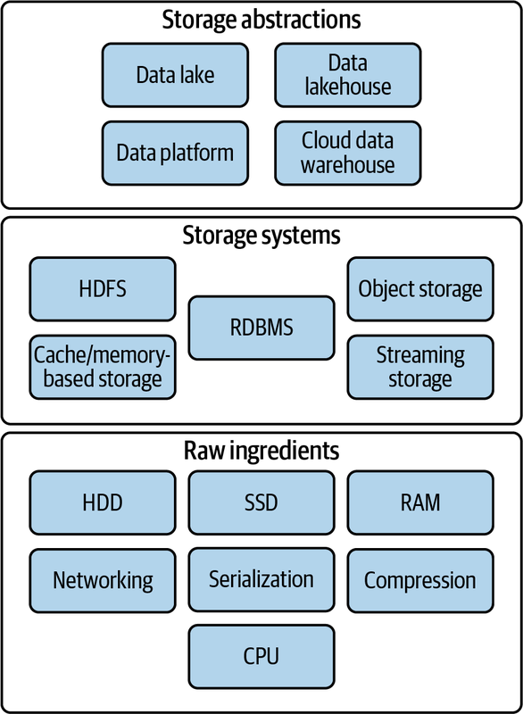{height="500px"}

:::
::::

---

## Single-Machine vs. Distributed Storage {.title-09 .crunch-title .text-90 .crunch-p}

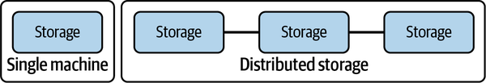{fig-align="center"}

:::: {.columns}
::: {.column width="50%"}

<center>

**Single-Machine**

</center>

- They are commonly used for storing operating system files, application files, and user data files.
- Filesystems are also used in databases to store data files, transaction logs, and backups.

:::
::: {.column width="50%"}

<center>

**Distributed Storage**

</center>

- A distributed filesystem is a type of filesystem that spans multiple computers.
- It provides a unified view of files across all the computers in the system.
- Have existed before cloud

:::
::::

---

## File Storage Types {.smaller .crunch-title}

:::: {.columns}
::: {.column width="30%"}

<center>

**Local Disk**

</center>

- OS-managed filesystems on local disk partition:
- NTFS (Windows)
- HFS+ (MacOS)
- ext4 (Linux)() on a local disk partition of SSD or magnetic disk

:::
::: {.column width="30%"}

<center>

[**Network-Attached (NAS)**]{.text-90}

</center>

- Accessed by clients over a network
- Redundancy and reliability, fine-grained control of resources, storage pooling across multiple disks for large virtual volumes, and file sharing across multiple machines

:::
::: {.column width="40%"}

**Cloud Filesystems**

- **Not object store (more on that later)**
- **Not the virtual hard drive attached to a virtual machine**
- Fully managed: Takes care of networking, managing disk clusters, failures, and configuration (Azure Files, Amazon Elastic Filesystem)
- Backed by Object Store

:::
::::

[Based on @reis_fundamentals_2022]{.text-70}

---

## Distributed FS vs Object Store {.smaller}

|     | Distributed File System | Object Storage |
|---|-------------------------|----------------|
| Organization| Files in hierarchical directories | Flat organization (though there can be overlays to provide hierarchical files structure) |
| Method | POSIX File Operations | REST API |
| Immutability | None: Random writes anywhere in file | Immutable: need to replace/append entire object |
| Performance | Performs best for smaller files | Performs best for large files |
| Scalability| Millions of files | Billions of objects |

: {tbl-colwidths="[20, 40, 40]"}

Both provide:

- Fault tolerance
- Availability and consistency

---

## Today: De-Coupling Storage from Compute {.title-08}

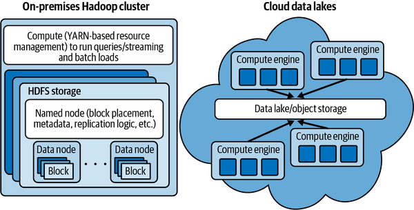{fig-align="center"}

---

## Plain Text (CSV, TSV, FWF)

{fig-align="center" height="400"}

- Pay attention to encodings!
- Lines end in linefeed, carriage-return, or both together depending on the OS that generated
- Typically, a single line of text contains a single record

---

## Binary Files

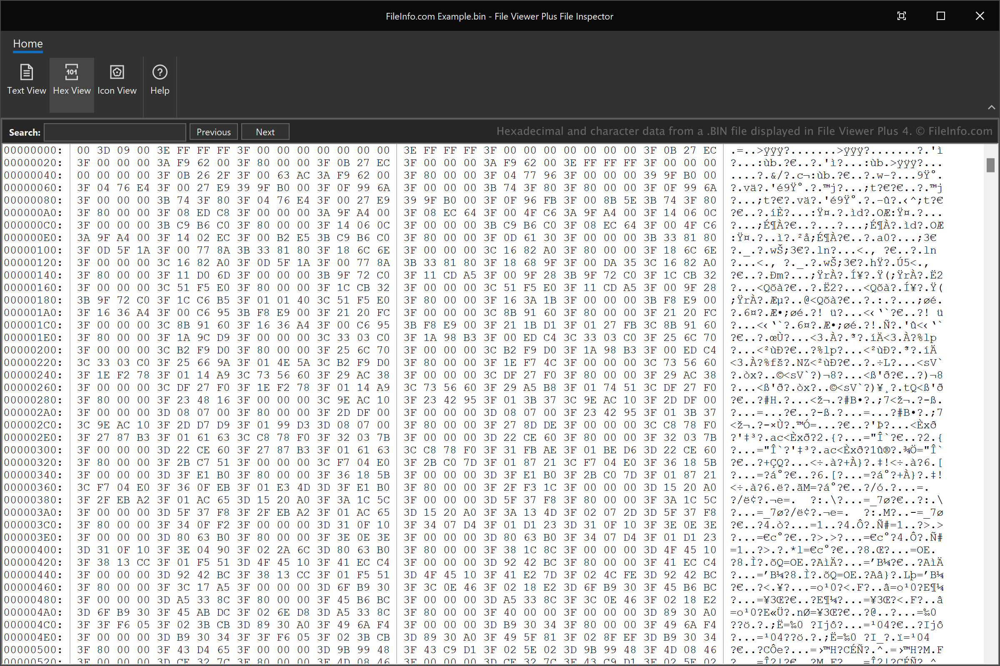{fig-align="center"}

---

## Traditional Row-Store

:::: {layout="[50, 50]" layout-valign="top"}

::: {#col1}

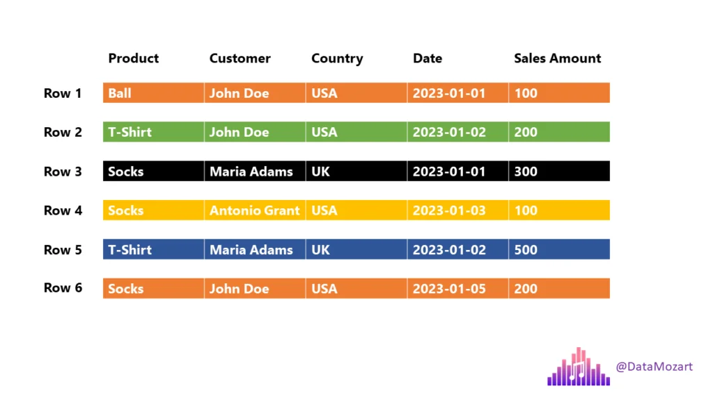{fig-align="center"}

:::

::: {#col2}

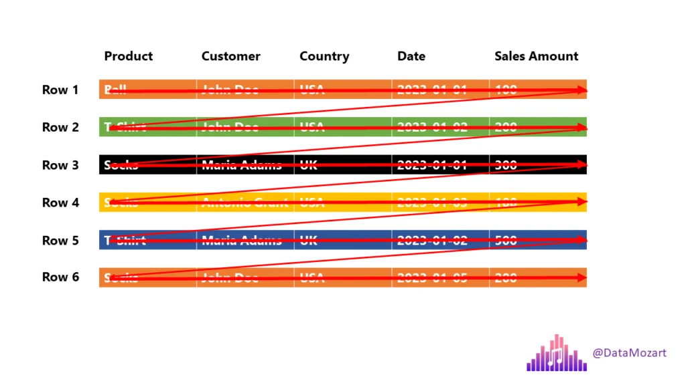{fig-align="center"}

:::
::::

* Query: _"How many balls did we sell?_
* The engine must scan each and every row until the end!

## Column-Store

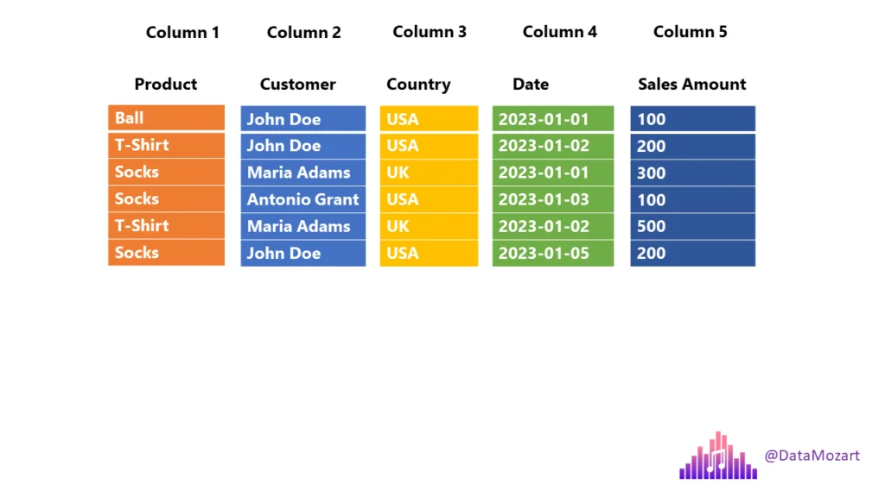{fig-align="center"}

::: {.aside}

[Parquet file format, everything you need to know](https://data-mozart.com/parquet-file-format-everything-you-need-to-know/)

:::


## Row Groups {.text-90}

:::: {layout="[50, 50]" layout-valign="top"}

::: {#col1}

**Data is stored in row groups!**


:::

::: {#col2}

**Only required fields**


:::
::::

## Metadata, compression, and dictionary encoding

:::: {layout="[50, 50]" layout-valign="top"}
::: {#col1}

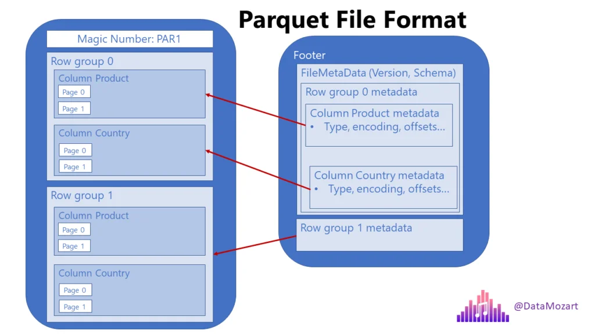{fig-align="center"}

:::

::: {#col2}

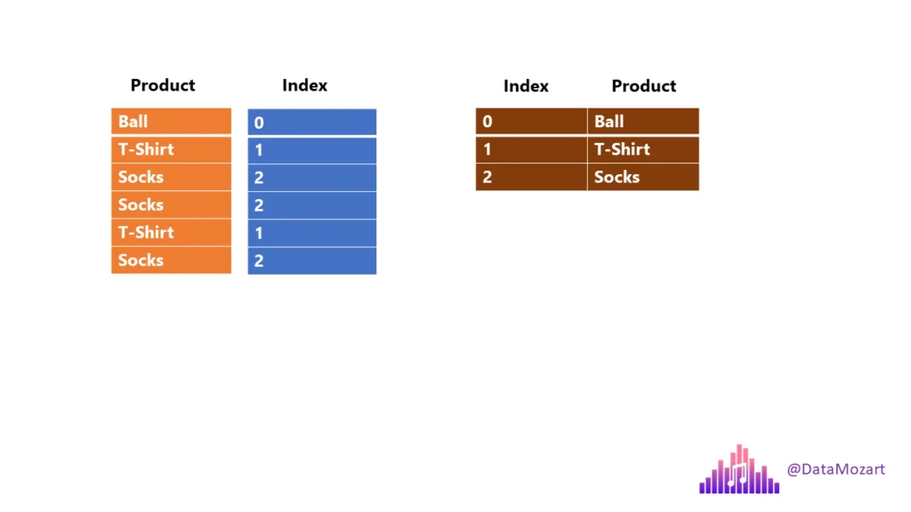{fig-align="center"}

:::
::::

---

## Before Arrow

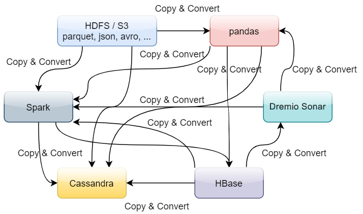{fig-align="center"}

## After Arrow

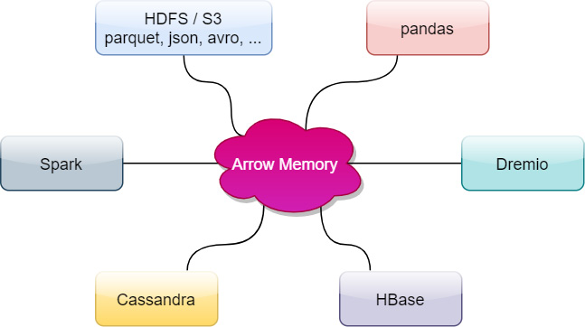{fig-align="center"}

---


## Arrow Compatibility

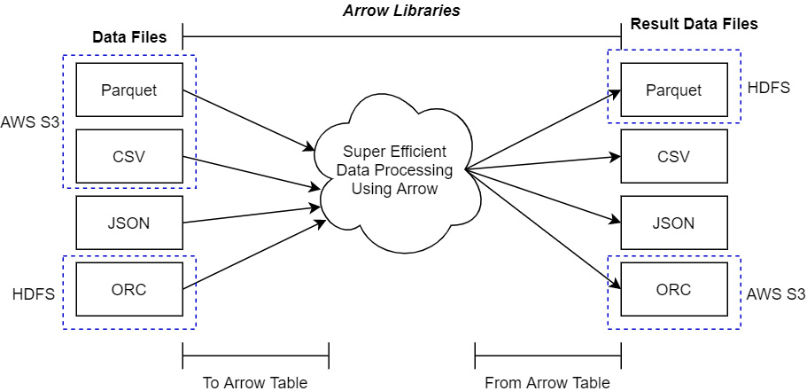{fig-align="center"}

---


## Arrow Performance

:::: {.columns}
::: {.column width="50%"}

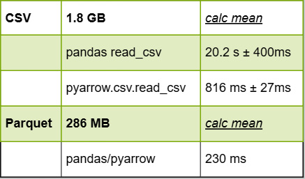{fig-align="center"}

:::
::: {.column width="50%"}

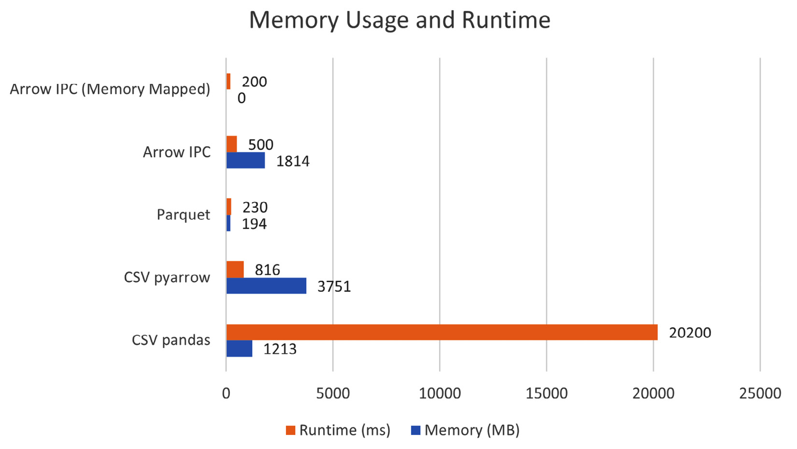{fig-align="center"}

:::
::::

---

## Using Arrow with CSV and Parquet

:::: {.columns}
::: {.column width="50%"}

<center>

**Python**

</center>

`pyarrow` or from `pandas`

```{.python}
import pandas as pd
pd.read_csv(engine = 'pyarrow')
pd.read_parquet()

import pyarrow.csv
pyarrow.csv.read_csv()

import pyarrow.parquet
pyarrow.parquet.read_table()
```

:::
::: {.column width="50%"}

<center>

**R**

</center>

Use the `arrow` package

```{.r}
library(arrow)

read_csv_arrow()
read_parquet()
read_json_arrow()

write_csv_arrow()
write_parquet()
```

:::
::::

**Recommendation:** save your intermediate and analytical datasets as `Parquet`!

<!-- Start _polars.qmd -->

---

## Before We Begin... {.text-90 .crunch-title}

> [Pandas](https://pandas.pydata.org/) is a fast, powerful, flexible and easy to use open source data analysis and manipulation tool, built on top of the Python programming language.

Pandas is slow, but less slow if you use it the right way!

* [Apache Arrow and the "10 Things I Hate About pandas"](https://wesmckinney.com/blog/apache-arrow-pandas-internals/) <font color=red size=5>(A 2017 post from the creator of Pandas...)</font>)
* [50x faster data loading in Pandas: no problem](https://blog.esciencecenter.nl/irregular-data-in-pandas-using-c-88ce311cb9ef) <font color=red size=5>(an old 2019 article...)</font>
* [Is Pandas really that slow?](https://medium.com/@tommerrissin/is-pandas-really-that-slow-cff4352e4f58)
* [Pandas 2.0 and the arrow revolution](https://datapythonista.me/blog/pandas-20-and-the-arrow-revolution-part-i)

---

## Polars {.crunch-title}

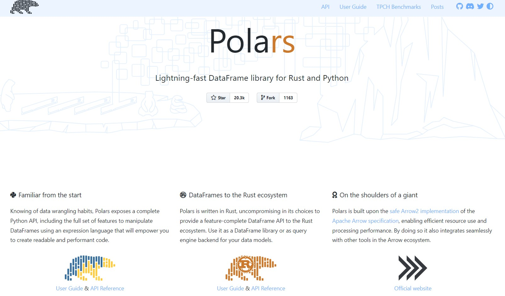{fig-align="center"}

---

## Further reading

- [Polars](https://github.com/pola-rs/polars)
- [User guide](https://pola-rs.github.io/polars-book/user-guide/) &larr; **MUST READ**
- [Polars GitHub repo](https://github.com/pola-rs/polars)
- [Pandas Vs Polars: a syntax and speed comparison](https://towardsdatascience.com/pandas-vs-polars-a-syntax-and-speed-comparison-5aa54e27497e)
- [Tips & tricks for working with strings in Polars](https://towardsdatascience.com/tips-and-tricks-for-working-with-strings-in-polars-ec6bb74aeec2)

<!-- Start _duckdb.qmd -->

---

## Use Cases for DuckDB {.crunch-title .text-90}

* Data Warehousing
* Business Intelligence
* Real-Time Analytics
* IoT Data Processing

**DuckDB in the Wild**

* [How We Silently Switched Mode's In-Memory Data Engine to DuckDB To Boost Visual Data Exploration Speed](https://mode.com/blog/how-we-switched-in-memory-data-engine-to-duck-db-to-boost-visual-data-exploration-speed/)
* [Why we built Rill with DuckDB](https://www.rilldata.com/blog/why-we-built-rill-with-duckdb)
* [Leveraging DuckDB for enhanced performance in dbt projects](https://www.astrafy.io/articles/leveraging-duckdb-for-enhanced-performance-in-dbt-projects)

---


## Key Features {.text-80 .crunch-title .crunch-li-8}

* **Columnar Storage, Vectorized Query Processing**: DuckDB contains a columnar-vectorized query execution engine, where queries are run on a large batch of values (a "vector") in one operation
  * Most analytical queries (think group by and summarize) or even data retrieval for training ML models require retrieving a subset of columns and now the entire row, columnar storage make this faster
* **In-Memory Processing**: All data needed for processing is brought within the process memory (recall that columnar storage format helps with this) making queries run faster (no DB call over the network)
* **SQL Support**: highly Postgres-compatible version of SQL[^1].
* **ACID Compliance**: Transactional guarantees (ACID properties) through bulk-optimized Multi-Version Concurrency Control (MVCC). 

[^1]: [Friendlier SQL with DuckDB](https://duckdb.org/2022/05/04/friendlier-sql.html)

---

## DuckDB: DIY {.title-09 .crunch-title}

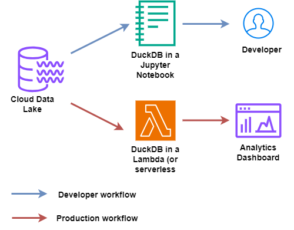{fig-align="center"}

[Using DuckDB in AWS Lambda](https://tobilg.com/using-duckdb-in-aws-lambda)

---

## Benchmarks and Comparisons

:::: {layout="[1,1]" layout-valign="center"}
::: {#benchmark-left}

* Tricky topic! Can make your chosen solution look better by focusing on metrics on which it provides better results
* In general, [TPC-H](https://www.tpc.org/tpch/) and [TPC-DS](https://www.tpc.org/tpcds/) are considered the standard benchmarks for data processing.

::: 
::: {#benchmark-right}

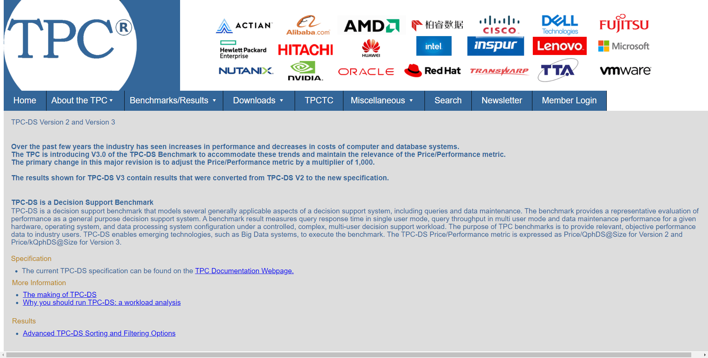

:::
::::

---

## Further Reading on DuckDB {.smaller}

1. [Parallel Grouped Aggregation in DuckDB](https://duckdb.org/2022/03/07/aggregate-hashtable.html)
1. [Meta queries](https://duckdb.org/docs/guides/meta/list_tables)
1. [Profiling queries in DuckDB](https://duckdb.org/dev/profiling)
1. [DuckDB tutorial for beginners](https://motherduck.com/blog/duckdb-tutorial-for-beginners/)
1. [DuckDB CLI API](https://duckdb.org/docs/api/cli)
1. [Using DuckDB in AWS Lambda](https://tobilg.com/using-duckdb-in-aws-lambda)
1. [Revisiting the Poor Man’s Data Lake with MotherDuck](https://dagster.io/blog/poor-mans-datalake-motherduck)
1. [Supercharge your data processing with DuckDB](https://medium.com/learning-sql/supercharge-your-data-processing-with-duckdb-cea907196704)
1. [Friendlier SQL with DuckDB](https://duckdb.org/2022/05/04/friendlier-sql.html)
1. [Building and deploying data apps with DuckDB and Streamlit](https://medium.com/@octavianzarzu/build-and-deploy-apps-with-duckdb-and-streamlit-in-under-one-hour-852cd31cccce)

---

## De-Coupling Storage from Compute {.title-08}

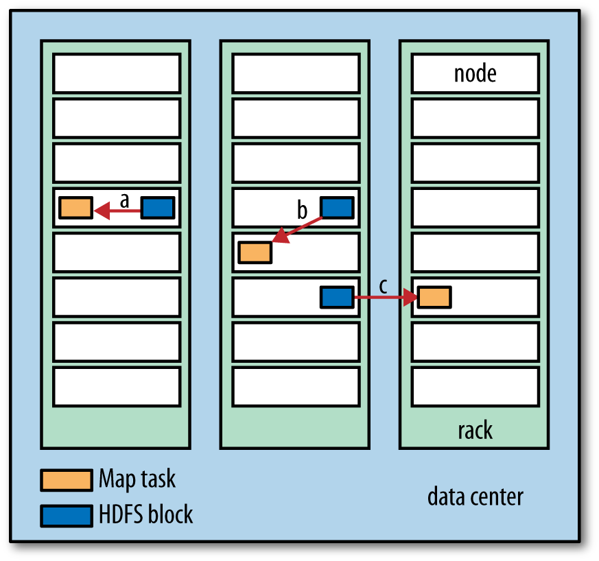{fig-align="center" height="500"}

