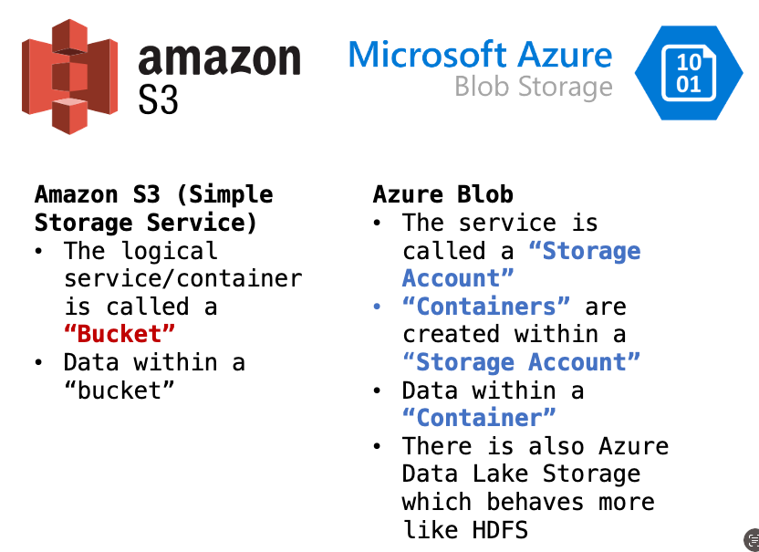
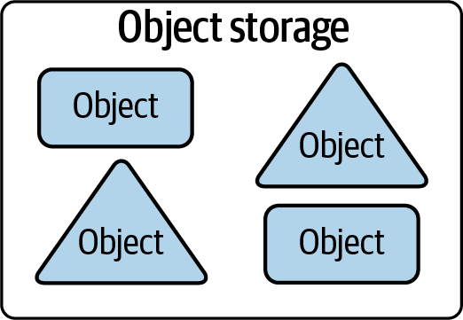
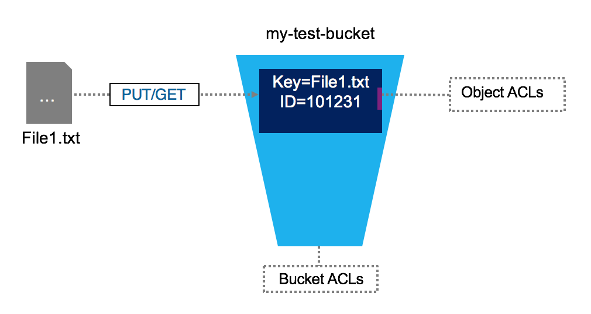
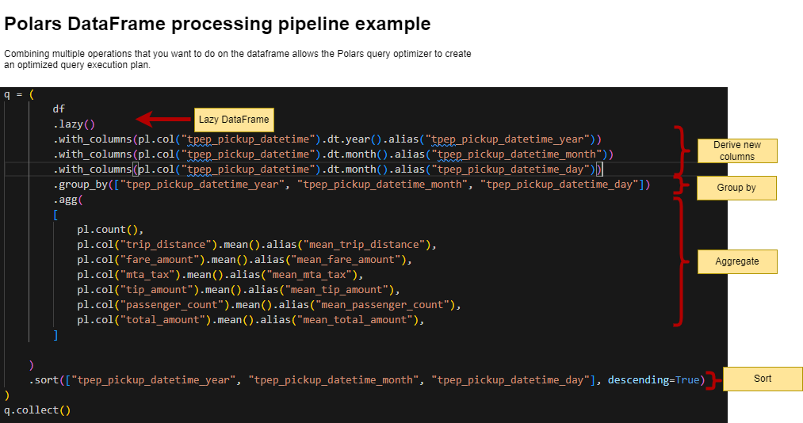
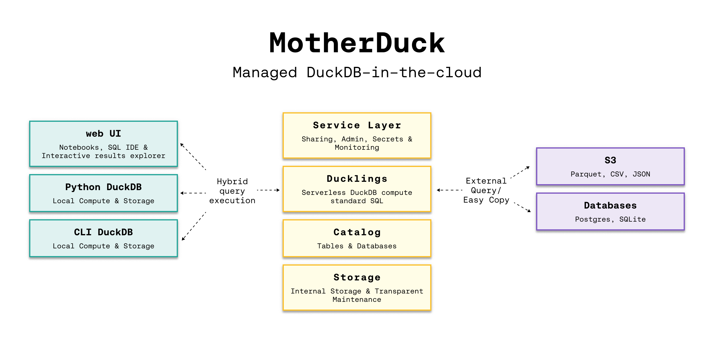

::: {.content-visible unless-format="revealjs"}

<center class='mb-3'>
<a class="h2" href="./slides.html" target="_blank">Open slides in new tab &rarr;</a>
</center>

:::

## Agenda and Goals for Today

:::: {.columns}
::: {.column width="50%"}

### Lecture

* Distributed file systems
* Modern file types
* Working with large tabular data on a single node
  * DuckDB
  * Polars

:::

::: {.column width="50%"}

### Lab

* Run a similar task with Pandas, polars and duckdb

:::
::::

# Filesystems {data-stack-name="Filesystems"}

## Object Stores {.smaller}

* Somewhat confusing because **object** has several meanings in computer science.
* In this context, we're talking about a specialized file-like construct. It could be any type of file: TXT, CSV, JSON, images, videos, audio


:::: {layout="[33, 33, 33]" layout-valign="top"}

::: {#cell1}

{fig-align="center"}

:::

::: {#cell2}



:::

::: {#cell3}



:::
::::

- Contains objects of all shapes and sizes: each gets a **unique identifier**
- Objects are **immutable**: cannot be modified in place (unlike local FS)

## Data-on-Disk Formats

* Plain Text (CSV, TSV, FWF)
* JSON
* Binary Files

## JSONL vs. JSON {.crunch-title .title-11 .smaller}

:::: {.columns}
::: {.column width="50%"}

**JSON Lines**: 4 records, one per line

``` {.json filename="dsan6000_staff.jsonl"}
{"id": 1, "first": "jeff", "last": "jacobs"}
{"id": 2, "first": "samyu", "last": "vakkalanka"}
{"id": 3, "first": "fangzhou", "last": "wang"}
{"id": 4, "first": "siru", "last": "wu"}
```

:::
::: {.column width="50%"}

**JSON**: 4 records enclosed in 1 JSON Array

``` {.json filename="dsan6000_staff.json"}
[
  {
    "id": 1,
    "first": "jeff",
    "last": "jacobs"
  },
  {
    "id": 2,
    "first": "samyu",
    "last": "vakkalanka"
  },
  {
    "id": 3,
    "first": "fangzhou",
    "last": "wang"
  },
  {
    "id": 4,
    "first": "siru",
    "last": "wu"
  }
]
```

:::
::::

## Issues with Common File Formats Like CSV {.smaller .title-11}

*(Ambiguities abound!)*

* **Delimiter:** Comma? Tab? Semicolon?
* **Quote characters:** Single `'` or double `"` quote? ASCII `""` or UTF-8 `“”`?
* **Escaping special characters:** Is `\n` an actual new line, or a piece of a string value?
* **Schema information** has to be sent/looked up separately
* **Nested** structures? ...Improvised and included along with schema info
* **Data engineers** often forced to work with CSV data and then build robust **exception handling** and **error detection** to ensure data quality (**Pydantic!**)

## Introducing Apache Parquet

* Free, open-source, column-oriented data storage format created by Twitter and Cloudera (v1.0 released July 2013)
- Data stored in **columnar format** (as opposed to **row** format), designed for read and write performance
* **Builds in schema information** and natively supports **nested** data
* Supported by R and Python through [Apache Arrow](https://arrow.apache.org/) (more coming up!)

## Apache Arrow for In-Memory Analytics {.title-09}

> Apache Arrow is a development platform for in-memory analytics. It contains a set of technologies that enable big data systems to process and move data fast. It specifies a standardized language-independent columnar memory format for flat and hierarchical data, organized for efficient analytic operations on modern hardware. [@topol_inmemory_2024]

# Polars {data-stack-name="Polars"}

Lightning-fast DataFrame library for Rust and Python

## Why is Polars Faster than Pandas? {.smaller .crunch-title}

* **Polars is written in Rust**. Rust is **compiled**; Python is **interpreted**
  * Compiled language: you generate the machine code only once then run it, subsequent runs do not need the compilation step.
  * Interpreted language: code has to be parsed, interpreted and converted into machine code every single time.
* **Parallelization**: Vectorized operations can be executed in parallel on multiple cores
* **Lazy evaluation**: Polars supports two APIs lazy as well as eager evaluation (used by pandas). In lazy evaluation, a query is executed only when required. While in eager evaluation, a query is executed immediately.
* **Polars uses [Arrow](https://arrow.apache.org/)** for in-memory data representation. Similar to how pandas uses NumPy (Pandas 2 allows using Arrow as backend)
* **Polars $\approx$ in-memory DataFrame library + query optimizer**

::: {.notes}

* [Excerpt from [this post](https://news.ycombinator.com/item?id=26454585) from [Ritchie Vink](https://github.com/ritchie46), author of Polars] Arrow provides the efficient data structures and some compute kernels, like a SUM, a FILTER, a MAX etc. Arrow is not a query engine. Polars is a DataFrame library on top of arrow that has implemented efficient algorithms for JOINS, GROUPBY, PIVOTs, MELTs, QUERY OPTIMIZATION, etc. (the things you expect from a DF lib).

:::

## Ease of Use {.smaller .crunch-title .crunch-ul}

* Familiar API for users of Pandas: differences in syntax but still a **Dataframe API** making it straightforward to perform common operations such as *filtering*, *aggregating*, and *joining* data
* See [Migrating from Pandas](https://pola-rs.github.io/polars-book/user-guide/migration/pandas/)
* **Reading data**

  ```{.python}
  # must install s3fs -> "pip install s3fs"
  # Using Polars
  import polars as pl
  polars_df = pl.read_parquet("s3://nyc-tlc/trip data/yellow_tripdata_2023-06.parquet")

  # using Pandas
  import pandas as pd
  pandas_df = pd.read_parquet("s3://nyc-tlc/trip data/yellow_tripdata_2023-06.parquet")
  ```
* **Selecting columns (see [Pushdown optimization](https://stackoverflow.com/questions/68713020/what-is-filter-pushdown-optimization))**
  ``` {.python}
  # Using Polars
  selected_columns_polars = polars_df[['column1', 'column2']]

  # Using Pandas
  selected_columns_pandas = pandas_df[['column1', 'column2']]
  ```

## Ease of Use (contd.) {.crunch-title .crunch-ul}

* **Filtering data**
  ```{.python}
  # Using Polars
  filtered_polars = polars_df[polars_df['column1'] > 10]

  # Using Pandas
  filtered_pandas = pandas_df[pandas_df['column1'] > 10]
  ```

* Though you can write Polars code that looks like Pandas, better to write **idiomatic** Polars code that takes advantage of Polars' features
* [Migrating from Apache Spark](https://pola-rs.github.io/polars-book/user-guide/migration/spark/): Whereas Spark DataFrame is a collection of rows, Polars DataFrame is closer to a collection of columns

## Installation, Data Loading, and Basic Operations {.title-10 .smaller}

Install via `pip`:

``` {.bash}
pip install polars
```

Import polars in your Python code and read data as usual:

``` {.python}
import polars as pl
df = pl.read_parquet("s3://nyc-tlc/trip data/yellow_tripdata_2023-06.parquet")
df.head()

shape: (5, 19)
┌──────────┬────────────┬──────────────┬──────────────┬─────┬──────────────┬──────────────┬──────────────┬─────────────┐
│ VendorID ┆ tpep_picku ┆ tpep_dropoff ┆ passenger_co ┆ ... ┆ improvement_ ┆ total_amount ┆ congestion_s ┆ Airport_fee │
│ ---      ┆ p_datetime ┆ _datetime    ┆ unt          ┆     ┆ surcharge    ┆ ---          ┆ urcharge     ┆ ---         │
│ i32      ┆ ---        ┆ ---          ┆ ---          ┆     ┆ ---          ┆ f64          ┆ ---          ┆ f64         │
│          ┆ datetime[n ┆ datetime[ns] ┆ i64          ┆     ┆ f64          ┆              ┆ f64          ┆             │
│          ┆ s]         ┆              ┆              ┆     ┆              ┆              ┆              ┆             │
╞══════════╪════════════╪══════════════╪══════════════╪═════╪══════════════╪══════════════╪══════════════╪═════════════╡
│ 1        ┆ 2023-06-01 ┆ 2023-06-01   ┆ 1            ┆ ... ┆ 1.0          ┆ 33.6         ┆ 2.5          ┆ 0.0         │
│          ┆ 00:08:48   ┆ 00:29:41     ┆              ┆     ┆              ┆              ┆              ┆             │
│ 1        ┆ 2023-06-01 ┆ 2023-06-01   ┆ 0            ┆ ... ┆ 1.0          ┆ 23.6         ┆ 2.5          ┆ 0.0         │
│          ┆ 00:15:04   ┆ 00:25:18     ┆              ┆     ┆              ┆              ┆              ┆             │
│ 1        ┆ 2023-06-01 ┆ 2023-06-01   ┆ 1            ┆ ... ┆ 1.0          ┆ 60.05        ┆ 0.0          ┆ 1.75        │
└──────────┴────────────┴──────────────┴──────────────┴─────┴──────────────┴──────────────┴──────────────┴─────────────┘
```

## Polars Pipeline Example {.crunch-title}

We'll run this as part of the lab in a little bit; **think how you might code this in Pandas...**

{fig-align="center"}

# DuckDB {data-stack-name="DuckDB"}

An in-process SQL OLAP database management system

## DuckDB {.text-80}

* [DuckDB](https://duckdb.org/) is an in-process [SQL](https://en.wikipedia.org/wiki/SQL) [OLAP](https://en.wikipedia.org/wiki/Online_analytical_processing) DB management system
* Like `sqlite`, but for analytics. What does this mean? It means that your database runs inside your process, there are no servers to manage, no remote system to connect to. Easy to experiment with SQL-like syntax.
* **Vectorized processing**: Loads chunks of data into memory (tries to keep everything in the CPU's L1 and L2 cache) and is thus able to handle datasets bigger than the amount of RAM available.
* Supports Python, R and a host of other languages
* Important paper on DuckDB: @raasveldt_duckdb_2019

## DuckDB: Fully-Managed {.smaller .crunch-title}

{fig-align="center"}

* [Architecture and capabilities](https://motherduck.com/docs/architecture-and-capabilities/)
* Seamlessly analyze data, whether it sits on your laptop, in the cloud or split between.
* Hybrid execution automatically plans each part of your query and determines where it's best computed
* [DuckDB Vs MotherDuck](https://kestra.io/blogs/2023-07-28-duckdb-vs-motherduck)

## Setting Up DuckDB

**Configuration and Initialization**: DuckDB is *integrated into* Python and R for efficient interactive data analysis (APIs for Java, C, C++, Julia, Swift, and others)

``` {.bash code-line-numbers="false"}
pip install duckdb
```

**Connecting to DuckDB**

``` {.python}
import duckdb
# directly query a Pandas DataFrame
import pandas as pd
data_url = "https://raw.githubusercontent.com/anly503/datasets/main/EconomistData.csv"
df = pd.read_csv(data_url)
duckdb.sql('SELECT * FROM df')
```

## Setting Up DuckDB (contd.) {.text-90}

**Supported data formats**: DuckDB can ingest data from a wide variety of formats – both on-disk and in-memory. See the [data ingestion page](https://duckdb.org/docs/api/python/data_ingestion) for more information.

```{.python}
import duckdb
duckdb.read_csv('example.csv')                # read a CSV file into a Relation
duckdb.read_parquet('example.parquet')        # read a Parquet file into a Relation
duckdb.read_json('example.json')              # read a JSON file into a Relation

duckdb.sql('SELECT * FROM "example.csv"')     # directly query a CSV file
duckdb.sql('SELECT * FROM "example.parquet"') # directly query a Parquet file
duckdb.sql('SELECT * FROM "example.json"')    # directly query a JSON file
```

## Querying DuckDB {.text-90}

**Essential Reading**

* [Friendlier SQL with DuckDB](https://duckdb.org/2022/05/04/friendlier-sql.html)
* [SQL Introduction](https://duckdb.org/docs/sql/introduction)

**Basic SQL Queries**

``` {.python}
import duckdb
import pandas as pd
babynames = pd.read_parquet("https://github.com/anly503/datasets/raw/main/babynames.parquet.zstd")
duckdb.sql("select count(*)  from babynames where Name='John'")
```

**Aggregations and Grouping**

``` {.python}
duckdb.sql("select State, Name, count(*) as count  from babynames group by State, Name order by State desc, count desc") 
```

## Querying DuckDB (contd.) {.crunch-title .text-90}

Essential reading: [`FROM` and `JOIN` clauses](https://duckdb.org/docs/sql/query_syntax/from.html)

**Joins and Subqueries**

``` {.python}
# Join two tables together
duckdb.sql("SELECT * FROM table_name JOIN other_table ON (table_name.key = other_table.key")
```

**Window Functions**

```{.python}
powerplants = pd.read_csv("https://raw.githubusercontent.com/anly503/datasets/main/powerplants.csv", parse_dates=["date"])
q = """
SELECT "plant", "date",
    AVG("MWh") OVER (
        PARTITION BY "plant"
        ORDER BY "date" ASC
        RANGE BETWEEN INTERVAL 3 DAYS PRECEDING
                  AND INTERVAL 3 DAYS FOLLOWING)
        AS "MWh 7-day Moving Average"
FROM powerplants
ORDER BY 1, 2;
"""
duckdb.sql(q)
```

## Using the DuckDB CLI and Shell {.crunch-title .smaller .crunch-ul .title-11}

* Install [DuckDB CLI](http://duckdb.org/docs/installation/) or use in browser via [shell.duckdb.org](https://shell.duckdb.org/) for data exploration via SQL; Once installed, import a local file into the shell and run queries
* You can download `powerplants.csv` [here](https://raw.githubusercontent.com/anly503/datasets/main/powerplants.csv)

  ``` {.bash}
  C:\Users\<username>\Downloads\duckdb_cli-windows-amd64> duckdb
  v0.8.1 6536a77232
  Enter ".help" for usage hints.
  Connected to a transient in-memory database.
  Use ".open FILENAME" to reopen on a persistent database.
  D CREATE TABLE powerplants AS SELECT * FROM read_csv_auto('powerplants.csv');
  D DESCRIBE powerplants;
  ┌─────────────┬─────────────┬─────────┬─────────┬─────────┬───────┐
  │ column_name │ column_type │  null   │   key   │ default │ extra │
  │   varchar   │   varchar   │ varchar │ varchar │ varchar │ int32 │
  ├─────────────┼─────────────┼─────────┼─────────┼─────────┼───────┤
  │ plant       │ VARCHAR     │ YES     │         │         │       │
  │ date        │ DATE        │ YES     │         │         │       │
  │ MWh         │ BIGINT      │ YES     │         │         │       │
  └─────────────┴─────────────┴─────────┴─────────┴─────────┴───────┘
  D  SELECT * from powerplants where plant='Boston' and date='2019-01-02';
  ┌─────────┬────────────┬────────┐
  │  plant  │    date    │  MWh   │
  │ varchar │    date    │ int64  │
  ├─────────┼────────────┼────────┤
  │ Boston  │ 2019-01-02 │ 564337 │
  └─────────┴────────────┴────────┘
  ```

## Profiling in DuckDB {.smaller}

**Query Optimization:** Use `EXPLAIN` and `ANALYZE` keywords to understand how your query is being executed and the time being spent in individual steps
    
``` {.bash}
D EXPLAIN ANALYZE SELECT * from powerplants where plant='Boston' and date='2019-01-02';
```

DuckDB will use all the cores available on the underlying compute, but you can adjust this (Full configuration details [here](https://duckdb.org/docs/sql/configuration.html))

```{.markdown}
D select current_setting('threads');
┌────────────────────────────┐
│ current_setting('threads') │
│           int64            │
├────────────────────────────┤
│                          8 │
└────────────────────────────┘
D SET threads=4;
D select current_setting('threads');
┌────────────────────────────┐
│ current_setting('threads') │
│           int64            │
├────────────────────────────┤
│                          4 │
└────────────────────────────┘
```

# In-Class Demo {data-stack-name="Demo"}

[GitHub Classroom Link]()

## References

::: {#refs}
:::
