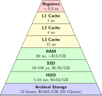
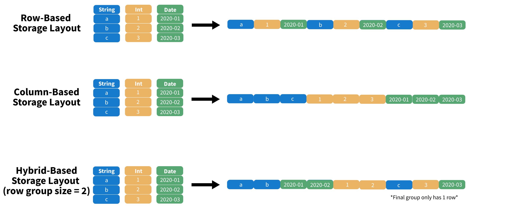

::: {.content-visible unless-format="revealjs"}

<center class='mb-3'>
<a class="h2" href="./slides.html" target="_blank">Open slides in new tab &rarr;</a>
</center>

:::

# Computer Architecture in One Diagram {.smaller .title-12 .crunch-title data-stack-name="Data Storage"}

:::: {layout="[45,55]" layout-align="center" layout-valign="center"}
::: {.column width="45%"}

{fig-align="center" width="500"}

:::
::: {.column width="55%"}

* Storage **&uarr; higher** on pyramid is **faster** but **more expensive**
* Registers, Caches **built into processor**
* Everything from **RAM** upwards uses electricity ⚡️, **dies when unplugged**
* **Solid-State Drives (SSDs)** have *no moving parts* ("flash memory")
* **Hard-Drive Disks (HDDs)** have *moving parts*: "heads" which scan over spinning magnetic disk then read data **sequentially**

:::
::::

## The Problem With CSVs (for Data Engineers) {.title-09 .crunch-title .crunch-p .text-85}


```{=html}
<table>
<thead>
<tr>
  <th class='tdvc'><span data-qmd="<i class='bi bi-1-circle'></i> Inherent ambiguities..."></span></th>
  <th><span data-qmd="<i class='bi bi-2-circle'></i> No built-in way to *communicate* schema info!"></span></th>
</tr>
</thead>
<tbody>
<tr>
  <td><span data-qmd="**Delimiter:** Comma? Tab? Semicolon?"></span></td>
  <td><span data-qmd="**Schema information:** Sent or looked up separately (codebooks)"></span></td>
</tr>
<tr>
  <td><span data-qmd="**Quote characters:** Single `'` or double `&quot;` quote?<br>ASCII `&quot;&quot;` or UTF-8 `“”`?"></span></td>
  <td><span data-qmd="**Nested structures:**<br>...Improvised and included in schema"></span></td>
</tr>
<tr>
  <td colspan="2"><span data-qmd="**Escaping special characters:** `\n` = new line, or part of string val?"></span></td>
  <td></td>
</tr>
</tbody>
</table>
```

$\leadsto$ **Data engineers** working with CSV data have to build robust **error detection** systems to ensure data quality ([**Pydantic!**](https://pydantic.dev/docs/validation/latest/get-started/) [**Pandera!**](https://pandera.readthedocs.io/en/stable/))

## The Problem With CSVs (for Data Scientists) {.crunch-title .title-075}

* Brainstorming exercise: What kinds of **operations** do you think of when you think of "doing" data science?
* For me: `mean()`, `std()`, `max()`, `min()`, etc...
* Computing SSRs: `(df['y'] - df['y_pred']) ** 2`
* These are **columnar** operations, yet `.csv` files are read **row-by-row**

## How CSVs Are Actually Stored on Disk {.crunch-title .title-09 .text-90}

``` {.csv filename="dsan6000_staff.csv"}
staff_id,last,first,points\n1,jacobs,jeff,300\n2,vakkalanka,samyu,400\n3,wang,fangzhou,500\n4,wu,siru,600
```

* ...Even if we only want to compute average of last column, computer has to **scan over all data in row** first (remember: **sequential** memory reads)

***...But Imagine A World Where... (John Lemon, from Beetles)***

``` {.csv filename="dsan6000_staff.csv"}
points,300,400,500,600\nstaff_id,1,2,3,4\nlast,jacobs,vakkalanka,wang,wu\nfirst,jeff,samyu,fangzhou,siru
```

* ...But I completely cheated here! I moved the last column to be the first column. How could we achieve this in practice?

## The Skip List Approach {.crunch-title .text-85 .fix-wrap}

*(Note: If you took DSAN 5000, you saw the [skip list](https://en.wikipedia.org/wiki/Skip_list) data structure... here we're generalizing this to `DataFrame`s!)*

Now imagine a **fancier header**, with an **index** telling the reader the exact **byte** where each column starts:

:::: {.columns}
::: {.column width="50%"}

| column name | column start |
| - | - |
| `staff_id` | 0 |
| `last` | 18 |
| `first` | 50 |
| `points` | 82 |

:::
::: {.column width="50%"}

``` {.csv .code-overflow-wrap code-line-numbers="true" filename="dsan6000_staff.csv"}
staff_id,1,2,3,4\nlast,jacobs,vakkalanka,wang,wu\nfirst,jeff,samyu,fangzhou,siru\npoints,300,400,500,600
```

$\leadsto$ Now the reader can just **skip over** bytes 0-81!

:::
::::

Even more efficient if we implement index as **Binary Search Tree**

## Sidenote Now, Important Later {.crunch-title .text-85 .crunch-p .crunch-li-8}

If we *did* have a setup where we wanted to operate over **rows**, this optimized-index approach would work just as well!

:::: {.columns}
::: {.column width="50%"}

**Sorted Data:**

* If **sorted** by `staff_id`: 1000 employees total, employee 500 starts at byte 820
* $\leadsto$ *(Higher ids guaranteed to be in later bytes)*

:::
::: {.column width="50%"}

**Time Series Data:**

* 2020 data starts at byte 0
* 2021 data starts at byte 458
* 2022 data starts at byte 1810
* 2023 data starts at ...

:::
::::

**Binned Data:** Last names N-Z start at byte 1130

* *(Faster insertions; Can't make guarantees besides bin start/end)*

## The Secret Columnar Sauce: RLE Compression {.crunch-title .title-07}

* With **row-based** storage, we "hop" from one data type to another with each subsequent read
  * `1` &rarr; `"jeff"` &rarr; `300` &rarr; `date(2023)`
* With **columnar** storage, sequential blocks have **same data type!** $\leadsto$ **Run-Length Encoding (RLE)**
* 2 million consecutive records with `date(2023)` becomes `(date(2023), 2000000)` 🤯
* 10 years of records: 20 million bytes &rarr; 20 bytes

# Dream No More... Parquet Files Have Arrived {.smaller .title-11 .crunch-title data-stack-name="Parquet"}

*Hybrid Columnar/Row-Based Storage*

{fig-align="center"}

## DuckDB Demo

<center>

[Open in Colab](https://colab.research.google.com/drive/1kkodGgDnvRAH0stiAKHEE8cWYGGVRikF?usp=sharing)

</center>

## References

::: {#refs}
:::
