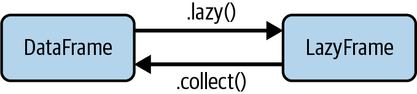

::: {.content-visible unless-format="revealjs"}

<center class='mb-3'>
<a class="h2" href="./slides.html" target="_blank">Open slides in new tab &rarr;</a>
</center>

:::

# DuckDB $\rightarrow$ Polars Roadmap {.text-75 .crunch-title .title-13}

* DuckDB *nice* to know, but in this class mainly as **intro to querying `.parquet`**
  
  *(More advanced DuckDB queries = more advanced SQL; outside scope of class!)*
* Polars we're learning **for its own sake**: augment Pandas w/**lazy evaluation**

  {fig-align="center"}


## HW5: No More Shoving SQL in Python with `"""` {.smaller .crunch-title .title-10}

* **DuckDB:** "Artificial" separation of computation and data
  * HW4 Q3 **Data** loaded into Pandas `DataFrame`
  * HW4 Q3 **Computation** written as SQL expression:
    ``` {.python}
    query = """
    <SQL code>
    """
    ```
  * ...Then you shoved them together: `result_df = con.execute(query).df()`
* **Polars:** "Natural" computation-data separation **within the same language (Python)**
  * HW5 Q2 **Data** loaded into **Polars** `DataFrame` (Python object)
  * HW5 Q2 **Computation** written as **Polars** functions (Python code)
  * `polars` library specifies which functions "activate" **eager evaluation**

# A Less-Rushed Introduction to DuckDB {data-stack-name="DuckDB"}

* DuckDB = *"SQLite for OLAP (Columnar Patterns)"*
* SQLite = *"DuckDB for OLTP (Row-Based Patterns)"*

## DuckDB: Buzzwords $\leadsto$ Understanding {.smaller .crunch-title .title-11 .crunch-p}

> *DuckDB is an **in-process SQL OLAP DBMS**.* [@aubury_getting_2024]

* **Database Management System (DBMS):** An interface between the database and its users, allowing create, read, update, and delete (CRUD) operations on the DB

* **Online Analytical Processing (OLAP):** A **data processing paradigm** focused on applying column-wise aggregation functions and joining large datasets together
  
  *(Contrasts with Online Transaction Processing (OLTP), where frequent writing of individual records (rows) is the dominant pattern of data interaction)*
* **Structured Query Language (SQL):** A *declarative* **programming language** used to store, manipulate, and query records in relational databases – DBs representing data as tables of rows and columns, with formal relationships defined across tables
* **In-process:** DuckDB *embeds within* a process + its memory. Most DBMSs run separately (e.g., on a remote server); DuckDB eliminates **connect/authenticate** steps

## DuckDB as *Ephemeral* DB-In-RAM {.crunch-title .smaller}

* Standalone operation (as its own process, independent of Python): [**DuckDB CLI**](https://shell.duckdb.org/#queries=v0,SELECT-'jeff'-AS-name%2C-3-AS-fav_number~)
* Python operation: Upon **`import duckdb`**, creates a **default, in-memory DB**
  ``` {.python}
  default_mem_con = duckdb.connect(database=':default:')
  ```
  
  <div class='text-70' style='margin-top: 8px; line-height: 1.2;'>*Typically **not** used, if only bc less clear **where** and **when** the DB was created (readers of your code would need to know this fact about `import duckdb`)*</div>
* Setting up a connection creates a **new**, `con`-specific in-memory DB:
  ``` {.python}
  con = duckdb.connect(database=':memory:')
  con = duckdb.connect() # database=':memory:' is default setting
  ```
* Can persist to **file** on disk:
  ``` {.python}
  con = duckdb.connect('my_cool_data.duckdb')
  ```
* **Please note <i class='bi bi-exclamation-triangle'></i>** `duckdb.connect()` is **not** how we connect to the on-disk **data files**, external **S3 objects**, or in-memory **`DataFrame`s** that we want to **run queries on!**
  ``` {.python}
  con.execute('SELECT * FROM my_df LIMIT 5;')
  ```

## SQLite: "DuckDB for OLTP" {.crunch-title}

* Both are simplified in-process DBMSs that connect to a single local file (also both free and open source)
* [SQLite](https://sqlite.org/fiddle/) optimized for **row-oriented**, **OLTP** workloads
* DuckDB optimized for **column-oriented**, **OLAP** workloads
* HW6 will give you exposure to **both!**
  * <i class='bi bi-1-circle'></i> SQLite for OLTP ingestion of events
  * <i class='bi bi-2-circle'></i> **Athena** (coming soon) for "automatic" ETL
  * <i class='bi bi-3-circle'></i> DuckDB for OLAP inference (MLFlow)

# A Non-Sprinted Introduction to Polars {data-stack-name="Polars"}

* <i class='bi bi-1-circle'></i> Eager vs. Lazy Evaluation
* <i class='bi bi-2-circle'></i> Building Expressions
* <i class='bi bi-3-circle'></i> In-Class Demo!

## Polars (Jeff's Mental Model) {.crunch-p .crunch-title .title-09 .crunch-li-10}

* **Polars** = `DataFrame` library in **Rust** for fast (query-optimized), distributed OLAP workflows
* `polars` = `DataFrame` library in **Python**, "high-level" (Python-level) "wrapper" around underlying **Polars** code
* If we want **optimized**, **distributed** processing, we need **lazy execution** (enabling logical $\leadsto$ physical query plan)...
* Query optimization via lazy execution **not part of `pandas`!**
* $\implies$ Let's find a lazy-execution-focused library that "feels" as close to Pandas as possible... that's `polars`!

## `pl.DataFrame` vs. `LazyFrame` {.crunch-title .crunch-ul .text-90}

* Polars has **two** "types" of `DataFrames`... "Types" in quotes because, a `LazyFrame` **doesn't actually contain any data!**
* A `LazyFrame` is a **plan** (using *expressions*) for creating a `pl.DataFrame`
* Call `lf.show_graph()` to show Polars' **optimized** query plan
* The special function **`collect()`** is what actually **executes** the plan, **materializing** the result as a `pl.DataFrame`

{fig-align="center"}

## `LazyFrame`s = "Plans" = Strings of Expressions {.crunch-title .title-10 .smaller}

* Since we're in OLAP mode, we'll almost always be using **columns** as our core objects
* $\implies$ Most Polars expressions involve `pl.col()`:
  * `pl.col('*')` is the expression *«all columns»*
  * `pl.col(pl.String)` is the expression *«all string columns»*
  * `pl.col('Age')` is the expression *«the column named `'Age'`»*
  * `pl.col('Age') > 20` is the expression *«the col named `'Age'` is greater than 20»*
* We then **use** expressions `e` via predicates:
  * `pl.select(e)` to keep only **columns** matching `e`
  * `pl.filter(e)` to keep only **rows** matching `e`
  * `pl.with_columns(e)` to **create new columns** based on `e`
  * `pl.group_by(e).len()` to **group** based on `e` (then aggregate, here by counting)


## Lab Time!

<center>

[Week 5 Lab: Polars](https://colab.research.google.com/drive/1Ma8uX8ISiYrlaDVTGztciZNTRRR3KG0E?usp=drive_link){.boxed-cb}

</center>

## References

::: {#refs}
:::
