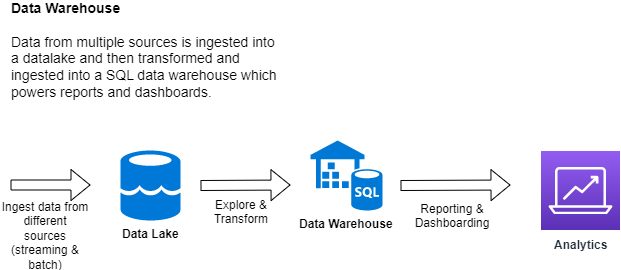

# Data Lakes {data-stack-name="Lakes vs. Warehouses"}

## Wikipedia Definition

> **[From Wikipedia](https://en.wikipedia.org/wiki/Data_lake)**: A data lake is a system or repository of data stored in its natural/raw format, usually object blobs or files. A data lake is usually a single store of data including raw copies of source system data, sensor data, social data etc., and transformed data used for tasks such as reporting, visualization, advanced analytics and machine learning. A data lake can include structured data from relational databases (rows and columns), semi-structured data (CSV, logs, XML, JSON), unstructured data (emails, documents, PDFs) and binary data (images, audio, video).

## Cloud Provider Definitions

Definitions in the wild (**emphasis mine**).

:::: {.columns}
::: {.column width="50%"}

**[AWS](https://aws.amazon.com/big-data/datalakes-and-analytics/what-is-a-data-lake/)**  
A data lake is a **centralized repository** that allows you to store all your **structured and unstructured** data at any scale. You can store your data as-is, without having to first structure the data, and run different types of analytics—from dashboards and visualizations to big data processing, real-time **analytics**, and machine learning to guide better decisions.

:::

::: {.column width="50%"}
**[GCP](https://cloud.google.com/learn/what-is-a-data-lake)**  
A data lake provides a **scalable and secure platform** that allows enterprises to: ingest **any data from any system at any speed**—even if the data comes from on-premises, cloud, or edge-computing systems; store any type or volume of data in full fidelity; process data in real time or batch mode; and analyze data using SQL, Python, R, or any other language, third-party data, or **analytics** application.
:::

::: {.column width="50%"}
**[Azure](https://azure.microsoft.com/en-us/solutions/data-lake/)**  
Azure Data Lake includes all the capabilities required to make it easy for developers, data scientists, and analysts to **store data of any size, shape, and speed**, and do all types of processing and **analytics** across platforms and languages.
:::

::: {.column width="50%"}
**[DataBricks](https://www.databricks.com/discover/data-lakes/introduction)**  
A data lake is a central location that holds a **large amount of data** in its native, **raw format**. Compared to a hierarchical data warehouse, which stores data in files or folders, a data lake uses a flat architecture and **object storage** to store the data.‍ 
:::
::::

## Working with a Cloud Data Lake

A cloud data lake is setup using the cloud provider's object store (S3, GCS, Azure Blob Storage).

 - The object stores are extremely scalable, for context, the maximum size of an object in S3 is 5 TB and [there is no limit to number of objects in an S3 bucket](https://docs.aws.amazon.com/AmazonS3/latest/userguide/BucketRestrictions.html).

 - They are extremely duarable, 99.999999999%. Provide strong consistency (read-after-write, listing buckets and objects, granting permissions etc.).

 - Cost effective, with [multiple storage classes](https://aws.amazon.com/s3/storage-classes/).

 - Integration with data processing tools such as Spark, machine learning tools such as SageMaker, data warehouses such as RedShift and data cataloging tools.

 - They provide _Fine Grained Access Control_ to the data.

## Data Warehouses

>**[From Wikipedia](https://en.wikipedia.org/wiki/Data_warehouse)**: In computing, a data warehouse (DW or DWH), also known as an enterprise data warehouse (EDW), is a system used for reporting and data analysis and is considered a core component of business intelligence. DWs are central repositories of integrated data from one or more disparate sources. They store current and historical data in one single place that are used for creating analytical reports for workers throughout the enterprise.

## Data Warehouse (Cloud Provider Definitions)

Definitions in the wild (**emphasis mine**).

::: columns
::: {.column width="50%"}

**[AWS](https://aws.amazon.com/data-warehouse/)**  
A data warehouse is a **central repository** of information that can be analyzed to make more informed decisions. **Data flows into a data warehouse** from transactional systems, relational databases, and other sources, typically **on a regular cadence**. Business analysts, data engineers, data scientists, and decision makers **access the data through business intelligence (BI) tools, SQL clients, and other analytics applications**.  

**[Azure](https://learn.microsoft.com/en-us/azure/architecture/data-guide/relational-data/data-warehousing)**  
A data warehouse is a **centralized repository** of integrated data from one or more **disparate sources**. Data warehouses store current and historical data and are used for **reporting and analysis** of the data.
:::

::: {.column width="50%"}
**[GCP](https://cloud.google.com/learn/what-is-a-data-warehouse)**  
A data warehouse is an **enterprise system** used for the **analysis and reporting** of structured and semi-structured data from **multiple sources**, such as point-of-sale transactions, marketing automation, customer relationship management, and more.   

**[Snowflake](https://www.snowflake.com/data-cloud-glossary/data-warehousing)**  
A data warehouse (DW) is a **relational database** that is designed for **analytical rather than transactional work**. It collects and aggregates data from one or many sources so it can be analyzed to produce business insights. 
:::

::: 

## Working with a Cloud Data Warehouse

All cloud providers provide a data warehouse solution that works in conjunction with their data lake solution.

 - AWS has [Redshift](https://aws.amazon.com/pm/redshift/), Azure has [Synapse Analytics](https://learn.microsoft.com/en-us/azure/architecture/data-guide/relational-data/data-warehousing). GCP has [BigQuery](https://cloud.google.com/bigquery) and then there is [Snowflake](https://www.snowflake.com/en/).

 - In a data warehouse, _Online analytical processing (OLAP)_ allows for fast querying and analysis of data from different perspectives. It also helps in pre-aggregating and pre-calculating the information available in the archive.
 
 - Data warehouses are Peta Byte scale ([Amazon RedShift](https://docs.aws.amazon.com/redshift/latest/mgmt/welcome.html), [Google BigQuery](https://cloud.google.com/blog/products/data-analytics/new-blog-series-bigquery-explained-overview), [Azure Synapse Analytics](https://azure.microsoft.com/en-us/updates/introducing-azure-synapse-analytics-a-limitless-analytics-service-with-unmatched-time-to-insight/)).

 - Data warehouses can have dedicated compute provisioned or be serverless (BigQuery is serverless, Redshift allows both options now).

 - Data warehouses now offer integrated ML capabilities, you can build models with SQL and use them in queries ([Amazon RedShift ML](https://aws.amazon.com/redshift/features/redshift-ml/), [Google BigQuery ML](https://cloud.google.com/bigquery-ml/docs/introduction), [Azure Synapse Analytics ML](https://learn.microsoft.com/en-us/azure/synapse-analytics/machine-learning/what-is-machine-learning)).

  - Integration with reporting and dashboarding tools such as Tableau, Grafana, Looker etc. and data analytics tools such as Spark and data cataloging tools.

 - They provide _Fine Grained Access Control_ to the data.

## Combining Data Lakes and Data Warehouses

Combine the flexibility, cost-efficiency, and scale of data lakes with the data management and ACID transactions of data warehouses to provide a single architecture that can enable business intelligence and machine learning on all data.

 - [Build a lakehouse architecture on AWS](https://aws.amazon.com/blogs/big-data/build-a-lake-house-architecture-on-aws/)
 - [The Databricks lakehouse platform](https://www.databricks.com/product/data-lakehouse)
 - [Open data lakehouse on Google Cloud](https://cloud.google.com/blog/products/data-analytics/open-data-lakehouse-on-google-cloud)
 - [The data lakehouse, the data warehouse and a modern data platform on Azure](https://techcommunity.microsoft.com/t5/azure-synapse-analytics-blog/the-data-lakehouse-the-data-warehouse-and-a-modern-data-platform/ba-p/2792337)