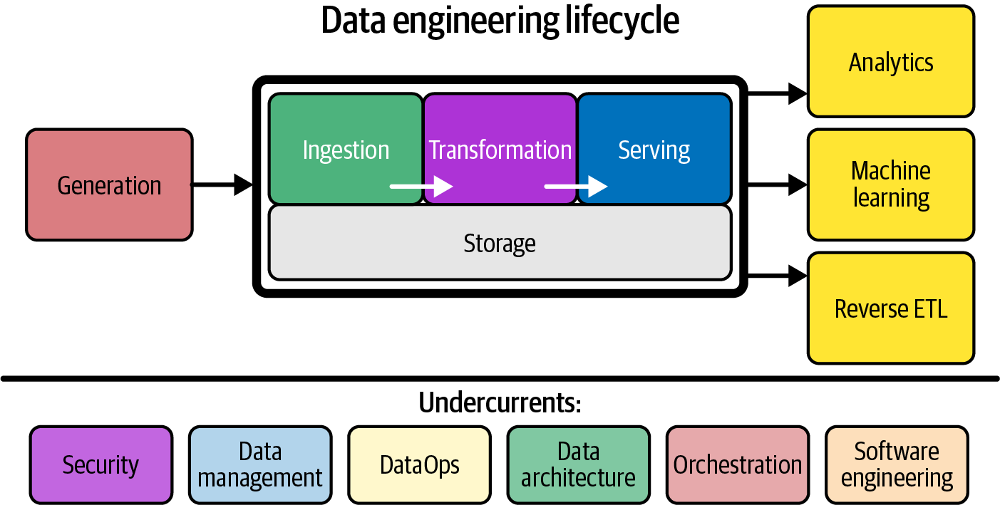
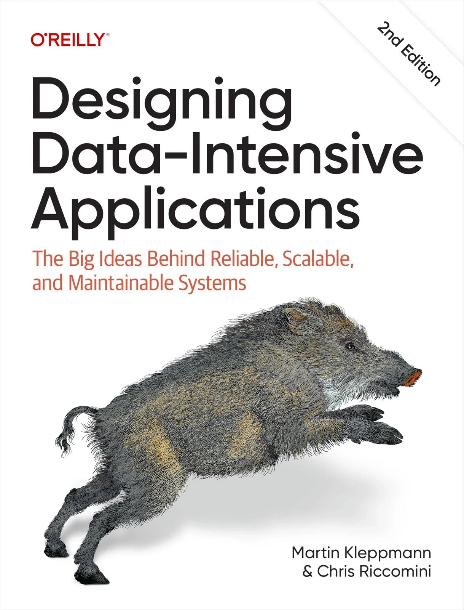
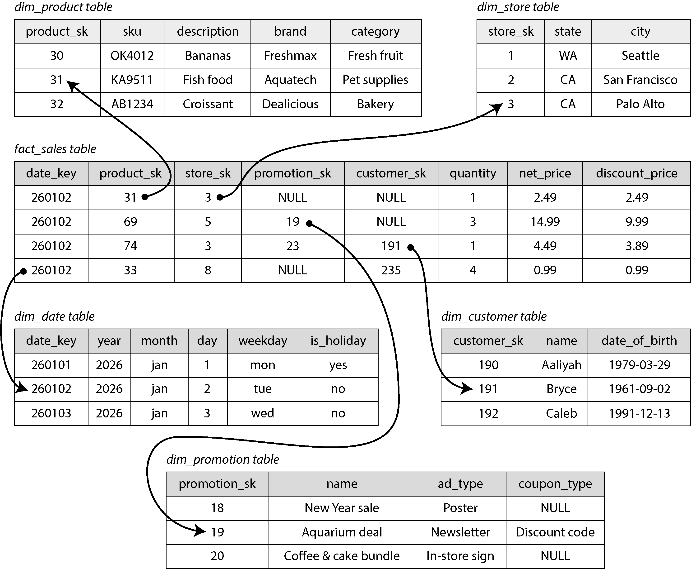

::: {.content-visible unless-format="revealjs"}

<a class="h2" href="./slides.html" target="_blank">Open slides in new tab &rarr;</a>

:::

# Data Engineering {.smaller .crunch-title .title-13 .ul-block .crunch-quarto-figure .crunch-img data-stack-name="Data Engineering"}

{.lightbox width="550"}

* Have you noticed? In most HWs, you've looked at `.parquet` **metadata** describing a column **schema**
* There's a whole book [@reis_fundamentals_2022], and a [whole job](https://trends.google.com/explore?q=data%20scientist%2C%20data%20engineer&date=2010-01-01%202026-10-01&geo=US), focused directly on facilitating seamless "flow" from raw data $\leadsto$ insights
* Today: **Streamline** separation and combination of (computation, data) by carefully defining and enforcing **schemas**
* Next week: Move to **full-on distributed computing** with **Spark!** [*(...Much harder to debug issues with data flowing "out there" across EC2 nodes)*]{style="font-size: 90%;"}

## What is Data Engineering? {.crunch-title .text-75 .crunch-img .crunch-blockquote .crunch-p-6 .crunch-ul .ul-block}

 book](images/reis-cover.jpg){fig-align="center" width="360"}

> Data engineering is the development, implementation, and maintenance of systems  and processes that take in raw data and **produce** **high-quality**, **consistent** information that supports downstream use cases, such as analysis and machine learning [@reis_fundamentals_2022]

Bolded terms $\Rightarrow$ new skills, tools in your toolkit:

* **Producers**, **consumers**: Who is responsible for what?
* Data **catalogs**: How does someone in your org *find* the data they're looking for, in their desired format?
* How is data **made available?** (Security, lifecycle management)

## What Do Data Engineers Do? {.title-09 .crunch-title .crunch-ul}

* **Disambiguation**: How to **interpret** what the data **means**?
  * <i class='bi bi-1-circle'></i> Register the **schema** within a data **catalog**
  * <i class='bi bi-2-circle'></i> Subject matter experts (*Data Stewards*) add meaningful descriptions
* **Deduplication**: Having a single source of truth!
* **Data Governance**: How long to store, access controls, etc.

Once this is done, data may be stored in a central repository such as a **data lake** or **data lakehouse**.

::: {.aside}

*Slide credit: Amit Arora!*

:::

# OLTP $\rightarrow$ OLAP: One Level Deeper {.crunch-title .title-09 .not-title-slide data-stack-name="OLTP &rarr; OLAP"}

:::: {layout="[1,1]" layout-valign="center"}
::: {#boar-book-left}

* Lakes vs. Warehouses
* Star Schema
* Extract-Transform-Load (ETL) Pipelines

:::
::: {#boar-book-right}

{fig-align="center" width="70%"}

:::
::::

## The Star Schema {.smaller .crunch-title .crunch-p}

:::: {.columns}
::: {.column width="65%"}

{fig-align="center" width="90%"}

:::
::: {.column width="35%"}

* In the center: a **single *fact table***
* Refers out to many **dimension tables**

:::
::::

## Telemetry &rarr; Analytics

Recall how many tiny bits of information are **streaming into** a given app's servers at any given time!

> Database administrators therefore **closely guard their OLTP databases**. They are usually **reluctant to let business analysts run ad hoc analytic queries on an OLTP database**, since those queries are often expensive, scanning large parts of the dataset, which can harm the performance of concurrently executing transactions.

# Athena for EDA on Raw Data! {data-stack-name="Athena"}

## What is the Quickest Possible Way to Explore Data in S3?

](images/athena_glue.jpg){fig-align="center"}

## Lab: Analyzing NYC Taxi dataset with Athena {.title-08 .crunch-title}

## References

::: {#refs}
:::
