::: {.content-visible unless-format="revealjs"}

The content for today is **split** between the following **two resources**:

<center class='mb-3'>
<a class="h2" href="https://gu-dsan.github.io/6000-fall-2025/slides/06-slides.html" target="_blank">Open *Spark* Slides from Main Site</a>
</center>

<center class='mb-3'>
<a class="h2" href="./slides.html" target="_blank">Open *MapReduce* slides in new tab &rarr;</a>
</center>

:::

# Highest-Level Overview (Roadmap!) {data-name="Roadmap" .smaller .title-12}

* Week 3: **Map-Reduce**
  * But, just the "plain", basic version **built into Python** (`map()`, `functools.reduce()`)
* Last Week: **Athena** with **AWS Glue** under the hood
  * "Automated" ETL Pipeline!
* This Week: Hitting a wall with Athena... It **doesn't know in advance what [types of] queries you're going to make!**
* If you're going to **group by** (e.g.) **state**, then rent **50 computers** to process one state each, Athena doesn't know to **place the Ohio data on the Ohio computer!**
* We need a way to **"steer" Map-Reduce's choices**... Enter **Hadoop MapReduce!**

# A Reminder: Map-Reduce as a *Paradigm* {data-stack-name="Map-Reduce"}

## What Happens When *Not* Embarrassingly Parallel? {.smaller .crunch-title .crunch-math .crunch-ul .title-09}

* Think of the difference between **linear** and **quadratic equations** in algebra:
* $3x - 1 = 0$ is "embarrassingly" solvable, on its own: you can solve it directly, by adding 3 to both sides $\implies x = \frac{1}{3}$. Same for $2x + 3 = 0 \implies x = -\frac{3}{2}$
* Now consider $6x^2 + 7x - 3 = 0$: Harder to solve "directly", so your instinct might be to turn to the laborious **quadratic equation**:

$$
\begin{align*}
x = \frac{-b \pm \sqrt{b^2 - 4ac}}{2a} = \frac{-7 \pm \sqrt{49 - 4(6)(-3)}}{2(6)} = \frac{-7 \pm 11}{12} = \left\{\frac{1}{3},-\frac{3}{2}\right\}
\end{align*}
$$

* And yet, $6x^2 + 7x - 3 = (3x - 1)(2x + 3)$, meaning that we could have **split** the problem into two "embarrassingly" solvable pieces, then **multiplied** to get result!

## The Analogy to Map-Reduce {.crunch-title .title-09}

| | |
|:- |:-:|
| $\leadsto$ If code is **not** embarrassingly parallel (instinctually requiring laborious serial execution), | $\underbrace{6x^2 + 7x - 3 = 0}_{\text{Solve using Quadratic Eqn}}$ |
| But can be **split** into... | $(3x - 1)(2x + 3) = 0$ |
| Embarrassingly parallel **pieces** which **combine** to same result, | $\underbrace{3x - 1 = 0}_{\text{Solve directly}}, \underbrace{2x + 3 = 0}_{\text{Solve directly}}$ |
| We can use **map-reduce** to achieve ultra speedup (running "pieces" on **GPU!**) | $\underbrace{(3x-1)(2x+3) = 0}_{\text{Solutions satisfy this product}}$ |

: {tbl-colwidths="[75,25]"}

## "Factoring" into Embarrassing and Non-Embarrassing Pieces {.smaller .crunch-title .crunch-details}

* Problem from DSAN 5000/5100: Computing SSR (**Sum of Squared Residuals**)
* $y = (1,3,2), \widehat{y} = (2, 5, 0) \implies \text{SSR} = (1-2)^2 + (3-5)^2 + (2-0)^2 = 9$
* Computing pieces separately:

```python
map(do_something_with_piece, list_of_pieces)
```

```{python}
my_map = map(lambda input: input**2, [(1-2), (3-5), (2-0)])
map_result = list(my_map)
map_result
```

* Combining solved pieces

```python
reduce(how_to_combine_pair_of_pieces, pieces_to_combine)
```

```{python}
from functools import reduce
my_reduce = reduce(lambda piece1, piece2: piece1 + piece2, map_result)
my_reduce
```

# But... Why is All This Weird Mapping and Reducing Necessary? {data-stack-name="Map-Reduce Rationale"}

* Without knowing a bit more of the **internals** of **computing efficiency**, it may seem like a huge cost in terms of overly-complicated overhead, not to mention learning curve...

## The "Killer Application": Matrix Multiplication {.crunch-title .smaller .title-11}

* *(I learned from <a href='http://infolab.stanford.edu/~ullman/' target='_blank'>Jeff Ullman</a>, who did the obnoxious Stanford thing of mentioning in passing how "two previous students in the <a href='http://web.stanford.edu/class/cs246/' target='_blank'>class</a> did this for a cool final project on web crawling and, well, it escalated quickly", aka became Google)*

{fig-align="center"}

## The Killer Way-To-Learn: Text Counts! {.smaller .crunch-title .crunch-ul .crunch-p .title-12}

* [-@leskovec_mining_2014]: Text counts (2.2) $\rightarrow$ Matrix multiplication (2.3) $\rightarrow \cdots \rightarrow$ PageRank (5.1)
* *(And yall thought it was just busywork for HW3* 😏*)*
* The goal: User searches <a href='https://www.youtube.com/watch?v=eqwiC93zmxI' target='_blank'>"Denzel Curry"</a>... How **relevant** is a given webpage?
* Scenario 1: Entire internet fits on CPU $\Rightarrow$ Can just make a big big hash table:

```{dot}
//| echo: false
//| fig-height: 4
digraph G {
    rankdir="LR";
    nodesep="10";
	edge [penwidth=1.2,arrowsize=0.85]
    node [
        shape=plaintext;
        fontname="Courier";
    ];
    # Chunked
    internet [shape=none label=<
<table border="1" cellborder="0">
<tr>
  <td border="1" sides="b"><font face="Helvetica">Scan in O(n):</font></td>
</tr>
<tr>
  <td port="p1" align="text" balign="left">Today Denzel Washington<br />ate a big bowl of Yum's<br />curry. Denzel allegedly<br />rubbed his tum and said<br />"yum yum yum" when he<br />tasted today's curry.<br />"Yum! It is me Denzel,<br />curry is my fav!", he<br />exclaimed. According to<br />his friend Steph, curry<br />is indeed Denzel's fav.<br />We are live with Del<br />Curry in Washington for<br />a Denzel curry update.</td>
</tr>
</table>>];

    # Combined counts
    ccounts [shape=none label=<
<table border="1" cellborder="0">
<tr>
  <td border="1" sides="b" colspan="2"><font face="Helvetica">Overall Counts</font></td>
</tr>
<tr>
  <td port="p1" border="1" align="text" balign="left" sides="r">('according',1)<br />('allegedly',1)<br />('ate',1)<br />('big',1)<br />('bowl',1)<br />('curry',6)<br />('del',1)<br />('denzel',5)<br />('exclaimed',1)<br />('fav',2)<br />('friend',1)</td>
  <td align="text" balign="left">('indeed',1)<br />('live',1)<br />('rubbed',1)<br />('said',1)<br />('steph',1)<br />('tasted',1)<br />('today',2)<br />('tum',1)<br />('update',1)<br />('washington',2)<br />('yum',4)</td>
</tr>
</table>>];
    internet -> ccounts[label="Hash Table"];
}
```

## If Everything *Doesn't* Fit on CPU...

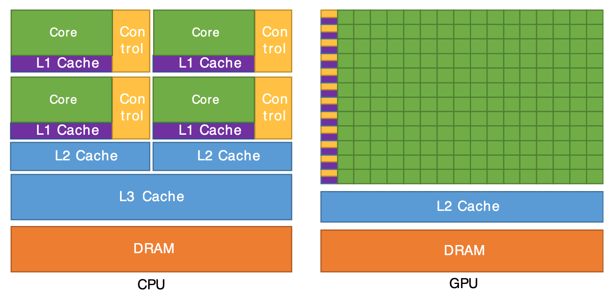{fig-align="center"}

## Break Problem into *Chunks* for the Green Bois! {.smaller .crunch-title .title-10 .crunch-quarto-figure}

```{dot}
//| echo: false
digraph G {
    rankdir="LR";
	edge [penwidth=1.2,arrowsize=0.85]
    node [
        shape=plaintext;
        fontname="Courier";
    ];
    # Chunked
    chunked [shape=none label=<
<table border="1" cellborder="0">
<tr>
  <td border="1" sides="b"><font face="Helvetica">Chunked Document</font></td>
</tr>
<tr>
  <td port="p1" border="1" align="text" balign="left" sides="b">Today Denzel Washington<br />ate a big bowl of Yum's<br />curry. Denzel allegedly<br />rubbed his tum and said</td>
</tr>
<tr>
  <td port="p2" border="1" align="text" balign="left" sides="b">"yum yum yum" when he<br />tasted today's curry.<br />"Yum! It is me Denzel,<br />curry is my fav!", he</td>
</tr>
<tr>
  <td port="p3" border="1" align="text" balign="left" sides="b">exclaimed. According to<br />his friend Steph, curry<br />is indeed Denzel's fav.<br />We are live with Del</td>
</tr>
<tr>
  <td port="p4" align="text" balign="left">Curry in Washington for<br />a Denzel curry update.</td>
</tr>
</table>>];
    // orig:p1 -> chunked:p1;
    // orig:p2 -> chunked:p2;
    // orig:p3 -> chunked:p3;
    // orig:p4 -> chunked:p4;

    # Chunked counts
    chcounts [shape=none label=<
<table border="1">
<tr>
  <td border="1" sides="b"><font face="Helvetica">Chunked Counts</font></td>
</tr>
<tr>
  <td port="p1" border="1" align="text" balign="left" sides="b">('today',1)<br />('denzel',1)<br />...<br />('tum',1)<br />('said',1)</td>
</tr>
<tr>
  <td port="p2" border="1" align="text" balign="left" sides="b">('yum',1)<br />('yum',1)<br />('yum',1)<br />...<br />('fav',1)</td>
</tr>
<tr>
  <td port="p3" border="1" align="text" balign="left" sides="b">('exclaimed',1)<br />...<br />('del',1)</td>
</tr>
<tr>
  <td port="p4" border="0" align="text" balign="left">('curry',1)<br />('washington',1)<br />('denzel',1)<br />('curry',1)<br />('update',1)</td>
</tr>
</table>>];
    chunked:p1 -> chcounts:p1[label="O(n/4)"];
    chunked:p2 -> chcounts:p2[label="O(n/4)"];
    chunked:p3 -> chcounts:p3[label="O(n/4)"];
    chunked:p4 -> chcounts:p4[label="O(n/4)"];

    # Sorted counts
    scounts [shape=none label=<
<table border="1">
<tr>
  <td border="1" sides="b"><font face="Helvetica">Hashed Counts</font></td>
</tr>
<tr>
  <td port="p1" border="1" align="text" balign="left" sides="b">('allegedly',1)<br />...<br />('curry',1)<br />('denzel',2)<br />...<br />('yum',1)</td>
</tr>
<tr>
  <td port="p2" border="1" align="text" balign="left" sides="b">('curry',2)<br />('denzel',1)<br />...<br />('yum',4)</td>
</tr>
<tr>
  <td port="p3" border="1" align="text" balign="left" sides="b">('according',1)<br />('curry',1)<br />('del',1)<br />('denzel',1)<br />...</td>
</tr>
<tr>
  <td port="p4" border="0" align="text" balign="left">('curry',2)<br />('denzel',1)<br />('update',1)<br />('washington',1)</td>
</tr>
</table>>];
    chcounts:p1 -> scounts:p1[label="O(n/4)"];
    chcounts:p2 -> scounts:p2[label="O(n/4)"];
    chcounts:p3 -> scounts:p3[label="O(n/4)"];
    chcounts:p4 -> scounts:p4[label="O(n/4)"];

    # Combined counts
    ccounts [shape=none,label=<
<table border="1" cellborder="0">
<tr>
  <td port="p0" border="1" sides="b"><font face="Helvetica">Overall Counts</font></td>
</tr>
<tr>
  <td port="p1" align="text" balign="left">('according',1)<br />('allegedly',1)<br />('ate',1)<br />('big',1)<br />('bowl',1)<br />('curry',6)<br />('del',1)<br />('denzel',5)<br />('exclaimed',1)<br />('fav',2)<br />('friend',1)<br />('indeed',1)<br />('live',1)<br />('rubbed',1)<br />('said',1)<br />('steph',1)<br />('tasted',1)<br />('today',2)<br />('tum',1)<br />('update',1)<br />('washington',2)<br />('yum',4)</td>
</tr>
</table>>];
    scounts:p1 -> ccounts:p1;
    scounts:p2 -> ccounts:p1;
    scounts:p3 -> ccounts:p1;
    scounts:p4 -> ccounts:p1;
    scounts:p2 -> ccounts[margin="5",labeldistance="4",penwidth="0",arrowsize="0.01",taillabel=<
<table border="0" cellborder="0">
<tr>
  <td bgcolor="white" color="black"><font color="black">Merge in<br />O(n)</font></td>
</tr>
</table>
    >,headlabel=" ",minlen="2"];
}
```

* $\implies$ Total = $O(3n) = O(n)$
* But **also** optimized in terms of constants, because of **sequential memory reads**

## In-Class Demo 1 {.crunch-title .crunch-img .text-90}

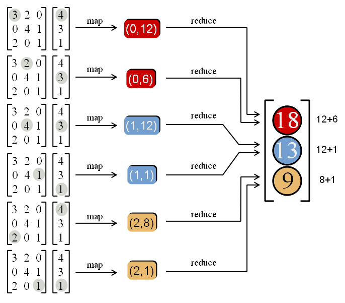{fig-align="center"}

[Map-Reduced **Matrix-Vector Multiplication** Demo](https://deepnote.com/workspace/Columbia-University-f2637961-0c74-4aff-8153-d766baa193ed/project/MapReduceDemo-41367b13-4253-47c8-8ffe-0544456d6070/notebook/DSAN5500HW5-8b90a6af23d34d239b7da0111228614d?utm_source=share-modal&utm_medium=product-shared-content&utm_campaign=notebook&utm_content=41367b13-4253-47c8-8ffe-0544456d6070)

## In-Class Demo 2 {.crunch-title .crunch-img .text-90}

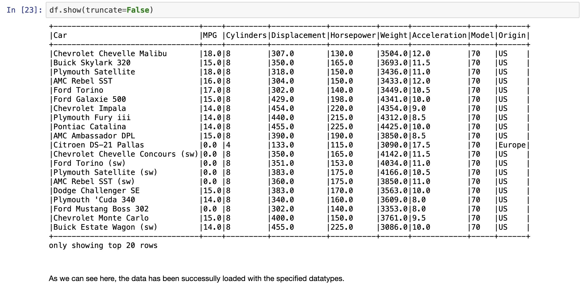{fig-align="center"}

* [Cars! Driving!](
https://colab.research.google.com/drive/1G894WS7ltIUTusWWmsCnF_zQhQqZCDOc)

::: {.aside}

Adapted from/almost identical to [Jacob Celestine's tutorial](https://jacobcelestine.com/knowledge_repo/colab_and_pyspark/)

:::

## In-Class Demo 3 {.crunch-title .crunch-img .text-90}

{fig-align="center"}

[Tennis! Swingin rackets! Scorin goals!](https://deepnote.com/workspace/dsan-f2637961-0c74-4aff-8153-d766baa193ed/project/MapReduceDemo-Duplicate-5b6d12ee-5b84-4b9c-b217-57081420a97d/notebook/DSAN5500HW5-e728d4f3669d412fa2af10e6f30b9689?utm_source=share-modal&utm_medium=product-shared-content&utm_campaign=notebook&utm_content=5b6d12ee-5b84-4b9c-b217-57081420a97d)

## Lab Time! {data-name="Lab 6"}

# Spark: a Unified Engine {data-stack-name="Spark Connectors"}

## Connected and extensible

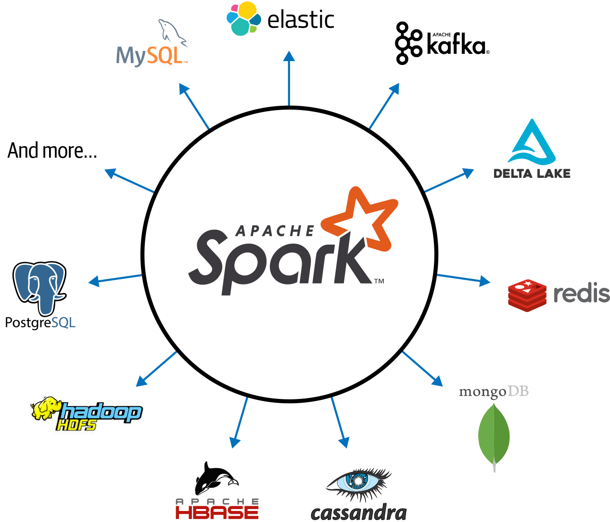{fig-align="center"}

<!-- 
## Caching and Persistence

By default, RDDs are recomputed every time you run an action on them. This can be expensive (in time) if you need to use a dataset more than once.

**Spark allows you to control what is cached in memory.**

To tell spark to cache an object in memory, use `persist()` or `cache()`:

* `cache():` is a shortcut for using default storage level, which is memory only
* `persist():` can be customized to other ways to persist data (including both memory and/or disk)

```{{python}}
# caches error RDD in memory, but only after an action is run
errors = logs.filter(lambda x: "error" in x and "2019-12" in x).cache()
``` -->

## Review of PySparkSQL Cheatsheet

[https://s3.amazonaws.com/assets.datacamp.com/blog_assets/PySpark_SQL_Cheat_Sheet_Python.pdf](https://s3.amazonaws.com/assets.datacamp.com/blog_assets/PySpark_SQL_Cheat_Sheet_Python.pdf)


## `collect` **CAUTION**

::: {.imgcenter}
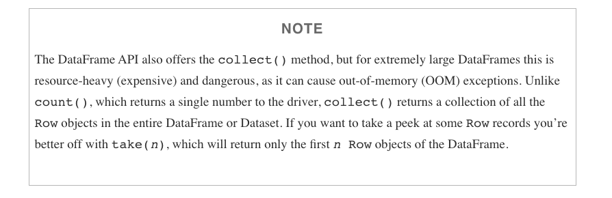
:::

<!-- ## Review of htop

::: {.imgcenter}

::: -->

<!-- ## htop top section explanation

::: {.imgcenter}

::: -->

<!-- ## htop bottom section explanation

::: {.imgcenter}

:::

[https://codeahoy.com/2017/01/20/hhtop-explained-visually/](https://codeahoy.com/2017/01/20/hhtop-explained-visually/) -->

## Spark Diagnostic UI: Understanding how the cluster is running your job

Spark Application UI shows important facts about you Spark job:

* Event timeline for each stage of your work
* Directed acyclical graph (DAG) of your job
* Spark job history
* Status of Spark executors
* Physical / logical plans for any SQL queries

#### Tool to confirm you are getting the horizontal scaling that you need!

Adapted from [AWS Glue Spark UI docs](https://docs.aws.amazon.com/glue/latest/dg/monitor-spark-ui.html)
and [Spark UI docs](https://spark.apache.org/docs/latest/web-ui.html)

## Spark UI - Event timeline

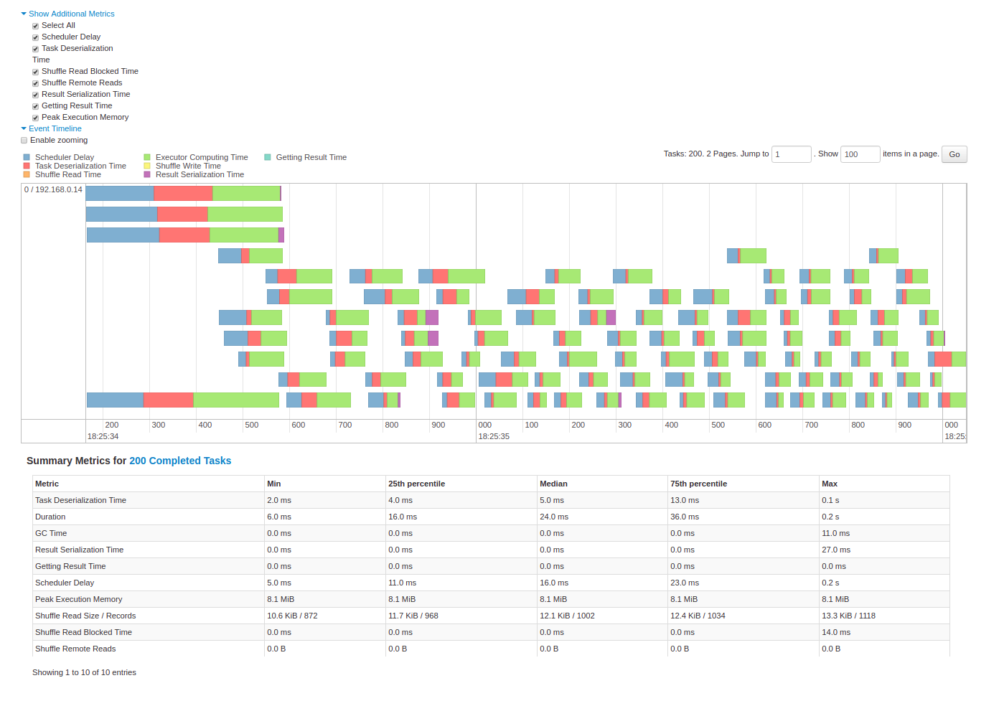{fig-align="center"}

## Spark UI - DAG

{fig-align="center"}

## Spark UI - Job History

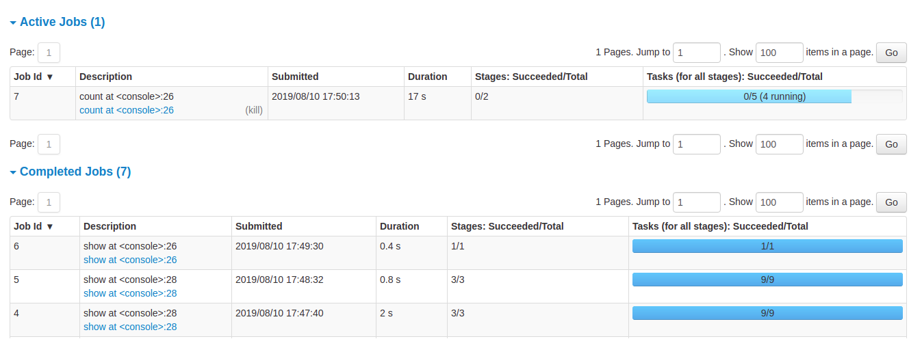{fig-align="center"}

## Spark UI - Executors

{fig-align="center"}

## Spark UI - SQL

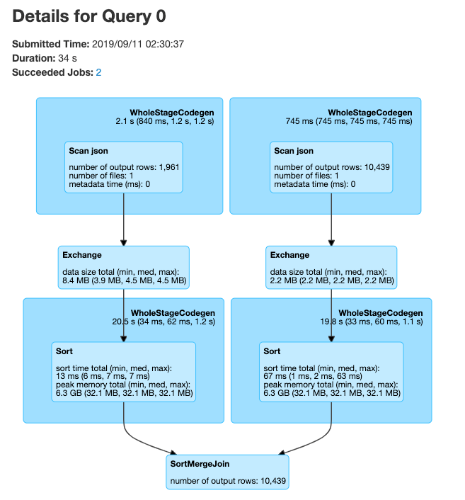{fig-align="center"}

# PySpark User Defined Functions

## UDF Workflow

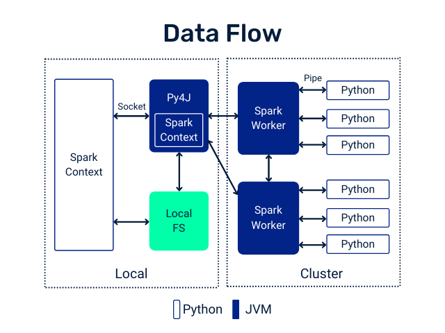{fig-align="center"}

## UDF Code Structure

### Clear input - a single row of data with one or more columns used

### Function - some work written in python that process the input using python syntax. No PySpark needed!

### Clear output - output with a scoped data type 

## UDF Example

Problem: make a new column with ages for adults-only

```
+-------+--------------+
|room_id|   guests_ages|
+-------+--------------+
|      1|  [18, 19, 17]|
|      2|   [25, 27, 5]|
|      3|[34, 38, 8, 7]|
+-------+--------------+
```

Adapted from [UDFs in Spark](https://blog.damavis.com/en/avoiding-udfs-in-apache-spark/)

## UDF Code Solution

```{{python}}
from pyspark.sql.functions import udf, col

@udf("array<integer>")
   def filter_adults(elements):
   return list(filter(lambda x: x >= 18, elements))

# alternatively
from pyspark.sql.types IntegerType, ArrayType
@udf(returnType=ArrayType(IntegerType()))
def filter_adults(elements):
   return list(filter(lambda x: x >= 18, elements))
```

```
+-------+----------------+------------+
|room_id| guests_ages    | adults_ages|
+-------+----------------+------------+
| 1     | [18, 19, 17]   |    [18, 19]|
| 2     | [25, 27, 5]    |    [25, 27]|
| 3     | [34, 38, 8, 7] |    [34, 38]|
| 4     |[56, 49, 18, 17]|[56, 49, 18]|
+-------+----------------+------------+
```

## Alternative to Spark UDF

```{{python}}
# Spark 3.1
from pyspark.sql.functions import col, filter, lit

df.withColumn('adults_ages',
              filter(col('guests_ages'), lambda x: x >= lit(18))).show()
```

## Another UDF Example

* Separate function definition form

```{{python}}
from pyspark.sql.functions import udf
from pyspark.sql.types import LongType

# define the function that can be tested locally
def squared(s):
  return s * s

# wrap the function in udf for spark and define the output type
squared_udf = udf(squared, LongType())

# execute the udf
df = spark.table("test")
display(df.select("id", squared_udf("id").alias("id_squared")))
```

* Single function definition form

```{{python}}
from pyspark.sql.functions import udf
@udf("long")
def squared_udf(s):
  return s * s
df = spark.table("test")
display(df.select("id", squared_udf("id").alias("id_squared")))
```

## Can also refer to a UDF in SQL

```{{sql}}
spark.udf.register("squaredWithPython", squared)
select id, squaredWithPython(id) as id_squared from test
```

* Consider all the corner cases
* Where could the data be null or an unexpected value
* Leverage python control structure to handle corner cases

[source](https://docs.databricks.com/en/udf/python.html)

## UDF Speed Comparison

:::: {.columns}
::: {.column width="53%"}

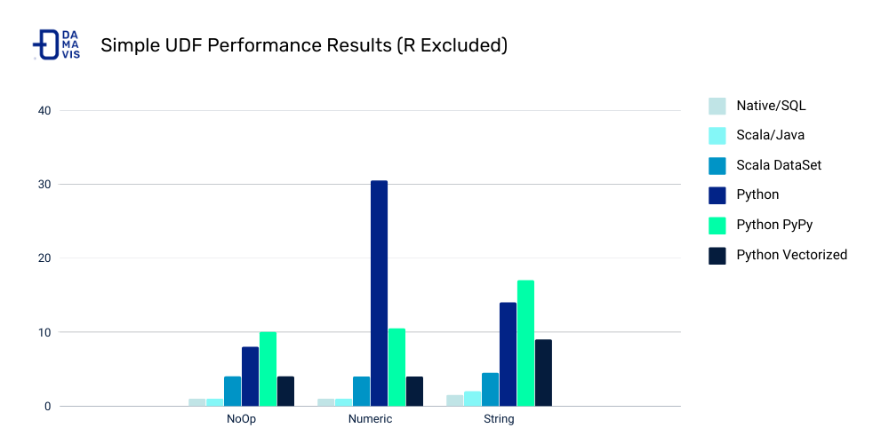{fig-align="center"}

:::
::: {.column width="45%"}
Costs:

* Serialization/deserialization (think pickle files)
* Data movement between JVM and Python
* Less Spark optimization possible

Other ways to make your Spark jobs faster [source](https://sparkbyexamples.com/spark/spark-performance-tuning/):

* Cache/persist your data into memory
* Using Spark DataFrames over Spark RDDs
* Using Spark SQL functions before jumping into UDFs
* Save to serialized data formats like Parquet

:::
::::

## Pandas UDF

From PySpark docs - Pandas UDFs are user defined functions that are executed by Spark using Arrow to transfer data and Pandas to work with the data, which allows vectorized operations. A Pandas UDF is defined using the pandas_udf as a decorator or to wrap the function, and no additional configuration is required. A Pandas UDF behaves as a regular PySpark function API in general.

```{{python}}
@pandas_udf("string")
def to_upper(s: pd.Series) -> pd.Series:
    return s.str.upper()

df = spark.createDataFrame([("John Doe",)], ("name",))
df.select(to_upper("name")).show()
+--------------+
|to_upper(name)|
+--------------+
|      JOHN DOE|
+--------------+
```

## Another example

```{{python}}
@pandas_udf("first string, last string")
def split_expand(s: pd.Series) -> pd.DataFrame:
    return s.str.split(expand=True)


df = spark.createDataFrame([("John Doe",)], ("name",))
df.select(split_expand("name")).show()
+------------------+
|split_expand(name)|
+------------------+
|       [John, Doe]|
+------------------+
```

[https://spark.apache.org/docs/latest/api/python/reference/pyspark.sql/api/pyspark.sql.functions.pandas_udf.html](https://spark.apache.org/docs/latest/api/python/reference/pyspark.sql/api/pyspark.sql.functions.pandas_udf.html)

## Scalar Pandas UDFs

* Vectorizing scalar operations - one plus one
* Pandas UDF needs to have same size input and output series

#### UDF Form

```{{python}}
from pyspark.sql.functions import udf

# Use udf to define a row-at-a-time udf
@udf('double')
# Input/output are both a single double value
def plus_one(v):
      return v + 1

df.withColumn('v2', plus_one(df.v))
```

#### Pandas UDF Form - **faster vectorized form**

```{{python}}
from pyspark.sql.functions import pandas_udf, PandasUDFType

# Use pandas_udf to define a Pandas UDF
@pandas_udf('double', PandasUDFType.SCALAR)
# Input/output are both a pandas.Series of doubles

def pandas_plus_one(v):
    return v + 1

df.withColumn('v2', pandas_plus_one(df.v))
```

[source](https://www.databricks.com/blog/2017/10/30/introducing-vectorized-udfs-for-pyspark.html)

## Grouped Map Pandas UDFs

* Split, apply, combine using Pandas syntax

```{{python}}
@pandas_udf(df.schema, PandasUDFType.GROUPED_MAP)
# Input/output are both a pandas.DataFrame
def subtract_mean(pdf):
    return pdf.assign(v=pdf.v - pdf.v.mean())

df.groupby('id').apply(subtract_mean)
```

## Comparison of Scalar and Grouped Map Pandas UDFs

:::: {.columns}
::: {.column width="53%"}
* Input of the user-defined function:

   * Scalar: pandas.Series
   * Grouped map: pandas.DataFrame

* Output of the user-defined function:

   * Scalar: pandas.Series
   * Grouped map: pandas.DataFrame

* Grouping semantics:

   * Scalar: no grouping semantics
   * Grouped map: defined by "groupby" clause

* Output size:

   * Scalar: same as input size
   * Grouped map: any size


:::
::: {.column width="45%"}

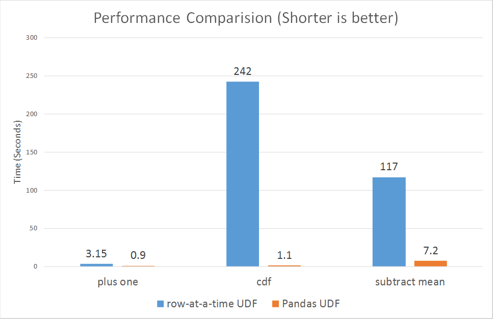{fig-align="center"}

:::
::::

## References

::: {#refs}
:::
