::: {.callout-note title="SaxaNet vs. GuestNet"}

If you are on Georgetown's campus, make sure that you are connected to the [**SaxaNet** wifi network](https://uis.georgetown.edu/saxanet/), and **not** the **GuestNet** wifi network. SSHing into a remote instance is **blocked** on GuestNet, which means if you are on GuestNet you wil not be able to connect to your EC2 instances.

:::

Follow these instructions _step-by-step_ to setup your AWS EC2 environment. This EC2 instance will serve as your development environment throughout the semester, allowing you to run Python code and Jupyter notebooks using VSCode as your IDE.

## Task 0: Accept the Invitation to join the AWS Classroom (the first time)

1. In your student email inbox, you will have an email from _AWS Academy_ with the subject _Course Invitation_. 

1. Open the email. Click on the _Get Started_ button as shown in the screenshot below.

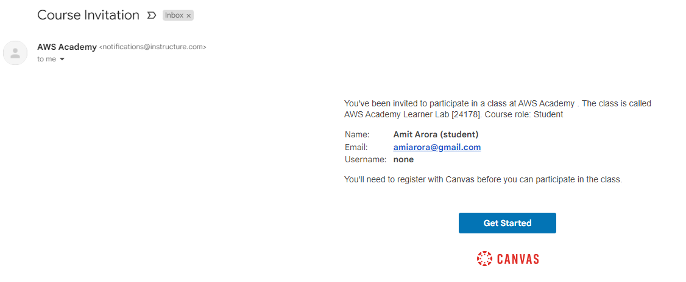{.lightbox}

1. Click on the _Create My Account_ button to create a new Canvas Account (note that this canvas account is different from your existing Georgetown canvas account).

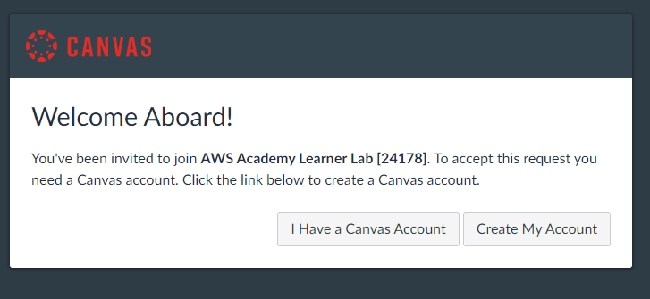{.lightbox}

1. Register your new account.

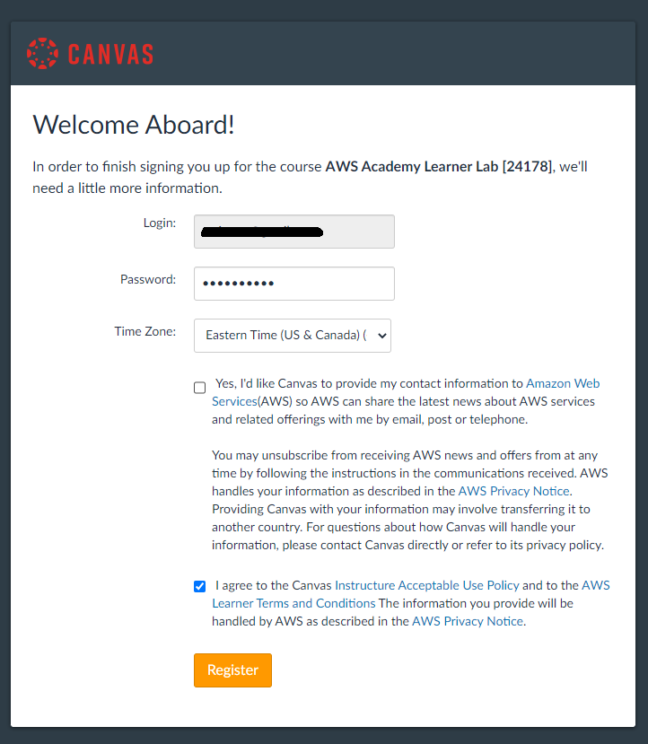{.lightbox}

1. You should now be logged into _AWS Academy Learners Lab_ and seeing a screen like the one shown below. Click on _Learners Lab_

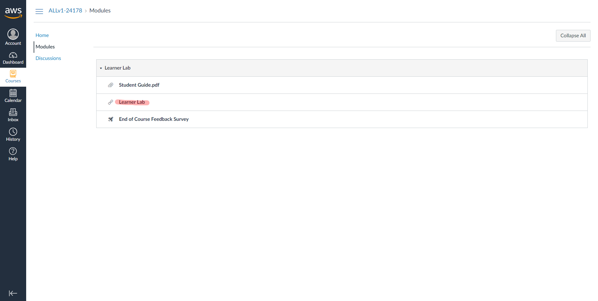{.lightbox}

1. Scroll all the way to the bottom of the page and accept the _Terms & Conditions_.

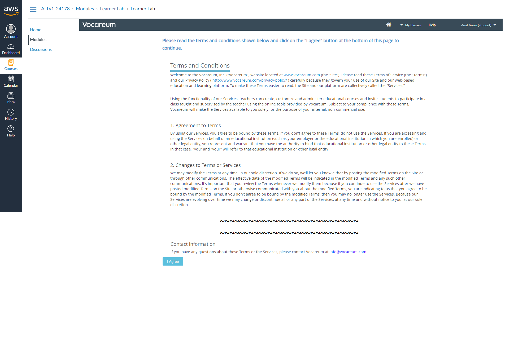{.lightbox}

1. You are now being logged in into the _AWS Console_. Notice the <font color="red">⬤</font> next to the word _AWS_ towards the top left of the page. This indicates that the AWS Console is not set up. Click on the _play_ button along side _Start Lab_ on the to top right corner of the page to start the lab.

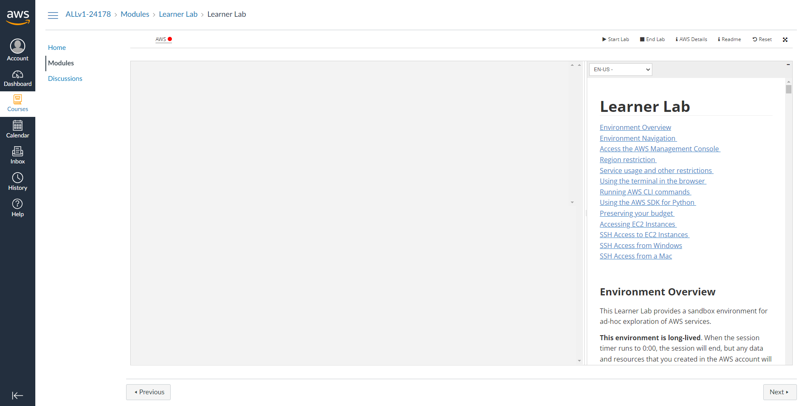{.lightbox}

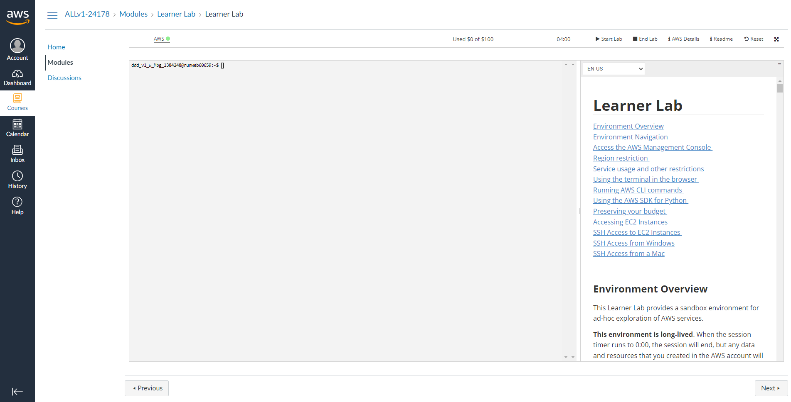{.lightbox}

1. Each _lab session_ that you start is at most 4 hours and you can see a timer showing the remaining time (hh:mm) on the ribbon along with the remaining budget out of the $50 allocated to each account. 

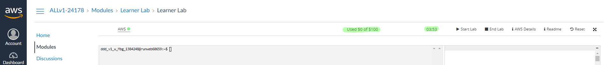{.lightbox}

1. This environment is **long-lived**. When the session timer runs to 0:00, the session will end, but any data and resources that you created in the AWS account will be retained. If you later launch a new session (for example, the next day), you will find that your work is still in the lab environment. Running EC2 instances will be stopped and then automatically restarted the next time you start a session.

::: {.callout-note title="Monitoring Your AWS Budget"}

Monitor your AWS budget in the interface above. Whenever you have an active AWS Console session, the latest known remaining budget information will display at the top of this screen. This data comes from AWS Budgets which typically updates every 8 to 12 hours. Therefore the remaining budget that you see may not reflect your most recent account activity. If you exceed your lab budget your lab account will be disabled and all progress and resources will be lost. Therefore, it is important for you to manage your spending.

:::

### Login into the AWS Console

The _AWS Console_ is your entry point into the AWS cloud. 

1. Click on the AWS link alongside the <font color="lightgreen">⬤</font>.

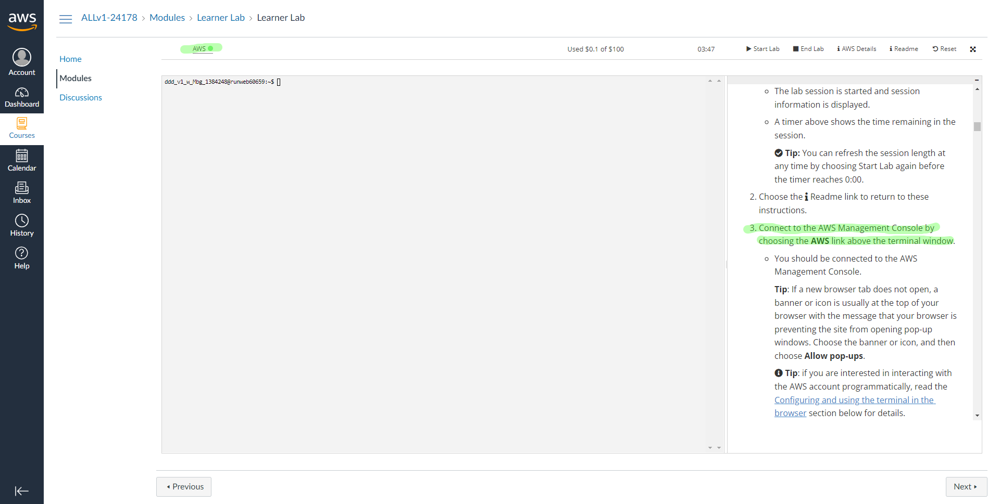{.lightbox}

1. A new tab will open in your browser, this is the _AWS Console_.

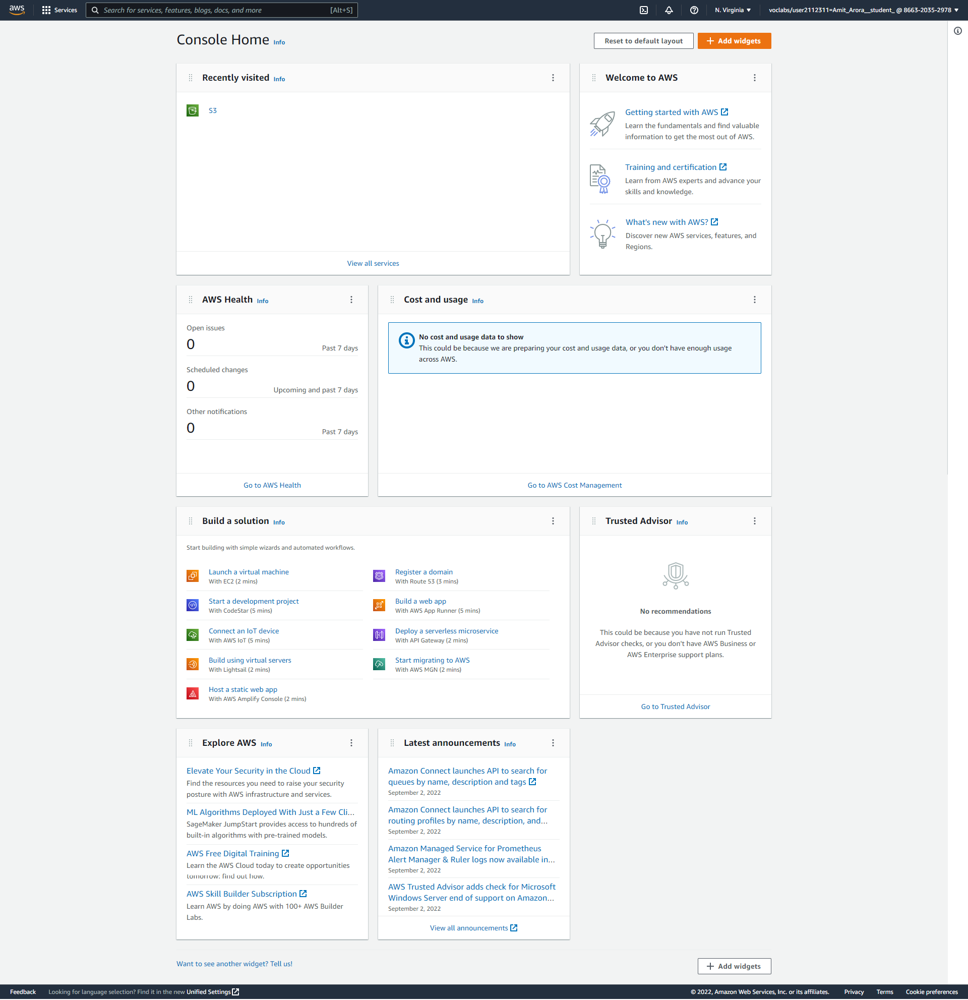{.lightbox}

1. Note the URL in your browser's address bar, it will start with the name of the AWS region (such as _us-east-1_) in which your cloud resources are hosted. 

1. Note the username on the top right hand corner, this is your _Federated Identity_. Also note that the you did not have to provide any credentials (username/password) to login into the AWS console.

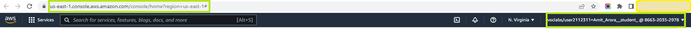{.lightbox}

### Logging into the AWS Console at a later time

To access the AWS Console in the future, login to the [AWS Canvas](), go to _Learner Lab_ -> _Modules_ -> _Start Lab_.

## Task 1: Create an EC2 Instance for Development

Now we'll create an EC2 instance that will serve as your development environment throughout the semester. This instance will run Ubuntu Linux and can be accessed remotely using VSCode.

### Navigate to EC2 Service

1. From the AWS Console home page, click on the **EC2** service. You can find it under "Compute" or by using the search bar at the top.

[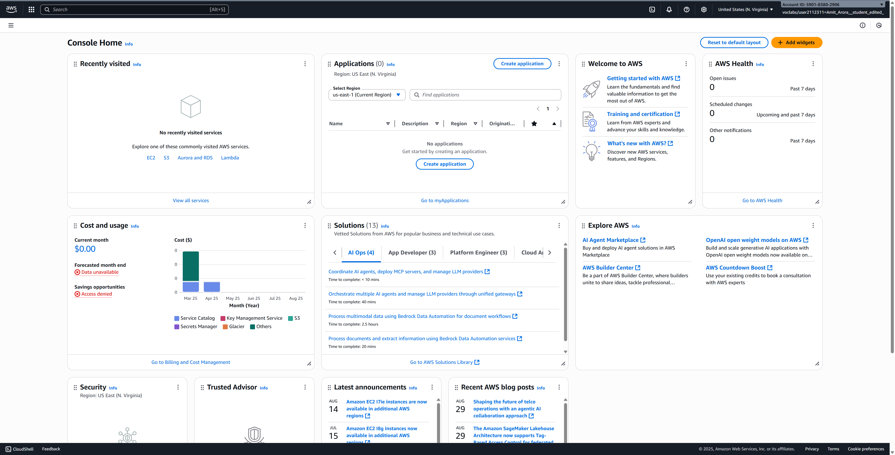](img/Console-Home-Console-Home.png)

2. Once you're in the EC2 Dashboard, click on the **Launch instances** button on the top right.

[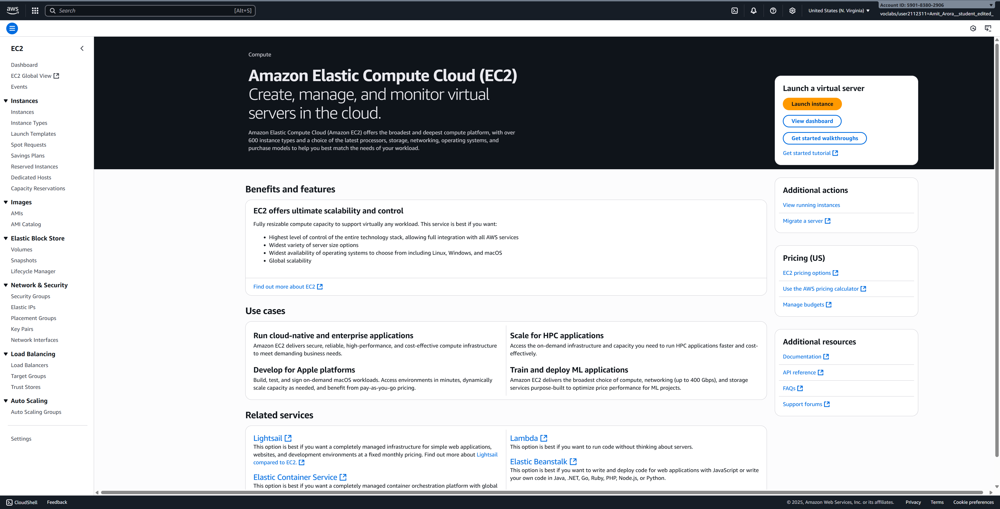](img/Home-EC2.png)

### Configure Your Instance

You'll now be on the "Launch an instance" page. Follow these steps to configure your instance:

#### Configure Instance Details

1. **Name and tags**: Give your instance a meaningful name, such as `{your-net-id}-dsan6k-dev` (replace `{your-net-id}` with your actual NET ID).

2. **Application and OS Images (Amazon Machine Image)**: 
   - Select **Ubuntu** 
   - Choose **Ubuntu Server 24.04 LTS (HVM), SSD Volume Type** (or the latest Ubuntu LTS version available)
   - Architecture: **64-bit (x86)**

3. **Instance type**: 
   - Select **t3.large** from the dropdown
   - This provides 2 vCPUs and 8 GiB of memory, suitable for data science workloads
   - As of September 2025 in us-east-1, this instance costs approximately $0.083 per hour (roughly $0.42 for 5 hours)

4. **Key pair (login)**:
   - Click on **Create new key pair**
   - Key pair name: `{your-net-id}-dsan6k-f2025` (replace `{your-net-id}` with your actual NET ID)
   - Key pair type: **RSA**
   - Private key file format: Choose based on your operating system:
     - **`.pem`** for Mac/Linux
     - **`.ppk`** for Windows (if using PuTTY)
   - Click **Create key pair** and save the file securely - you'll need this to connect to your instance

::: callout-important

**SAVE YOUR `.pem` KEY PAIR FILE SECURELY!** This file is your only way to access your EC2 instance. Store it in a safe location on your computer and never share it with anyone.

:::

5. **Network settings**:
   - Leave all settings as default (this includes VPC, subnet, auto-assign public IP, and security group settings)
   - The default settings will automatically enable public IP and allow SSH access

6. **Configure storage**:
   - Change the root volume size from 8 GiB to **100 GiB**
   - Volume type: **gp3** (General Purpose SSD)
   - This provides ample storage for datasets and software installations

7. **Advanced details** (expand this section):
   - **IAM instance profile**: Select **LabInstanceProfile** from the dropdown
   - This gives your EC2 instance permissions to access other AWS services
   - Leave all other settings as default

8. **Review and Launch**:
   - Review all your settings
   - Click the **Launch instance** button

[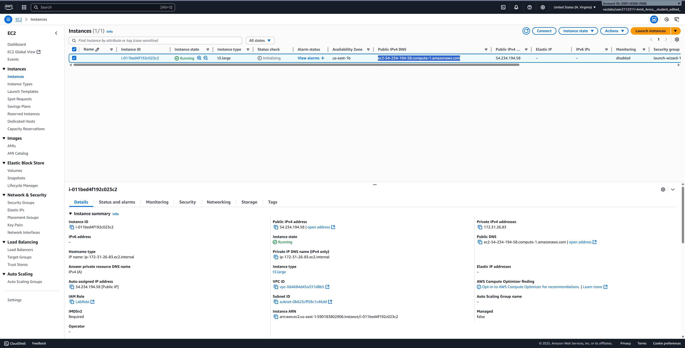](img/Instances-EC2.png)

[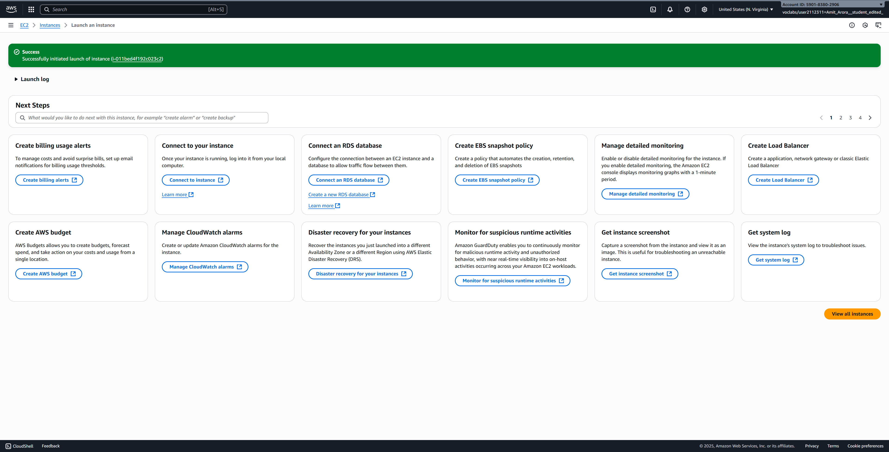](img/Launch-an-instance-EC2.png)

### Wait for Instance to Initialize

1. After clicking "Launch instance", you'll see a success message. Click on **View all instances** to go back to the instances list.

2. Your new instance will appear in the list with a status of "Pending". Wait a few minutes for it to change to "Running" and for the status checks to pass (2/2 checks passed).

3. Once the instance is running, note down the **Public IPv4 DNS** - you'll need this to connect via VSCode.

::: callout-note
The instance typically takes 1-2 minutes to fully initialize and become accessible.
:::

## Task 2: Connect to EC2 Instance using VSCode

Now that your EC2 instance is running, we'll set up VSCode to connect to it remotely. This will allow you to write code, run Python scripts, and work with Jupyter notebooks directly on your EC2 instance using the familiar VSCode interface.

### Prerequisites

1. Install **Visual Studio Code** on your local machine if you haven't already: [Download VSCode](https://code.visualstudio.com/)

2. Install the **Remote - SSH** extension in VSCode:
   - Open VSCode
   - Click on the Extensions icon in the sidebar (or press `Ctrl+Shift+X`)
   - Search for "Remote - SSH"
   - Install the extension by Microsoft

### Video Tutorial

For a detailed walkthrough of connecting VSCode to an EC2 instance, watch this helpful video tutorial:

<div style="position: relative; padding-bottom: 56.25%; height: 0; overflow: hidden; max-width: 100%; background: #000;">
  <iframe 
    src="https://www.youtube.com/embed/V9bjfDI20zo" 
    style="position: absolute; top: 0; left: 0; width: 100%; height: 100%;" 
    frameborder="0" 
    allow="accelerometer; autoplay; clipboard-write; encrypted-media; gyroscope; picture-in-picture" 
    allowfullscreen
    title="How to Connect VSCode to EC2 Instance">
  </iframe>
</div>

Alternatively, you can [watch on YouTube directly](https://www.youtube.com/watch?v=V9bjfDI20zo).

### Step-by-Step Connection Instructions

#### Configure SSH Connection

1. **Set up your SSH key permissions** (Mac/Linux only):
   ```bash
   chmod 400 ~/path/to/your-key.pem
   ```
   Replace `~/path/to/your-key.pem` with the actual path to your downloaded key file.

2. **Open VSCode** and press `F1` or `Ctrl+Shift+P` (Windows/Linux) or `Cmd+Shift+P` (Mac) to open the command palette.

3. Type **"Remote-SSH: Open SSH Configuration File"** and select it.

4. Choose the configuration file to edit (usually `~/.ssh/config` on Mac/Linux or `C:\Users\YourUsername\.ssh\config` on Windows).

5. Add the following configuration to the file:
   ```
   Host dsan6000-ec2
       HostName YOUR_EC2_PUBLIC_DNS
       User ubuntu
       IdentityFile ~/path/to/your-key.pem
   ```
   Replace:
   - `YOUR_EC2_PUBLIC_DNS` with your instance's public IPv4 DNS
   - `~/path/to/your-key.pem` with the actual path to your key file

6. Save the configuration file.

#### Connect to Your Instance

1. Press `F1` or open the command palette again.

2. Type **"Remote-SSH: Connect to Host"** and select it.

3. Select **dsan6000-ec2** from the list (or whatever name you gave your host).

4. VSCode will open a new window and connect to your EC2 instance.

5. If prompted about the platform, select **Linux**.

6. If this is your first connection, you'll be asked to verify the authenticity of the host. Select **Continue**.

::: {.callout-warning}

Important: AWS Session Expiration and EC2 Domain Name Changes

**Every time your AWS session ends (typically after 4 hours) and you restart it:**

- Your EC2 instance will **automatically restart** (give it ~2 minutes to become fully operational)
- The instance will have a **NEW public IPv4 DNS/domain name** 
- You **MUST update the HostName** in your VSCode SSH config file (`~/.ssh/config`) with the new DNS
- **Your data is safe!** The storage is persistent - all your files, installed software, and work remain intact
- Only the compute infrastructure restarts with a new address

**What this means for you:**
1. After starting a new AWS session, wait 2 minutes for EC2 to fully start
2. Check the new public IPv4 DNS in the EC2 console
3. Update your VSCode SSH config with the new DNS
4. Reconnect VSCode to your instance

Remember: **The old hostname is gone, but your content persists!**
:::

#### Initial Setup on EC2

Once connected, open a terminal in VSCode (`Terminal` → `New Terminal`) and run these commands to set up your development environment:

```bash
# Update package list
sudo apt update

# Install Python and essential tools
sudo apt install -y python3-pip python3-venv git

# Install Jupyter
pip3 install jupyter notebook jupyterlab

# Create a working directory
mkdir ~/dsan6000
cd ~/dsan6000

# Test S3 access with your bucket
# Replace 'your-net-id' with your actual NET ID
aws s3 ls
aws s3 ls s3://your-net-id-dsan6k-f2025/

# Create a test file and upload it to S3
echo "Hello from EC2!" > test.txt
aws s3 cp test.txt s3://your-net-id-dsan6k-f2025/

# Download the file back from S3
aws s3 cp s3://your-net-id-dsan6k-f2025/test.txt downloaded-test.txt
cat downloaded-test.txt
```

::: callout-tip
You can now use VSCode on your local machine to edit files, run Python scripts, and work with Jupyter notebooks directly on your EC2 instance. The Remote-SSH extension makes it feel like you're working locally, but all computation happens on your EC2 instance.

Additionally, your EC2 instance has AWS CLI pre-configured with the LabInstanceProfile, allowing you to seamlessly interact with S3 and other AWS services directly from the terminal.
:::

## Important: Shutting Down Your Resources

To avoid unnecessary charges to your AWS account, it's crucial to properly shut down your resources when not in use.

### Stop Your EC2 Instance

When you're done working:

1. Go to the EC2 Dashboard in AWS Console
2. Select your instance
3. Click **Instance State** → **Stop instance**
4. Confirm the action

::: callout-note
**Stopping** an instance preserves your data and allows you to restart it later. **Terminating** an instance permanently deletes it and all associated data.
:::

### End Your Lab Session

1. Return to the AWS Academy Learner Lab page
2. Click the **End Lab** button
3. This will stop the billing timer for your session

::: callout-important
**At the end of each work session:**

1. **Stop your EC2 instance** (not terminate - stop preserves your work)
2. **End the lab** in AWS Academy to stop the billing timer
3. Remember you have a **$50 budget** for the entire semester - use it wisely!

**Budget Management Tips:**
- A stopped instance costs only for storage (minimal)
- A running t3.xlarge instance costs approximately $0.22 per hour
- Always stop instances when not actively using them
- Set up billing alerts in AWS to monitor your spending
:::

### Restarting Your Work

When you want to continue working:

1. Start a new lab session in AWS Academy
2. Go to EC2 Dashboard
3. Select your instance and click **Instance State** → **Start instance**
4. Wait for it to enter "Running" state
5. Connect via VSCode as before (the DNS might change - check the new public IPv4 DNS)

::: callout-tip
Your data and installed software persist on the instance between sessions, so you can pick up right where you left off!
:::
